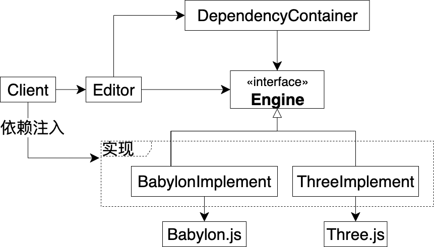
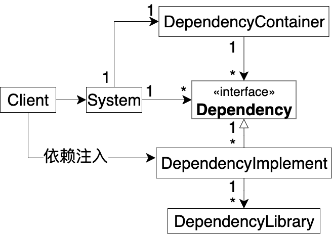

# 编辑器使用引擎创建场景

## 需求

编辑器需要使用引擎来创建一个场景


## 实现思路

编辑器引入Three.js引擎，调用它来创建场景


## 给出UML


总体来看，分为用户、编辑器、引擎这三个部分

我们看下用户这个部分：
Client是用户

我们看下编辑器这个部分：
Editor是编辑器

我们看下引擎这个部分：
Three.js是Three.js引擎


## 给出代码


我们依次看下每个模块的代码，它们包括：

- Client的代码
- Editor的代码

### Client的代码

Client
```ts
Editor.createScene()
```

Client调用Editor来创建场景

### Editor的代码

Editor
```ts
import {
	Scene,
	...
} from "three";

export let createScene = function () {
	let scene = new Scene();

	...
}
```

Editor引入Three.js引擎，并在createScene函数中调用它来创建场景


## 提出问题

- 如果要将Three.js引擎替换为Babylon.js引擎，需要哪些修改？


# 编辑器替换引擎


## 概述解决方案

- Editor改为引入Babylon.js引擎，并修改Editor中与引擎相关的代码

## 给出UML


领域模型跟之前一样，只是将Three.js替换为Babylon.js


## 结合UML图，描述如何具体地解决问题


需要进行下面的修改：

- 将Three.js换成Babylon.js
- 修改Editor的相关代码


## 给出代码

Client代码跟之前一样，故省略

我们看下Editor的代码：
### Editor的代码

Editor
```ts
import {
	Scene,
	Engine,
	...
} from "babylonjs";

export let createScene = function () {
	let scene = new Scene(new Engine())

	...
}
```

Editor改为引入Babylon.js引擎，并修改createScene函数中与引擎相关的代码，改为调用Babylon.js来创建场景

## 提出问题

- 替换引擎的成本太高
替换引擎需要修改Editor中所有与引擎相关代码，成本太高了。有没有办法能在不修改Editor代码的情况下实现替换引擎呢？


# 使用依赖隔离模式来改进

## 概述解决方案

- 解除依赖
只要解除Editor和引擎的依赖，把替换引擎的逻辑隔离出去就可以实现


## 给出UML




总体来看，分为用户、编辑器、引擎、容器这四个部分

我们看下用户这个部分：

Client是用户


我们看下编辑器这个部分：

Editor是编辑器


我们看下引擎这个部分：

Engine接口是对引擎的抽象，抽象出了Editor需要的接口

BabylonImplement是使用Babylon.js引擎对Engine接口的实现

ThreeImplement是使用Three.js引擎对Engine接口的实现

Babylon.js是Babylon.js引擎

Three.js是Three.js引擎


我们看下容器这个部分：

DependencyContainer是保存注入的Engine接口实现的容器，提供操作它的get和set函数

**依赖关系**

Client通过依赖注入的方式注入Engine接口的一个实现（BabylonImplement或者ThreeImplement），从而使Editor能够调用它来创建场景


## 结合UML图，描述如何具体地解决问题

- 替换Three.js为Babylon.js引擎现在不再影响Editor了，只需要增加BabylonImplement，并让Client从注入ThreeImplement改为注入BabylonImplement即可
因为Editor只依赖Engine接口，所以Engine接口的实现的变化不会影响Editor


## 给出代码

我们依次看下各个部分的代码，它们包括：

- 用户的代码
- 编辑器的代码
- 容器的代码
- 引擎的代码


### 用户的代码

Client
```ts
Editor.injectDependencies(BabylonImplement.implement())

Editor.createScene()
```


Client首先注入了BabylonImplement；然后创建了场景


### 编辑器的代码

Editor
```ts
export let injectDependencies = function (implement: Engine) {
	DependencyContainer.setEngine(implement);
};

export let createScene = function () {
	let { createScene, ...}: Engine = DependencyContainer.getEngine()

	let scene = createScene()

	...
}
```

Editor增加了injectDependencies函数，它将Client注入的Engine接口实现保存到DependencyContainer中 

createScene函数通过DependencyContainer获得注入的Engine接口实现，它的类型是Engine接口，用来创建场景

值得注意的是：
Editor只依赖Engine接口，没有依赖Engine接口的实现


### 容器的代码

DependencyContainer
```ts
let _engine: Engine = null

export let getEngine = (): Engine => {
  return _engine;
}

export let setEngine = (engine: Engine) {
  _engine = engine;
}
```

DependencyContainer使用_engine这个闭包变量来保存注入的Engine接口实现（当然也可以保存到一个state中；或者将DependencyContainer改为一个类，从而保存到它的私有成员中），并提供了get和set函数来获得和保存注入的Engine接口实现


### 引擎的代码

Engine
```ts
//scene为抽象类型
//这里用any类型表示抽象类型
type scene = any

export interface Engine {
    createScene(): scene
    ...
}
```

Engine接口抽象出了Editor需要的接口，其中包括createScene函数


ThreeImplement
```ts
import {
	Scene,
...
} from "three";

export let implement = (): Engine => {
	return {
		createScene: () => {
			return new Scene();
		},
		...
  }
}
```

ThreeImplement的implement函数使用了Three.js引擎，返回了Engine接口的实现


BabylonImplement
```ts
import {
	Scene,
	Engine,
	...
} from "babylonjs";

export let implement = (): Engine => {
	return {
		createScene: () => {
			return new Scene(new Engine())
		},
		...
  }
}
```

BabylonImplement的implement函数使用了Babylon.js引擎，返回了Engine接口的实现


<!-- # 设计意图

阐明模式的设计目标 -->

# 定义

## 一句话定义

隔离系统的外部依赖，使得外部依赖的变化不会影响系统

<!-- ## 概述抽象的解决方案 -->
## 补充说明

将外部依赖隔离后，系统变得更“纯”了，类似于函数式编程中“纯函数”的概念
<!-- ，从而消除了外部依赖带来了副作用 -->

哪些依赖属于外部依赖呢？依赖的各种第三方库、外部环境等都属于外部依赖。具体来说：

- 对于编辑器而言，引擎、UI组件库（如Ant Design）、后端、文件操作、日志等都属于外部依赖；
- 对于引擎而言，各种子引擎（如物理引擎、动画引擎、粒子引擎）、后端、文件操作、日志等都属于外部依赖

可以将每个可能会变化的外部依赖都抽象为接口，从而使用依赖隔离模式将其隔离出去


## 通用UML





<!-- ## 分析角色 -->

我们来看看模式的相关角色：

总体来看，分为用户、系统、外部依赖、容器这四个部分


我们看下用户这个部分：

- Client
该角色是用户，通过依赖注入的方式注入DependencyImplement

我们看下系统这个部分：

- System
该角色使用了外部依赖，它只知道外部依赖的接口（Dependency）而不知道具体实现（DependencyImplement）


我们看下外部依赖这个部分：

- Dependency
该角色是外部依赖的接口
- DependencyImplement
该角色是Dependency的实现
- DependencyLibrary
该角色是一个库


我们看下容器这个部分：

- DependencyContainer
该角色是保存注入的DependencyImplement的容器，提供操作它的get和set函数


## 角色之间的关系

- 可以有多个Dependency
如除了Engine以外，还可以有File、Server等Dependency，其中每个Dependency对应一个外部依赖

- 一个Dependency可以有多个DependencyImplement来实现
如Engine的实现除了有ThreeImplement，还可以有BabylonImplement等实现


- Client可以依赖注入多个Dependency接口的实现。其中，对于一个Dependency接口而言，Client只依赖注入实现它的一个DependencyImplement

- 因为System可以使用多个Dependency接口，所以它们是一对多的关系

- 一个DependencyImplement一般只使用一个DependencyLibrary，但也可以使用多个DependencyLibrary
如可以增加实现Engine接口的ThreeAndBabylonImplement，它同时使用Three.js和Babylon.js这两个DependencyLibrary来创建场景

- 只有一个DependencyContainer容器，它保存了所有注入的DependencyImplement，为每个DependencyImplement都提供了get和set函数 


## 角色的抽象代码

下面我们来看看各个角色的抽象代码：


我们依次看下各个部分的抽象代码，它们包括：

- 用户的抽象代码
- 系统的抽象代码
- 容器的抽象代码
- 外部依赖的抽象代码

### 用户的抽象代码
Client
```ts
System.injectDependencies(Dependency1Implement1.implement(), 其它DependencyImplement...)

System.doSomethingUseDependency1()
```

### 系统的抽象代码
System
```ts
export let injectDependencies = function (dependency1Implement1: Dependency1, ...) {
	DependencyContainer.setDependency1(dependency1Implement1)
	注入其它DependencyImplement...
};

export let doSomethingUseDependency1 = function () {
	let { abstractOperate1, ...}: Dependency1 = DependencyContainer.getDependency1()

	let value1: abstractType1 = abstractOperate1()

	...
}

更多doSomethingUseDependencyX函数...
```

### 容器的抽象代码
DependencyContainer
```ts
let _dependency1: Dependency1 = null

更多的_dependencyX...

export let getDependency1 = (): Dependency1 => {
  return _dependency1;
}

export let setDependency1 = (dependency1: Dependency1) {
  _dependency1 = dependency1;
}

更多的get和set函数（如getDependency2、setDependency2）...
```

### 外部依赖的抽象代码
Dependency1
```ts
type abstractType1 = any;
...

export interface Dependency1 {
    abstractOperate1(): abstractType1,
    ...
}
```

有多个Dependency，这里只给出一个Dependency的抽象代码


Dependency1Implement1
```ts
import {
	api1,
...
} from "dependencylibrary1";

export let implement = (): Dependency1 => {
	return {
		abstractOperate1: () => {
			使用api1...
		},
		...
  }
}
```
DependencyLibrary1
```ts
export let api1 = function () {
	...
}

...
```

有多个DependencyImplement和多个DependencyLibrary，这里只给出一个DependencyImplement和一个DependencyLibrary的抽象代码


## 遵循的设计原则在UML中的体现


依赖隔离模式主要遵循下面的设计原则：

- 依赖倒置原则
系统依赖于外部依赖的抽象（Dependency）而不是外部依赖的细节（DependencyImplement和DependencyLibrary），从而外部依赖的细节的变化不会影响系统
- 开闭原则
要隔离更多的外部依赖，只需要增加对应的Dependency、DependencyImplement和DependencyLibrary，以及DependencyContainer增加对应的闭包变量和get、set函数即可，无需修改System；要替换外部依赖的实现，只需要对它的Dependency增加更多的DependencyImplement，然后Client改为注入新的DependencyImplement即可，无需修改System；要修改已有的外部依赖（如升级版本），只需要修改DependencyImplement和DependencyLibrary即可，无需修改System

依赖隔离模式也应用了“依赖注入”、“控制反转”的思想


# 应用

## 优点

- 提高系统的稳定性
外部依赖的变化不会影响系统
- 提高系统的扩展性
可以任意替换外部依赖而不影响系统
- 提高系统的可维护性
系统与外部依赖解耦，便于维护


## 缺点

无

## 使用场景

### 场景描述

系统的外部依赖经常变化

### 具体案例

<!-- ## 实现该场景需要修改模式的哪些角色？ -->
<!-- ## 使用模式有什么好处？ -->

- 编辑器使用的引擎、UI库等第三方库需要替换

- 编辑器使用的引擎、UI库等第三方库的版本需要升级

如需要升级编辑器使用的Three.js引擎的版本，只需要升级作为DependencyLibrary的Three.js，并修改ThreeImplement，使其使用升级后的Three.js即可

- 需要增加编辑器使用的引擎、UI库等第三方库

如需要让编辑器在已使用Three.js引擎的基础上增加使用Babylon.js引擎，则只需要加入ThreeAndBabylonImplement，让它同时使用Three.js和Babylon.js这两个DependencyLibrary


## 注意事项

- Dependency要足够抽象，才不至于在修改或增加DependencyImplement时需要修改Dependency，从而影响System

当然，在开发阶段难免考虑不足，如一开始只有一个DependencyImplement时，Dependency往往只会考虑这个DependencyImplement。这导致在增加实现该Dependency的其它DependencyImplement时发现需要修改Dependency，使其更加抽象，这样才能容纳因增加更多的DependencyImplement而带来的变化

因此，我们可以允许在开发阶段修改Dependency，但是在发布前则确保Dependency已经足够抽象和稳定

<!-- - 有多少个Dependency接口，DependencyContainer就有多少个get和set函数 -->

- 最好一开始就使用依赖隔离模式，将所有的可能会变化的外部依赖都隔离，这样可以避免后期使用依赖隔离模式时导致系统要改动的地方太多的情况


# 扩展

<!-- TODO 编辑器ui -->

## 升级为洋葱架构

如果基于依赖隔离模式设计一个这样的架构：

- 划分4个层：外部依赖层、应用服务层、领域服务层、领域模型层，其中前者为上层，前者依赖后者
<!-- - 外部依赖都位于外部依赖层，它们是按照依赖隔离模式设计的，在运行时由用户注入 -->
- 将系统的所有外部依赖都使用依赖隔离模式来隔离出去，为每个外部依赖抽象一个Dependency接口。将DependencyImplement放到最上层的外部依赖层，将Dependency放到最下层的领域模型层。
这是因为DependencyImplement容易变化，所以将其放到最上层，这样它的变化不会影响其它层；而Dependency非常稳定不易变化，且被领域模型依赖，所以将其放到领域模型层
<!-- 其它三层不依赖外部依赖层，而是依赖领域模型层中的Application Core（具体就是依赖Dependency） -->
- 运用领域驱动设计来设计系统,将系统的核心逻辑建模为领域模型，将其放到领域模型层

那么这样的架构就是洋葱架构。洋葱架构如下图所示：


洋葱架构与传统的三层架构的区别是颠倒了层之间的依赖关系：洋葱架构将三层架构中的最下层（外部依赖层）改为最上层；将三层架构中的倒数第二层（领域模型层）下降为最下层

洋葱架构的核心思想就是：

- 将变化最频繁的外部依赖放在最上层从而不影响其它层
- 将领域模型放在最下层，使其不受其它层的影响。虽然它的变化会影响其它层，但是它通常比较稳定，不容易变化

<!-- 这样的好处是外部依赖层容易变化，但它的变化现在不会影响其他层 -->


<!-- # 结合其它模式

## 结合哪些模式？
## 使用场景是什么？
## UML如何变化？
## 代码如何变化？ -->


# 最佳实践

<!-- ## 结合具体项目实践经验，如何应用模式来改进项目？ -->
## 哪些场景不需要使用模式


- 系统的外部依赖比较稳定，不易变化


- 开发Demo或者开发短期使用的系统


对于上面的场景，可以在系统中直接使用外部依赖而不需要使用依赖隔离模式将其隔离，从而能最快地开发系统


<!-- ## 哪些场景需要使用模式？ -->
## 给出具体的实践案例

<!-- - 使用了频繁变化的外部依赖的系统 -->
### 扩大使用场景

编辑器的外部依赖不只是引擎，也包括UI组件库等。如需要将旧的UI组件库（如React UI 组件库-Antd）替换为新的组件库，则可使用依赖隔离模式，提出UI这个Dependency接口，并加入作为UI接口实现的OldUIImplement、NewUIImplement，它们调用对应的UI组件库；然后让Client从注入OldUIImplement改为注入NewUIImplement

除了编辑器外，引擎、网站等系统也可以使用依赖隔离模式。如需要替换引擎的物理引擎、将网站的后端从阿里云换成腾讯云等场景，都可以使用依赖隔离模式


### 外部依赖在运行时会变化

有些外部依赖在运行时会变化，对于这种情况，使用依赖隔离模式后可以在运行时注入变化后的DependencyImplement，从而切换外部依赖。如编辑器向用户提供了“切换渲染效果”的功能，它的需求是：用户点击一个按钮后，切换不同的引擎来渲染场景

因为引擎的接口是同一个Dependency，所以为了实现该功能，只需在按钮的点击事件中注入实现该Dependency的对应的DependencyImplement到DependencyContainer中即可


### 满足各种修改外部依赖的用户需求

我遇到过这种问题：3D应用开发完成后，交给3个外部用户使用。用了一段时间后，这3个用户提出了不同的修改外部依赖的要求：第一个用户想要升级3D应用依赖的引擎A，第二个用户想要替换引擎A为引擎B，第三个用户想要同时使用引擎B和升级后的引擎A。
如果3D应用没有使用依赖隔离模式，而是使用调用引擎这个外部依赖的话，我们就需要将交付的代码修改为3个版本，分别满足3个用户的需求。交付的3个版本的代码如下：

- 使用了升级A的3D应用代码
- 使用了B的3D应用代码
- 使用了B和升级A的3D应用代码

因为每个版本都需要修改3D应用中与引擎相关的代码，所以导致工作量很大。如果使用了依赖隔离模式进行解耦，那么就只需要对3D应用做下面的修改：

- 修改AImplement和ALibrary，实现升级
- 增加BLibrary
- 增加BImplement，它使用BLibrary
- 增加ABImplement，它使用BLibrary和升级后的ALibrary
- DependencyContainer增加保存B、AB的闭包变量和对应的get、set函数

这样的话，交付的代码就只有1个版本，从而减少了很多工作量。只是该版本的代码需要在Client中分别为这3个用户注入不同的DependencyImplement，具体如下：

- Client为第一个用户注入升级后的AImplement
- Client为第二个用户注入BImplement
- Client为第三个用户注入ABImplement


# 更多资料推荐

可以在网上搜索“依赖注入 控制反转 依赖倒置”来找到依赖注入思想的资料

可以在网上搜索“洋葱架构”、“the-onion-architecture-part”来找到洋葱架构的资料

六边形架构类似于洋葱架构，可以在网上搜索“六边形架构”来找到它的资料

