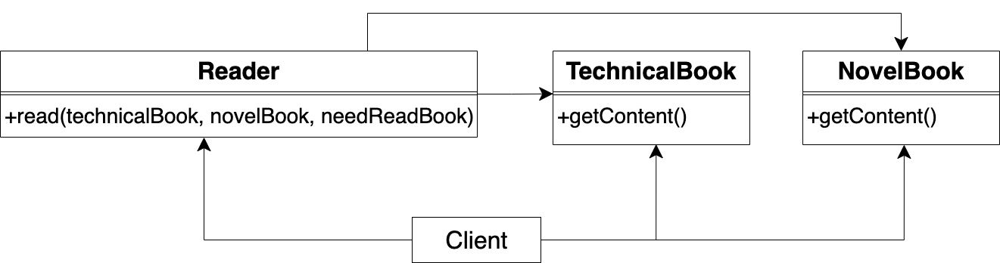

# 1.5 依赖倒置原则

## 定义

高层模块不应该依赖低层模块，两者都应该依赖其抽象；抽象不应该依赖细节；细节应该依赖抽象


## 补充说明

<!-- 如何分辨高层模块、低层模块？ -->
所谓的高层、低层模块是按照依赖的方向来定的，如模块1依赖模块2，我们就说相对而言，模块1属于高层模块，模块2属于低层模块


<!-- “抽象”在函数式编程的代码中指的就是接口或者类型
“细节”在函数式编程的代码中指的就是模块或者函数 -->

“抽象”在代码中具体指的就是接口或者类型，“细节”在代码中具体指的就是模块或者函数

依赖倒置原则具体是指模块或者函数之间不应该直接依赖，而应该是依赖于它们的接口或者类型。所以说，符合依赖倒置原则的编程可以看作是“面向接口/类型编程”

符合依赖倒置原则有下面的好处：

- 减少细节之间的耦合性
- 便于替换细节
- 提高系统的稳定性
<!-- - 降低并行开发细节时引起的风险 -->
- 提高代码的可读性和可维护性


## 案例1

以读者读书的系统为例，领域模型如下：


现在只有技术书，伪代码如下：
TechnicalBook
```ts
type technicalBook = {
    getContent: () => string
}

export let TechnicalBook: technicalBook = {
    getContent: () => {
        return "技术书的内容"
    }
}
```
Reader
```ts
export let read = (technicalBook: technicalBook) => {
    let content = technicalBook.getContent()

    ...
}
```
Client
```ts
Reader.read(TechnicalBook)
```

现在增加小说书，读者只能阅读技术书或者小说书，这由Client决定。
修改后的领域模型如下：



修改后的伪代码如下：

TechnicalBook代码不变，故省略

NovelBook
```ts
type novelBook = {
    getContent: () => string
}

export let NovelBook: novelBook = {
    getContent: () => {
        return "小说书的内容"
    }
}
```
Reader
```ts
export let read = (technicalBook: technicalBook, novelBook: novelBook, needReadBook: string) => {
    let content = null

    switch (needReadBook) {
        case "technical":
            content = technicalBook.getContent()
            break
        case "novel":
        default:
            content = novelBook.getContent()
            break
    }

    ...
}
```
Client
```ts
//这里选择让读者读小说书
Reader.read(TechnicalBook, NovelBook, "novel")
```

这里的问题是因为Reader依赖了每类书，所以如果一类书发生了变化，或者增加了一类书，那么Reader都需要对应修改代码。

我们需要解除Reader与每类书的依赖，从而使其符合依赖倒置原则。修改后的领域模型如下：


现在提出了书的接口：Book，让Reader改为依赖书的接口，而不依赖书的实现模块。这样做的好处是只要Book接口不变，它的实现模块的变化不会影响到Reader。修改后的伪代码如下：
Book
```ts
export interface Book {
    getContent(): string
}
```
TechnicalBook
```ts
export let TechnicalBook: Book = {
    getContent: () => {
        return "技术书的内容"
    }
}
```
NovelBook
```ts
export let NovelBook: Book = {
    getContent: () => {
        return "小说书的内容"
    }
}
```
Reader
```ts
export let read = (book: Book) => {
    let content = book.getContent()

    ...
}
```
Client
```ts
//这里选择让读者读小说书
Reader.read(NovelBook)
```