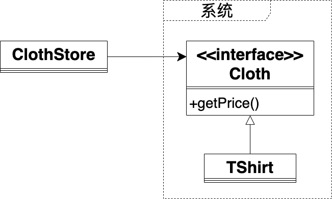
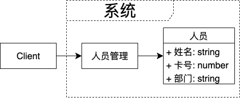

# 再看设计原则

本章结合案例代码，回顾了经典的6个设计原则

## 1.1 设计基础

这个世界处于不断的变化中，需求也在不断的变化。为了应对需求的变化，减少变化影响的范围，我们需要进行设计。

### 如何进行设计

从下面四个方面进行设计：

- 抽象、封装为基本方法 
- 高内聚、低耦合为评判标准
- 设计原则为指导思想
- 编程模式为套路模板


### 抽象

抽象的定义：从众多的具体事物中，抽取共同的、本质的属性


如上图所示，展示了逐步抽象的过程，具体过程如下：
1.左上图片展示了一个具有最多细节的、具体的牛
2.从上往下，从左往右依次进行抽象
3.最后抽象成了右下图片中的牛，这时候只剩下牛最基本的框架


更多的抽象案例：

- “红色、黄色、紫色”抽象为“颜色”
- “黑人、白人、黄人”抽象为“人”
- “鸡、鸭、鹅”抽象为“鸟”，它们具有共同的外观：头、身体、爪子、翅膀，以及共同的行为：吃、飞
<!-- TODO tu -->


#### 项目中哪些地方用到了抽象？

可以说抽象无处不在，具体的应用如下：

- 在重构方面：消除重复代码时需要进行抽象，抽取它们共同的特性，消除这部分的重复
- 在设计方面：设计架构时需要进行抽象，抽取各个视图（如数据视图、层次视图、服务视图等）中的本质属性（如数据视图抽取数据相关的本质属性），形成各个视图的架构图
- 在测试方面：写测试用例时需要进行抽象，提取在用户的视角下被测试的代码有哪些行为，对这些行为进行测试


### 封装

封装的定义：隐藏对象的属性和实现细节，仅对外公开接口；将抽象得到的数据和行为相结合，形成一个有机的整体


如上图所示，展示了封装的一个例子，其中上方的图片展示了一只鸡的内部细节，包括各种器官等；下方的图片展示了封装后的结果，隐藏了内部细节，形成了“鸡”这个整体


#### 项目中哪些地方用到了封装？

封装跟抽象一样，可以说无处不在，而且两者常一起使用。具体的应用如下：

- 在重构方面：重命名函数名时需要进行封装，使其不暴露内部的细节，而只显示这个函数的抽象行为，从而让用户只看函数名就知道它是做什么的
- 在设计方面：设计接口时需要进行封装，隐藏细节
- 在测试方面：写测试用例时需要进行封装，跟函数名一样，测试用例名应该不暴露内部的细节，而只显示该用例的抽象行为，从而让用户只看用例名就知道它是做什么的


### 高内聚、低耦合

在系统设计中通常用内聚度和耦合度作为衡量模块独立程度的标准，我们希望内聚度高，耦合度低。其中，内聚是指每个模块尽可能独立地完成自己的功能，不依赖模块外部的代码；耦合是指模块与模块之间相互依赖的程度，依赖得越多，耦合度越高，导致牵一发而动全身

让系统保持高内聚、低耦合的好处是使模块的“可重用性”、“移植性”大大增强

<!-- TODO tu
(TODO 需要去除水印) -->


## 1.2 单一职责原则

### 定义

只有一个原因引起变化，或者说一次只做一件事情


### 补充说明

如果一个模块或者函数做了多件事情，那么应该将其拆分

从函数名上就能看出一个函数是否符合单一职责原则，如“getAndSetData”这个函数名一看就知道做了两件事情，应该将其拆分为getData、setData这两个函数

如果一个模块或者函数做了多件事情，有下面的缺点：

- 任何一件事情的变化都会影响它
- 用户调用它时，本来只预期它做某件事情，结果它实际上还做了其它的事情，这可能造成不可预料的bug


### 案例1


上图是操作书的接口，它不符合单一职责原则。这是因为它的getBookID、setBookID函数是对书的数据的操作，而它的addBook函数则是对书的行为的操作，所以该接口做了两件事情

应该将其拆分为两个接口，使每个接口只做一件事情。拆分后的接口如下图所示：


BookData接口负责操作书的数据。BookAction接口负责操作书的行为。原来的BookInfo接口改为实现BookData接口和BookAction接口


### 案例2

```ts
type userName = string

type phone = number

type changeUser = (newUserData: [userName, phone]) => void
```
上面的代码是函数（changeUser）的签名。从签名可知，该函数不符合单一职责原则，这是因为它的形参是一个元组，包含了多个数据，这说明该函数做了多件事情。

应该将其拆分为多个函数，使每个函数只做一件事情。拆分后的函数签名如下所示：
```ts
type userName = string

type phone = number

type changeUserName = (newUserName: userName) => void
type changePhone = (newPhone: phone) => void
```


## 1.3 依赖倒置原则

### 定义

高层模块不应该依赖低层模块，两者都应该依赖其抽象；抽象不应该依赖细节；细节应该依赖抽象


### 补充说明

<!-- 如何分辨高层模块、低层模块？ -->
所谓的高层、低层模块是按照依赖的方向来定的，如模块1依赖模块2，我们就说相对而言，模块1属于高层模块，模块2属于低层模块


<!-- “抽象”在函数式编程的代码中指的就是接口或者类型
“细节”在函数式编程的代码中指的就是模块或者函数 -->

“抽象”在代码中具体指的就是接口或者类型，“细节”在代码中具体指的就是模块或者函数

依赖倒置原则具体是指模块或者函数之间不应该直接依赖，而应该是依赖于它们的接口或者类型。所以说，符合依赖倒置原则的编程可以看作是“面向接口/类型编程”

符合依赖倒置原则有下面的好处：

- 减少细节之间的耦合性
- 便于替换细节
- 提高系统的稳定性
- 提高代码的可读性和可维护性


### 案例1

以读者读书的系统为例，领域模型如下：


现在只有技术书，伪代码如下：
TechnicalBook
```ts
type technicalBook = {
    getContent: () => string
}

export let TechnicalBook: technicalBook = {
    getContent: () => {
        return "技术书的内容"
    }
}
```
Reader
```ts
export let read = (technicalBook: technicalBook) => {
    let content = technicalBook.getContent()

    ...
}
```
Client
```ts
Reader.read(TechnicalBook)
```

现在增加小说书，读者只能阅读技术书或者小说书，这由Client决定。
修改后的领域模型如下：

<!-- 既可以选择阅读技术书或者选择阅读小说书，这具体是由Client决定读者阅读哪类书 -->


修改后的伪代码如下：

TechnicalBook代码不变，故省略

NovelBook
```ts
type novelBook = {
    getContent: () => string
}

export let NovelBook: novelBook = {
    getContent: () => {
        return "小说书的内容"
    }
}
```
Reader
```ts
export let read = (technicalBook: technicalBook, novelBook: novelBook, needReadBook: string) => {
    let content = null

    switch (needReadBook) {
        case "technical":
            content = technicalBook.getContent()
            break
        case "novel":
        default:
            content = novelBook.getContent()
            break
    }

    ...
}
```
Client
```ts
//这里选择让读者读小说书
Reader.read(TechnicalBook, NovelBook, "novel")
```

这里的问题是因为Reader依赖了每类书，所以如果一类书发生了变化，或者增加了一类书，那么Reader都需要对应修改代码。

我们需要解除Reader与每类书的依赖，从而使其符合依赖倒置原则。修改后的领域模型如下：


现在提出了书的接口：Book，让Reader改为依赖书的接口，而不依赖书的实现模块。这样做的好处是只要Book接口不变，它的实现模块的变化不会影响到Reader。修改后的伪代码如下：
Book
```ts
export interface Book {
    getContent(): string
}
```
TechnicalBook
```ts
export let TechnicalBook: Book = {
    getContent: () => {
        return "技术书的内容"
    }
}
```
NovelBook
```ts
export let NovelBook: Book = {
    getContent: () => {
        return "小说书的内容"
    }
}
```
Reader
```ts
export let read = (book: Book) => {
    let content = book.getContent()

    ...
}
```
Client
```ts
//这里选择让读者读小说书
Reader.read(NovelBook)
```

## 1.4 接口隔离原则

### 定义

模块间的依赖关系应该建立在最小的接口上


### 补充说明

应该将庞大的接口拆分成更小的接口

“接口”属于面向对象编程的概念，它在函数式编程中的对应是“类型”。两者的对比代码如下：
接口
```ts
export interface Interface1 {
    value1: number
    func1: () => string
}
```
类型
```ts
export type type1 = {
    value1: number
    func1: () => string
}
```

因为这两者其实是等价的，所以说接口隔离原则应用在函数式编程中就是指类型应该保持最小

值得注意的是：
类型名首写字母是小写，而接口名首写字母是大写


### 案例1

我们开发了一个用户管理系统，其中有一个查询接口User，供管理员查询用户。领域模型如下：


系统上线后，发现系统速度非常慢，这是由于User中的complexSerach函数性能太差造成的。我们可以修改User接口，将complexSearch函数拿出来放到新的接口中，从而把原有的接口拆分为两个更小的接口。修改后的领域模型如下：


现在，管理员可以根据自己的需要使用SimpleUser接口或者ComplexUser接口，只依赖最小的接口，从而符合接口隔离原则


## 1.5 最少知识原则

### 定义

一个对象应该对其他对象有最少的了解

### 补充说明

最少知识原则也称为迪米特法则，虽然名字不同，但描述的是同一个规则。该原则可理解为一个模块或者一个函数A应该对自己需要耦合或调用的模块或者函数B知道得最少。A不需要知道B的细节，只需要知道B提供的接口

该原则包括两个方面：

- 只知道直接的朋友
- 只知道朋友提供的与我相关的接口


### 第一个方面的案例

老板要经理汇报部门的成员数，领域模型如下：


图中省略了用户Client

伪代码如下：
Boss
```ts
export let Boss = {
    command: (manager) => {
        let members = []

        for (let i = 0; i < 20; i++) {
            members.push(Member.create())
        }

        manager.count(members)
    }
}
```
Manager
```ts
export let Manager = {
    count: (members) => {
        console.log("成员数为：", members.length)
    }
}
```
Client
```ts
Boss.command(Manager)
```


这里的问题是Boss应该只知道Manager，不应该知道Member。

我们需要解除Boss和Member的依赖，修改后的领域模型如下：


图中省略了Client

现在把创建Member的逻辑从Boss的command函数移到了Manager新增加的createAllMembers函数中，从而解除了Boss与Member的依赖，降低了系统间的耦合，提高了系统的健壮性。修改后的伪代码如下：
Boss
```ts
export let Boss = {
    command: (manager) => {
        manager.count()
    }
}
```
Manager
```ts
export let Manager = {
    createAllMembers: () => {
        let members = []

        for (let i = 0; i < 20; i++) {
            members.push(Member.create())
        }

        return members
    },
    count: () => {
        console.log("成员数为：", Manager.createAllMembers().length)
    }
}
```
Client代码不变，故省略


### 第二个方面的案例

前端使用一个后端服务来更新用户信息，但是该后端服务却暴露了过多的细节。领域模型如下：


前端需要调用后端服务的三个属于实现细节的函数。这样做的问题是如果这三个函数中的任何一个修改了，都会影响前端。因此，后端服务应该只暴露一个update函数，并把原有的三个函数隐藏为私有函数。修改后的领域模型如下：


## 1.6 合成复用原则

### 定义

尽量使用组合而不是继承

### 补充说明

“继承”属于面向对象编程的概念，函数式编程中没有“继承”的概念。但是，函数式编程其实也可以实现面向对象编程中的“继承”，只是把继承的对象从 “类”换成“模块”即可。如Rescript作为一个函数式编程语言，支持在一个模块B中引入另一个模块A，使B获得A所有的成员，这就相当于实现了B继承A。相关代码如下：
```re
module A = {
  let value1 = "A1"

  let func1 = () => {
    //返回1
    1
  }
}

module B = {
  //引入A，获得了A.value1, A.func1
  include A

  //覆盖了A.value1
  let value1 = "B1"

  let func2 = () => {
    //调用A.func1并返回
    func1()
  }
}
```

继承在函数式编程中的领域模型如下：


我们来看下继承的优点：

- 因为子模块可以直接通过继承获得父模块的成员，所以实现新的子模块比较容易
<!-- - 可以在父模块的基础上扩展子模块 -->

继承的缺点：

- 因为继承破坏了封装，父模块的细节完全暴露给子模块，所以父模块的任何细节发生了改变都会影响到子模块
- 因为继承是静态的，所以在运行时不能改变继承关系


组合在函数式编程中的领域模型如下：


我们来看下组合的优点：

- 因为新模块看不到已有模块的细节，新模块只能通过已有模块的接口来访问它，所以组合维持了封装
<!-- - 能够通过装饰器模式等方法来包装组合 -->
- 因为组合是动态的，所以在运行时能改变组合关系

组合的缺点：

- 模块的数量会比较多

继承关系属于“Is-A”的关系，组合关系属于“Has-A”的关系

### 案例1


如上图所示，因为雇员、经理都是人，它们与人是“Is-A”的关系，所以它们的关系是继承关系。实际上，雇员、经理是两种角色，而人可以同时有几种不同的角色，如一个人可以既是雇员又是经理。然而这里因为使用了继承，所以一个人就只能是雇员或者经理。因此，我们将继承关系改为组合关系，修改后的领域模型如下：


现在，因为人与角色是“Has-A”的关系，所以一个人可以通过组合不同的角色，来实现一个人既是雇员又是经理


## 1.7 开闭原则

### 定义

对扩展开放，对修改关闭


### 补充说明

系统应该通过扩展而不是修改已有的代码来实现变化


在项目中，如果我们为了增加第三方库的功能而直接修改第三方库的代码，就违反了开闭原则，因为这是通过修改了已有代码来实现变化。这会造成下面的问题：

- 升级第三方库的版本时，会导致原有的修改失效，从而不得不再修改一遍

有很多改进的方法，其中一个方法就是使用设计模式中的“中间者模式”，增加一个模块A来封装第三方库，让用户改为调用模块A而不是直接调用第三方库。这样在需要增加第三方库的功能时，只需增加一个模块B，使其继承模块A；然后在模块B中加入增加的功能代码；最后让用户改为调用模块B。这样做的话就通过扩展而不是修改来实现变化，从而符合开闭原则

值得注意的是：
因为开闭原则允许修改用户代码，所以“用户改为调用模块B”并没有违反开闭原则。如果我们直接修改了模块A的代码而不是改用户代码，就违反了开闭原则


### 案例1

以服装店销售衣服系统为例，领域模型如下：



ClothStore是用户

Cloth和TShirt属于系统

现在需要对TShirt中所有40元以上的衣服9折销售，有下面两种实现的思路如下：

<!-- - 修改用户模块ClothStore
在卖衣服时通过判断价格来打对应的折扣 -->
- 修改接口Cloth
首先，Cloth增加一个函数的定义：getOffPrice()，用于进行打折处理；然后，TShirt实现该函数；最后，ClothStore从调用getPrice函数改为调用getOffPrice函数
- 修改实现模块TShirt
修改TShirt的getPrice函数，实现打折处理

上面的两种实现思路都违反了开闭原则，因为它们都是通过修改系统的代码来实现变化。

为了符合开闭原则，我们可以增加一个继承TShirt的子模块：OffTShirt，在其中覆写getPrice函数，实现打折处理。领域模型如下：


这样就只需要修改用户模块ClothStore，使其从调用TShirt改为调用OffTShirt，而不需要修改系统的代码。这样就通过扩展来实现了变化，符合开闭原则


### 案例2


我们来看另一个例子，我们开发了一个人员管理系统，领域模型如下：



人员固定有三个数据：姓名、卡号、部门

现在用户提出了新的需求，希望能够任意地新增、修改、删除人员的数据，那么系统应该如何设计，才能实现用户的需求且符合开闭原则？

可以将人员和它的数据改为组合关系，修改后的领域模型如下：


现在对于人员和人员的三个数据，它们的关系如下：
```ts
人员 = 人员数据项1 + 人员数据项2 + 人员数据项3

其中：
人员数据项1 = 名称(值为姓名) + 值（值为具体的姓名） + 类型(值为string)
人员数据项2 = 名称(值为卡号) + 值（值为具体的卡号） + 类型(值为number)
人员数据项3 = 名称(值为部门) + 值（值为具体的部门） + 类型(值为string)
```

现在可以这样来实现用户的需求：

- 通过增加一个人员数据项，并使人员组合该数据项，从而实现增加人员的一个数据
- 通过增加一个修改后的人员数据项，并使人员组合该数据项，从而实现修改人员的一个数据
- 通过使人员不再组合某个数据项，从而实现删除人员的某个数据

因为这些都是通过扩展而非修改来实现变化，所以符合开闭原则