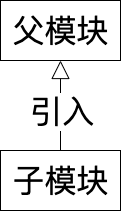
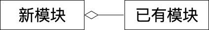

# 定义

尽量使用组合而不是继承

# 补充说明

“继承”属于面向对象编程的概念，函数式编程中没有“继承”的概念。但是，函数式编程其实也可以实现面向对象编程中的“继承”，只是把继承的对象从 “类”换成“模块”即可。如Rescript作为一个函数式编程语言，支持在一个模块B中引入另一个模块A，使B获得A所有的成员，这就相当于实现了B继承A。相关代码如下：
```re
module A = {
  let value1 = "A1"

  let func1 = () => {
    //返回1
    1
  }
}

module B = {
  //引入A，获得了A.value1, A.func1
  include A

  //覆盖了A.value1
  let value1 = "B1"

  let func2 = () => {
    //调用A.func1并返回
    func1()
  }
}
```

继承在函数式编程中的领域模型如下：


我们来看下继承的优点：
- 因为子模块可以直接通过继承获得父模块的成员，所以实现新的子模块比较容易
<!-- - 可以在父模块的基础上扩展子模块 -->

继承的缺点：
- 因为继承破坏了封装，父模块的细节完全暴露给子模块，所以父模块的任何细节发生了改变都会影响到子模块
- 因为继承是静态的，所以在运行时不能改变继承关系


组合在函数式编程中的领域模型如下：


我们来看下组合的优点：
- 因为新模块看不到已有模块的细节，新模块只能通过已有模块的接口来访问它，所以组合维持了封装
<!-- - 能够通过装饰器模式等方法来包装组合 -->
- 因为组合是动态的，所以在运行时能改变组合关系

组合的缺点：
- 模块的数量会比较多

继承关系属于“Is-A”的关系，组合关系属于“Has-A”的关系

# 案例1


如上图所示，因为雇员、经理都是人，它们与人是“Is-A”的关系，所以它们的关系是继承关系。实际上，雇员、经理是两种角色，而人可以同时有几种不同的角色，如一个人可以既是雇员又是经理。然而这里因为使用了继承，所以一个人就只能是雇员或者经理。因此，我们将继承关系改为组合关系，修改后的领域模型如下：


现在，因为人与角色是“Has-A”的关系，所以一个人可以通过组合不同的角色，来实现一个人既是雇员又是经理

