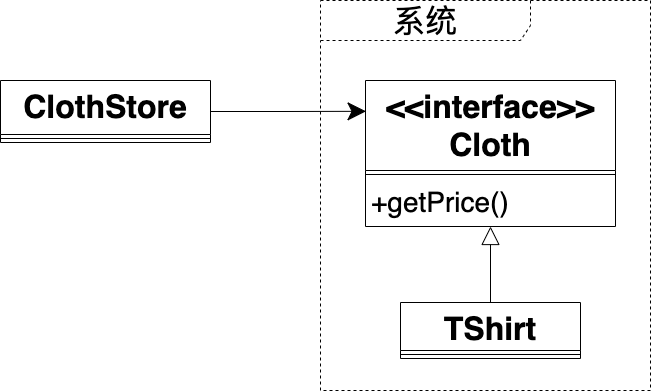
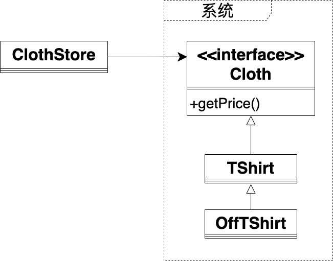
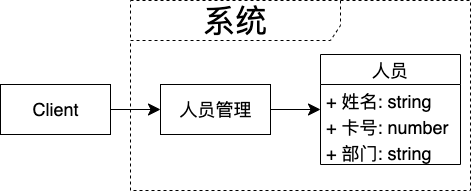
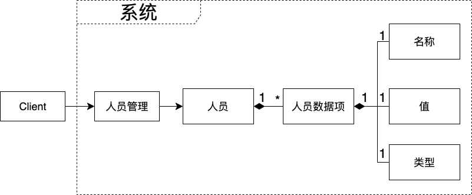

# 定义

对扩展开放，对修改关闭


# 补充说明

系统应该通过扩展而不是修改已有的代码来实现变化


在项目中，如果我们为了增加第三方库的功能而直接修改第三方库的代码，就违反了开闭原则，因为这是通过修改了已有代码来实现变化。这会造成下面的问题：
- 升级第三方库的版本时，会导致原有的修改失效，从而不得不再修改一遍

有很多改进的方法，其中一个方法就是使用设计模式中的“中间者模式”，增加一个模块A来封装第三方库，让用户改为调用模块A而不是直接调用第三方库。这样在需要增加第三方库的功能时，只需增加一个模块B，使其继承模块A；然后在模块B中加入增加的功能代码；最后让用户改为调用模块B。这样做的话就通过扩展而不是修改来实现变化，从而符合开闭原则

值得注意的是：
因为开闭原则允许修改用户代码，所以“用户改为调用模块B”并没有违反开闭原则。如果我们直接修改了模块A的代码而不是改用户代码，就违反了开闭原则


# 案例1

以服装店销售衣服系统为例，领域模型如下：



ClothStore是用户

Cloth和TShirt属于系统

现在需要对TShirt中所有40元以上的衣服9折销售，有下面两种实现的思路如下：

<!-- - 修改用户模块ClothStore
在卖衣服时通过判断价格来打对应的折扣 -->
- 修改接口Cloth
首先，Cloth增加一个函数的定义：getOffPrice()，用于进行打折处理；然后，TShirt实现该函数；最后，ClothStore从调用getPrice函数改为调用getOffPrice函数
- 修改实现模块TShirt
修改TShirt的getPrice函数，实现打折处理

上面的两种实现思路都违反了开闭原则，因为它们都是通过修改系统的代码来实现变化。

为了符合开闭原则，我们可以增加一个继承TShirt的子模块：OffTShirt，在其中覆写getPrice函数，实现打折处理。领域模型如下：



这样就只需要修改用户模块ClothStore，使其从调用TShirt改为调用OffTShirt，而不需要修改系统的代码。这样就通过扩展来实现了变化，符合开闭原则


# 案例2


我们来看另一个例子，我们开发了一个人员管理系统，领域模型如下：



人员固定有三个数据：姓名、卡号、部门

现在用户提出了新的需求，希望能够任意地新增、修改、删除人员的数据，那么系统应该如何设计，才能实现用户的需求且符合开闭原则？

可以将人员和它的数据改为组合关系，修改后的领域模型如下：



现在对于人员和人员的三个数据，它们的关系如下：
```ts
人员 = 人员数据项1 + 人员数据项2 + 人员数据项3

其中：
人员数据项1 = 名称(值为姓名) + 值（值为具体的姓名） + 类型(值为string)
人员数据项2 = 名称(值为卡号) + 值（值为具体的卡号） + 类型(值为number)
人员数据项3 = 名称(值为部门) + 值（值为具体的部门） + 类型(值为string)
```

现在可以这样来实现用户的需求：
- 通过增加一个人员数据项，并使人员组合该数据项，从而实现增加人员的一个数据
- 通过增加一个修改后的人员数据项，并使人员组合该数据项，从而实现修改人员的一个数据
- 通过使人员不再组合某个数据项，从而实现删除人员的某个数据

因为这些都是通过扩展而非修改来实现变化，所以符合开闭原则