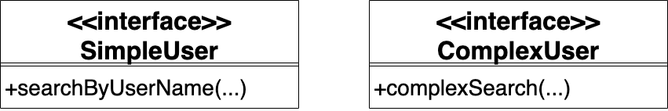

# 1.4 接口隔离原则

## 定义

模块间的依赖关系应该建立在最小的接口上


## 补充说明

应该将庞大的接口拆分成更小的接口

“接口”属于面向对象编程的概念，它在函数式编程中的对应是“类型”。两者的对比代码如下：
接口
```ts
export interface Interface1 {
    value1: number
    func1: () => string
}
```
类型
```ts
export type type1 = {
    value1: number
    func1: () => string
}
```

因为这两者其实是等价的，所以说接口隔离原则应用在函数式编程中就是指类型应该保持最小

值得注意的是：
类型名首写字母是小写，而接口名首写字母是大写


## 案例1

我们开发了一个用户管理系统，其中有一个查询接口User，供管理员查询用户。领域模型如下：


系统上线后，发现系统速度非常慢，这是由于User中的complexSerach函数性能太差造成的。我们可以修改User接口，将complexSearch函数拿出来放到新的接口中，从而把原有的接口拆分为两个更小的接口。修改后的领域模型如下：



现在，管理员可以根据自己的需要使用SimpleUser接口或者ComplexUser接口，只依赖最小的接口，从而符合接口隔离原则