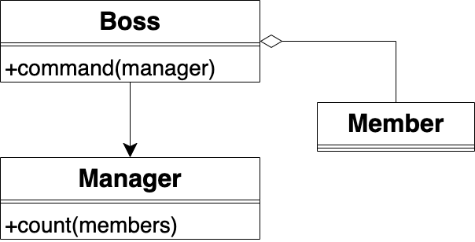
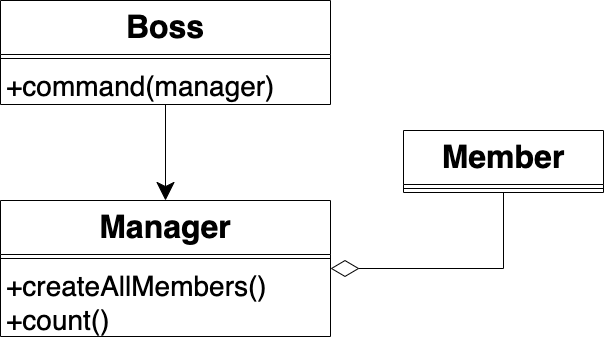

# 定义

一个对象应该对其他对象有最少的了解

# 补充说明

最少知识原则也称为迪米特法则，虽然名字不同，但描述的是同一个规则。该原则可理解为一个模块或者一个函数A应该对自己需要耦合或调用的模块或者函数B知道得最少。A不需要知道B的细节，只需要知道B提供的接口

该原则包括两个方面：
- 只知道直接的朋友
- 只知道朋友提供的与我相关的接口


# 第一个方面的案例

老板要经理汇报部门的成员数，领域模型如下：



图中省略了用户Client

伪代码如下：
Boss
```ts
export let Boss = {
    command: (manager) => {
        let members = []

        for (let i = 0; i < 20; i++) {
            members.push(Member.create())
        }

        manager.count(members)
    }
}
```
Manager
```ts
export let Manager = {
    count: (members) => {
        console.log("成员数为：", members.length)
    }
}
```
Client
```ts
Boss.command(Manager)
```


这里的问题是Boss应该只知道Manager，不应该知道Member。

我们需要解除Boss和Member的依赖，修改后的领域模型如下：



图中省略了Client

现在把创建Member的逻辑从Boss的command函数移到了Manager新增加的createAllMembers函数中，从而解除了Boss与Member的依赖，降低了系统间的耦合，提高了系统的健壮性。修改后的伪代码如下：
Boss
```ts
export let Boss = {
    command: (manager) => {
        manager.count()
    }
}
```
Manager
```ts
export let Manager = {
    createAllMembers: () => {
        let members = []

        for (let i = 0; i < 20; i++) {
            members.push(Member.create())
        }

        return members
    },
    count: () => {
        console.log("成员数为：", Manager.createAllMembers().length)
    }
}
```
Client代码不变，故省略


# 第二个方面的案例

前端使用一个后端服务来更新用户信息，但是该后端服务却暴露了过多的细节。领域模型如下：


前端需要调用后端服务的三个属于实现细节的函数。这样做的问题是如果这三个函数中的任何一个修改了，都会影响前端。因此，后端服务应该只暴露一个update函数，并把原有的三个函数隐藏为私有函数。修改后的领域模型如下：


