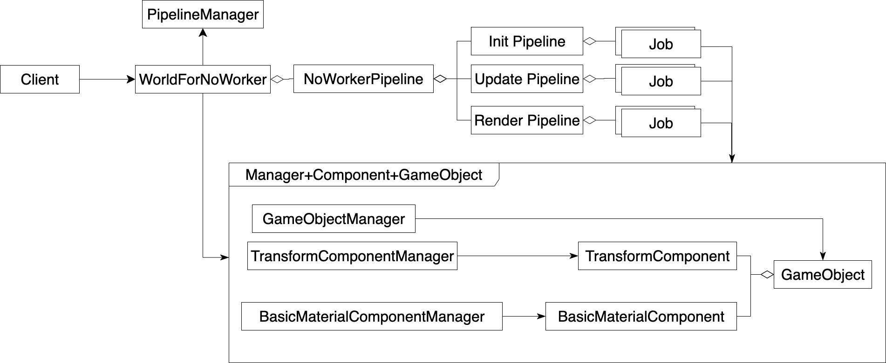
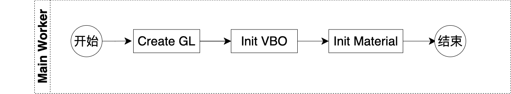
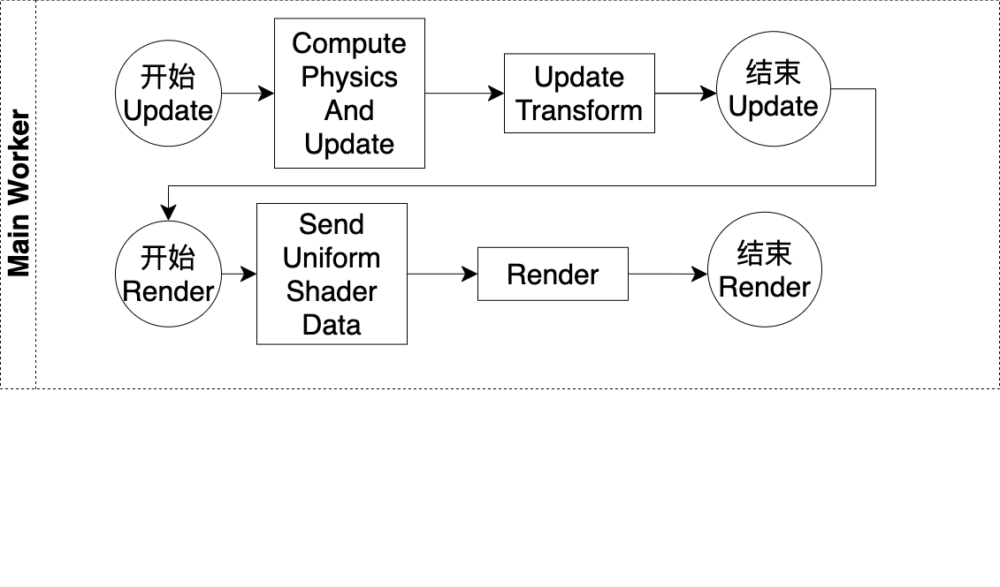
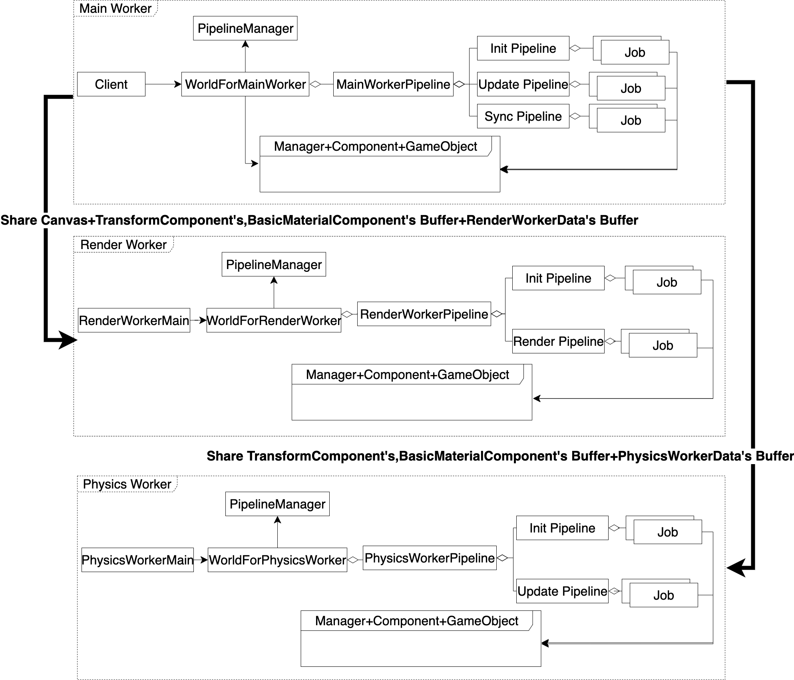
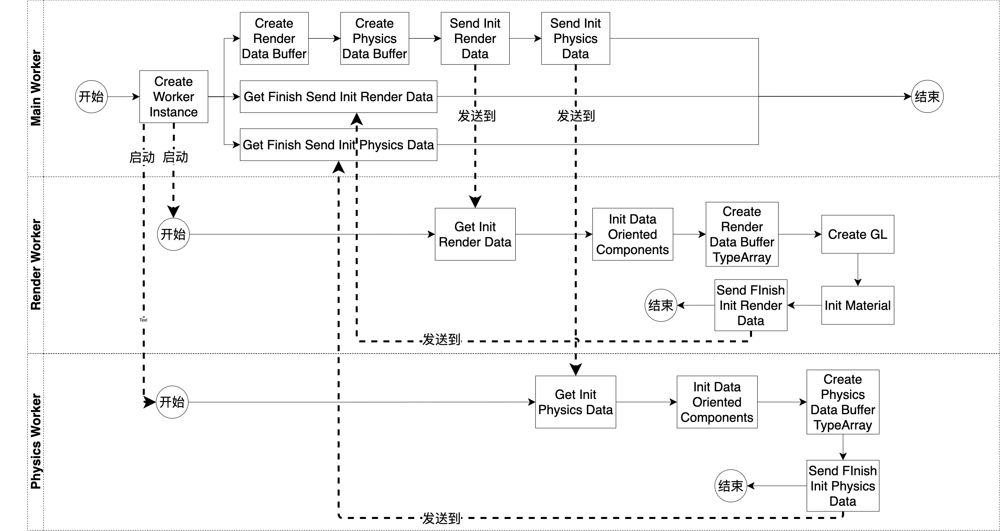
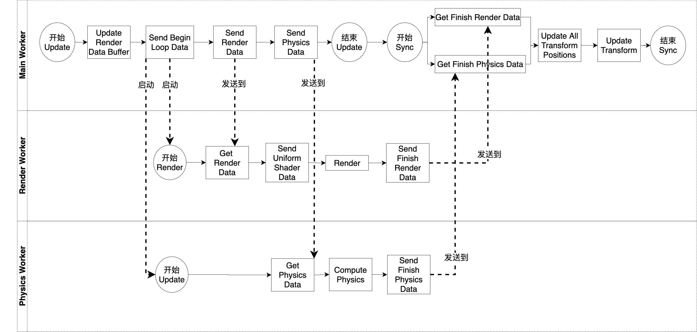
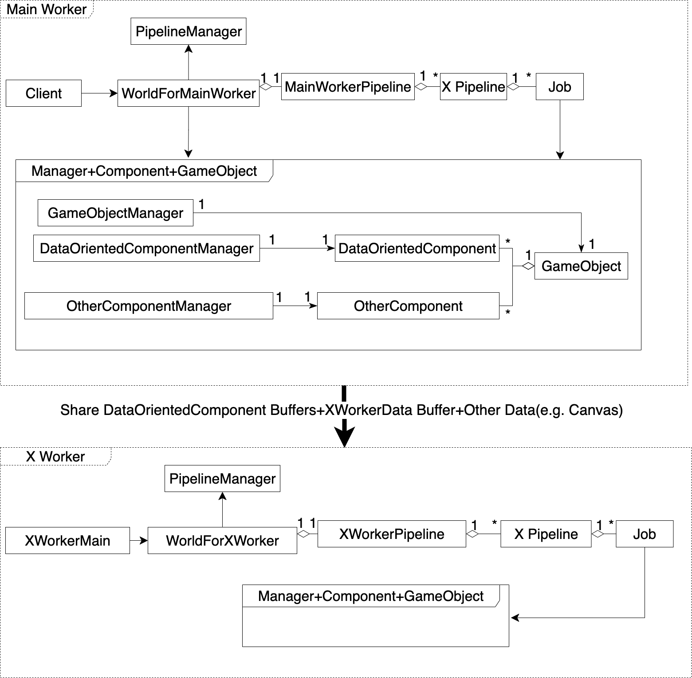
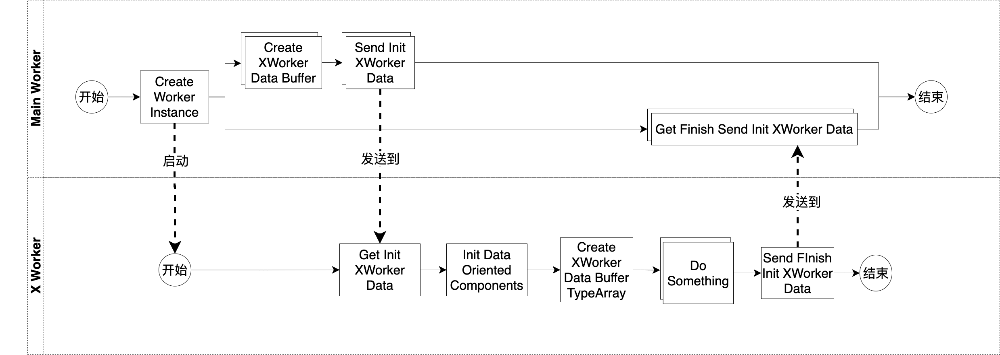
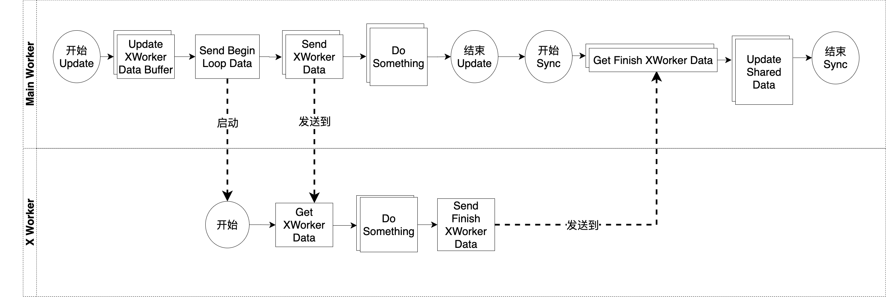

# 前置要求

请先阅读“ECS模式”、“管道模式”


# 单线程

## 需求

我们开发一个引擎，需要实现下面的功能：

- 渲染包括8000个三角形的大型场景
- 每帧进行物理计算，计算并更新每个三角形的位置


## 实现思路

为了简单、快速地实现，我们先在单线程的运行环境中来实现，也就是让引擎只运行在主线程中。
我们使用ECS模式中的Manager层和Component+GameObject层来创建和管理场景，将场景数据保存在组件的Buffer中。
我们使用管道模式的管道来实现引擎的初始化、更新和渲染的逻辑，具体来说就是注册一个Pipeline管道模块，它包括Init Pipeline、Update Pipeline、Render Pipeline这三个管道，它们分别有初始化、更新和渲染相关的Job


## 给出UML




总体来看，分为用户、门户、管道、Manager+Component+GameObject这四个部分


我们来看下用户、门户这两个部分：

Client是用户

WorldForNoWorker是门户，提供了引擎的API


我们来看下管道这个部分：

PipelineManager负责管理管道

NoWorkerPipeline是注册的管道模块

Init Pipeline是初始化管道，包括初始化相关的Job，实现了初始化的逻辑

Update Pipeline是更新管道，包括更新相关的Job，实现了更新的逻辑

Render Pipeline是渲染管道，包括渲染相关的Job，实现了渲染的逻辑


我们来看下Manager+Component+GameObject这个部分：

Manager+Component+GameObject是ECS模式中的Manager层和Component+GameObject层，用来创建和管理场景

场景中的一个三角形就是一个GameObject，它挂载了两种组件：TransformComponent、BasicMaterialComponent，其中前者负责维护三角形的位移数据，如位置、模型矩阵；后者负责维护三角形的材质数据，如颜色

GameObjectManager负责管理所有的gameObject

TransformComponentManager负责管理所有的TransformComponent组件

BasicMaterialComponentManager负责管理所有的BasicMaterialComponent组件


**依赖关系**
<!-- 我们来看下依赖关系： -->

Job调用了Manager+Component+GameObject来读写场景数据

WorldForNoWorker调用了Manager+Component+GameObject来创建场景


<!-- **初始化流程图** -->


<!-- 如上图所示，初始化运行了主线程的Init Pipeline管道，依次执行其中的Job -->

Main Worker包括了运行在主线程的Init Pipeline的Job

初始化运行了主线程的Init Pipeline


我们看下主线程的Init Pipeline，它主要做了下面的事情：

- 初始化

它的具体流程如下：

1.在“Create GL”Job中创建了WebGL上下文；
2.在“Init VBO”Job中初始化VBO；
3.在“Init Material”Job中初始化材质




<!-- 如上图所示，主循环的一帧依次进行了更新和渲染
在更新中，运行了主线程的Update Pipeline管道，依次执行其中的Job；
在渲染中，运行了主线程的Render Pipeline管道，依次执行其中的Job -->

Main Worker包括了运行在主线程的Update Pipeline和Render Pipeline的Job

主循环的一帧依次进行了更新和渲染，其中在“更新”中，运行了主线程的Update Pipeline；在“渲染”中，运行了主线程的Render Pipeline


<!-- 主循环的一帧首先并行运行了主线程的Update Pipeline；
然后运行了主线程的Render Pipeline -->

首先，我们看下主线程的Update Pipeline，它主要做了下面的事情：

- 更新

它的具体流程如下：

1.在“Compute Physics And Update”Job中进行物理计算，计算并更新所有TransformComponent组件的位置；
2.在“Update Transform”Job中更新所有TransformComponent组件的模型矩阵


然后，我们看下主线程的Render Pipeline，它主要做了下面的事情：

- 渲染

它的具体流程如下：

1.在“Send Uniform Shader Data”Job中发送相机数据到GPU；
2.在“Render”Job中渲染


## 给出代码

首先，我们看下Client的代码；
然后，我们依次看下Client代码中前两个步骤的代码，它们包括：

- 创建WorldState的代码
- 创建场景的代码

然后，因为Client会注册NoWorkerPipeline，它包括Init Pipeline、Update Pipeline、Render Pipeline这三个管道，所以我们依次看下各个管道的Job的代码

然后，我们依次看下Client代码中剩余的两个步骤的代码，它们包括：

- 初始化的代码
- 主循环的代码

最后，我们运行Client的代码


### Client的代码

Client
```ts
let worldState = WorldForNoWorker.createState({ transformComponentCount: 8000, basicMaterialComponentCount: 8000 })

worldState = ClientUtils.createScene(worldState, 8000)

注册NoWorkerPipeline

...

WorldForNoWorker.init(worldState, ...).then(worldState => {
    _loop(worldState)
})
```

Client首先调用WorldForNoWorker的createState函数并传入最大的组件个数，创建了WorldState，用来保存引擎所有的数据；然后创建场景；然后注册了NoWorkerPipeline；然后初始化；最后主循环


### 创建WorldState的代码


WorldForNoWorker
```ts
export let createState = ({ transformComponentCount, basicMaterialComponentCount }): state => {
    return {
        ecsData:
        {
            gameObjectManagerState: GameObjectManager.createState(),
            transformComponentManagerState: TransformComponentManager.createState(transformComponentCount),
            basicMaterialComponentManagerState: BasicMaterialComponentManager.createState(basicMaterialComponentCount)
        },
        pipelineState: PipelineManager.createState(),
    }
}
```

createState函数创建了WorldState，它包括场景数据和管道数据，其中场景数据来自各个Manager的state，管道数据来自PipelineManagerState


### 创建场景的代码

ClientUtils
```ts
let _createTriangle = (worldState: worldState, color: Array<number>, position: Array<number>): worldState => {
    创建一个triangleGameObject、一个transformComponent、一个basicMaterialComponent
    挂载这两个组件到该triangleGameObject
    设置该transformComponent的position为position
    设置该basicMaterialComponent的color为color

    return worldState
}

export let createScene = (worldState: worldState, count: number): worldState => {
    //执行_createTriangle函数count次，创建了count个三角形
    return range(0, count - 1).reduce(worldState => {
        return _createTriangle(worldState, 随机的color, 随机的color)
    }, worldState)
}
```

createScene函数创建了场景，场景包括了8000个三角形。每个三角形都是一个GameObject，它挂载了两种组件：TransformComponent、BasicMaterialComponent。每个三角形的位置、颜色都是随机值

<!-- 因为这里使用了ECS模式，所以创建场景的实现代码跟ECS模式章节中的案例代码是一样的，故这里省略相关代码 -->

<!-- 值得注意的是：
TransformComponent、BasicMaterialComponent这两个组件的Buffer是ArrayBuffer而不是SharedArrayBuffer
这是因为：
目前只是单线程，不需要在线程之间共享Buffer；
ArrayBuffer的兼容性更好 -->


### 各个管道的Job的代码

<!-- Client注册的NoWorkerPipeline包括Init Pipeline、Update Pipeline、Render Pipeline这三个管道，我们依次看下各个管道的Job的代码 -->

首先，我们看下Init Pipeline管道的各个Job的代码：
CreateGLJob
```ts
export let exec: ... = (worldState, ...) => {
    从canvas中获得WebGL上下文，并保存到worldState中
}
```

该Job创建了WebGL上下文

InitVBOJob
```ts
export let exec: ... = (worldState, ...) => {
    创建并初始化VBO，并保存到worldState中
}
```

该Job初始化VBO

InitMaterialJob
```ts
export let exec: ... = (worldState, ...) => {
    创建并初始化Program，并保存到worldState中
}
```

该Job初始化材质。因为只有一种材质（BasicMaterialComponent），而该材质只对应一个Program，所以这里只创建了一个Program


然后，我们看下Update Pipeline管道的各个Job的代码：
ComputePhysicsAndUpdateJob
```ts
export let exec: ... = (worldState, ...) => {
    进行一些物理计算
    用计算结果更新所有TransformComponent组件的位置
}
```
该Job进行物理计算，计算并更新了所有TransformComponent组件的位置

UpdateTransformJob
```ts
export let exec: ... = (worldState, ...) => {
    更新所有TransformComponent组件的模型矩阵
}
```

<!-- 该Job更新所有TransformComponent组件的模型矩阵 -->


最后，我们看下Render Pipeline管道的各个Job的代码：
SendUniformShaderDataJob
```ts
export let exec: ... = (worldState, ...) => {
    构造假的相机数据
    遍历每个Program：
        发送相机数据
}
```

该Job负责发送只与Shader相关的数据，也就是只与Program相关的数据。因为目前只有相机数据（视图矩阵、投影矩阵）属于这类数据，所以该Job只发送了相机数据到GPU

RenderJob
```ts
export let exec: ... = (worldState, ...) => {
    清空canvas

    遍历场景中所有的gameObject：
        获得gameObject挂载的组件
        获得渲染的相关数据
        渲染该gameObject
}
```

该Job渲染场景中所有的三角形


### 初始化的代码

WorldForNoWorker
```ts
export let init = (state: state, ...): Promise<state> => {
    初始化管道
    ...
    运行了Init Pipeline管道，执行其中的Job
}
```

init函数实现了初始化

<!-- 
这里首先初始化PipelineManager；
然后保存canvas到全局变量中，从而在CreateGLJob中获得它；
最后运行了Init Pipeline管道，执行其中的Job -->


### 主循环的代码

Client
```ts
let _loop = (worldState: worldState) => {
    WorldForNoWorker.update(worldState).then(worldState => {
        WorldForNoWorker.render(worldState).then(worldState => {
            ...
            requestAnimationFrame(
                (time) => {
                    _loop(worldState)
                }
            )
        })
    })
}

WorldForNoWorker.init(worldState, ...).then(worldState => {
    _loop(worldState)
})
```

_loop函数实现了主循环，其中主循环的一帧调用了WorldForNoWorker的update和render函数来分别进行更新和渲染，我们看下相关代码：
WorldForNoWorker
```ts
export let update = (state: state): Promise<state> => {
    运行了Update Pipeline管道，执行其中的Job
}

export let render = (state: state): Promise<state> => {
    运行了Render Pipeline管道，执行其中的Job
}
```

这两个函数分别运行了对应的管道，进行了更新或者渲染


### 运行Client的代码

运行截图如下：


该场景包括了8000个三角形，其中后面的三角形被前面的三角形遮挡了


## 提出问题


- 性能差
因为场景中三角形过多，导致FPS较低


# 使用多线程模式来改进

## 概述解决方案

<!-- 通过下面的改进来提高性能： -->
- 开一个渲染线程和一个物理线程

目前所有的逻辑都运行在主线程。因为现代CPU都是多核的，每个核可以运行一个线程，所以现代CPU都支持多个线程并行运行。因此，可以开一个渲染线程和一个物理线程，其中前者负责渲染，后者负责物理计算。让它们和主线程并行运行，从而可以提高FPS

值得注意的是：
渲染线程只读主线程的数据，物理线程既读又写主线程的数据

为了避免物理线程写主线程的数据造成的冲突，首先备份物理线程需要写的主线程数据；然后让物理线程将要写的数据写到备份数据中；最后在主线程的同步阶段读取备份数据，将其更新到主线程的数据


## 给出UML




总体来看，分为Main Worker、Render Worker、Physics Worker这三个部分

Main Worker对应主线程，包括了运行在主线程的模块；Render Worker对应渲染线程，包括了运行在渲染线程的模块；Physics Worker对应物理线程，包括了运行在物理线程的模块

这三个部分的模块结构跟之前的领域模型的模块结构一样，只是其中的用户、门户、管道这几个部分中的模块不一样。具体不一样的地方如下：
这三个部分的用户分别为Client、RenderWorkerMain、PhysicsWorkerMain
这三个部分的门户分别为WorldForMainWorker、WorldForRenderWorker、WorldForPhysicsWorker
这三个部分的管道模块分别为MainWorkerPipeline、RenderWorkerPipeline、PhysicsWorkerPipeline
这三个部分的管道分别为：

- Init Pipeline、Update Pipeline、Sync Pipeline
- Init Pipeline、Render Pipeline
- Init Pipeline、Update Pipeline


线程之间需要传送数据，传送的方式一般有两种：拷贝或者共享。在领域模型中，线程之间只标明了“共享”这种方式，具体是主线程向其它两个线程共享了数据，这里介绍共享了什么数据：
主线程将canvas通过OffscreenCavnas API共享到渲染线程，使渲染线程从中获得WebGL上下文；
我们设置两种组件的两个Buffer为SharedArrayBuffer，在主线程创建它们，将它们从主线程共享到渲染线程和物理线程，从而使这两个线程能够从中直接读写组件中的场景数据；
主线程创建了RenderWorkerData的Buffer，它也是SharedArrayBuffer，用来保存场景中所有的transformComponent和basicMaterialComponent组件。主线程将其共享给渲染线程，使渲染线程能够使用它们来从组件的Buffer中读取到场景数据；
主线程创建了PhysicsWorkerData的Buffer，它也是SharedArrayBuffer，属于备份数据，用来保存物理线程通过物理计算计算的结果。主线程将其共享给物理线程，使物理线程能够将计算结果写进去

值得注意的是：
SharedArrayBuffer能够直接在线程之间共享，ArrayBuffer却不行


为什么物理线程不直接将计算结果写到主线程共享的TransformComponent组件的Buffer中呢？因为这会造成冲突，我们后面再详细讨论




总体来看，分为Main Worker、Render Worker、Physics Worker这三个部分

Main Worker包括了运行在主线程的Init Pipeline的Job，Render Worker包括了运行在渲染线程的Init Pipeline的Job，Physics Worker包括了运行在物理线程的Init Pipeline的Job 

初始化并行运行了主线程、渲染线程、物理线程的Init Pipeline


首先，我们看下主线程的Init Pipeline，它主要做了下面的事情：
1.创建其它线程的worker，启动其它线程的初始化
2.创建共享数据：RenderWorkerData的Buffer、PhysicsWorkerData的Buffer
3.发送数据到其它线程

它的具体流程如下：

1.主线程在“Create Worker Instance”Job中创建了渲染线程和物理线程的worker。这会执行这两个线程的用户（RenderWorkerMain、PhysicsWorkerMain）的代码，从而运行这两个线程的Init Pipeline，启动它们的初始化
2.主线程会执行三条并行的Job线，其中第一条Job线依次执行这些Job逻辑：
在“Create Render Data Buffer”Job中创建RenderWorkerData的Buffer、在“Create Physics Data Buffer”Job中创建PhysicsWorkerData的Buffer、在“Send Init Render Data”Job中向渲染线程发送初始化数据、在“Send Init Physics Data”Job中向物理线程发送初始化数据；第二条Job线依次执行这些Job逻辑：在“Get Finish Send Init Render Data”Job中等待渲染线程发送过来的结束指令；第三条Job线依次执行这些Job逻辑：在“Get Finish Send Init Physics Data”Job中等待物理线程发送过来的结束指令


然后，我们看下渲染线程的Init Pipeline，它主要做了下面的事情：
1.初始化渲染

它的具体流程如下：

1.在“Get Init Render Data”Job中等待，直到获得主线程发送的渲染数据
2.在“Init Data Oriented Components”Job中初始化共享的TransformComponent和BasicMaterialComponent
3.在“Create Render Data Buffer TypeArray”Job中创建RenderWorkerData的Buffer的视图
4.在“Create GL”Job中创建WebGL上下文
5.在“Init Material”Job中初始化材质
6.在“Send Finish Init Render Data”Job中向主线程发送结束指令


最后，我们看下物理线程的Init Pipeline，它主要做了下面的事情：
1.初始化物理

它的具体流程如下：

1.在“Get Init Physics Data”Job中等待，直到获得主线程发送的物理数据
2.在“Init Data Oriented Components”Job中初始化共享的TransformComponent和BasicMaterialComponent
3.在“Create Physics Data Buffer TypeArray”Job中创建PhysicsWorkerData的Buffer的视图
4.在“Send Finish Init Physics Data”Job中向主线程发送结束的指令




总体来看，分为Main Worker、Render Worker、Physics Worker这三个部分

Main Worker包括了运行在主线程的Update Pipeline和Sync Pipeline的Job，Render Worker包括了运行在渲染线程运行的Render Pipeline的Job，Physics Worker包括了运行在物理线程运行的Update Pipeline的Job 

<!-- 主循环的一帧首先并行运行了主线程的Update Pipeline、渲染线程的Render Pipeline、物理线程的Update Pipeline；
然后运行了主线程的Sync Pipeline -->


主循环的一帧首先并行地在主线程进行了更新、在渲染线程进行了渲染、在物理线程进行了更新，然后在主线程进行了同步。其中，在“并行”中，并行运行了主线程的Update Pipeline、渲染线程的Render Pipeline、物理线程的Update Pipeline；
在“同步”中，运行了主线程的主线程的Sync Pipeline


首先，我们看下主线程的Update Pipeline，它主要做了下面的事情：
1.更新共享数据RenderWorkerData的Buffer
2.启动渲染线程的渲染和物理线程的更新
3.发送数据到其它线程

它的具体流程如下：

1.因为组件可能发生了变化，所以在“Update Render Data Buffer”Job中更新了RenderWorkerData的Buffer中的组件数据；
2.在“Send Begin Loop”Job中，向渲染线程和物理线程发送开始主循环的指令。当这两个线程接收到该指令后，会分别运行Render Pipeline和Update Pipeline，分别启动它们的渲染和更新
3.在“Send Render Data”Job中向渲染线程发送渲染数据
4.在“Send Physics Data”Job中向物理线程发送物理数据


然后，我们看下渲染线程的Render Pipeline，它主要做了下面的事情：
1.渲染

它的具体流程如下：

1.在“Get Render Data”Job中等待，直到获得主线程发送的渲染数据
2.在“Send Uniform Shader Data”Job中发送相机数据到GPU
3.在“Render”Job中渲染
4.在“Send Finish Render Data”Job中向主线程发送结束指令


然后，我们看下物理线程的Update Pipeline，它主要做了下面的事情：
1.物理计算

它的具体流程如下：

1.在“Get Physics Data”Job中等待，直到获得主线程发送的物理数据
2.在“Compute Physics”Job中进行物理计算，将计算结果写到共享的PhysicsWorkerData的Buffer中
3.在“Send Finish Physics Data”Job中向主线程发送结束指令


最后，我们看下主线程的Sync Pipeline，它主要做了下面的事情：
1.等待其它线程完成自己的流程
2.同步

它的具体流程如下：

1.在“Get Finish Render Data”和“Get Finish Physics Data”Job中等待，直到分别获得渲染线程、物理线程发送来的结束指令
2.在“Update All Transform Positions”Job中从PhysicsWorkerData的Buffer中获得物理线程中经过物理计算得到的计算结果，用来更新所有TransformComponent组件的位置；
3.在“Update Transform”Job中更新所有TransformComponent组件的模型矩阵


**回答如何解决冲突**

现在，我们来回答之前“为什么物理线程不直接将计算结果写到主线程共享的TransformComponent组件的Buffer中呢？”的问题：
因为主线程的更新和物理线程的更新是在同一时间并行进行的，所以如果在这期间，物理线程将计算结果写到共享的TransformComponent组件Buffer中，那么此后主线程从中读取数据时可能获得被物理线程修改后的值而不是原始值，从而造成冲突。因此为了避免冲突，首先让物理线程将计算结果写到PhysicsWorkerData的Buffer中；然后在主线程进行同步时，再读取PhysicsWorkerData的Buffer，将其写到TransformComponent组件的Buffer中


**解释延迟一帧**

渲染线程和物理线程相比主线程是延迟了一帧的，这是因为主线程的Sync Pipeline中的“Update Transform” Job会更新模型矩阵，这更新后的值只能在下一帧被渲染线程和物理线程使用，所以这一帧的渲染线程和物理线程使用的实际是上一帧的模型矩阵，因此它们延迟了一帧


## 结合UML图，描述如何具体地解决问题

- 因为把“渲染”和“物理计算”的逻辑从主线程分别移到了两个线程中，并让它们与主线程并行运行，所以提高了FPS


## 给出代码

首先，我们看下主线程中Client的代码；

然后，我们看下初始化的相关代码，它们包括：

- 主线程运行的Init Pipeline的Job的代码
- 渲染线程中RenderWorkerMain的代码
- 我们看下物理线程中PhysicsWorkerMain的代码
- 渲染线程运行的Init Pipeline的Job的代码
- 物理线程运行的Init Pipeline的Job的代码

然后，我们看下主循环阶段的相关代码，它们包括：

- 主线程运行的Update Pipeline的Job的代码
- 渲染线程运行的Render Pipeline的Job的代码
- 物理线程运行的Update Pipeline的Job的代码

上面三个Pipeline是并行运行的，它们结束后，会运行主线程的Sync Pipeline，因此我们看下它的Job的代码

最后，我们运行主线程中Client的代码


### 主线程中Client的代码


Client
```ts
//此处设置运行环境为多线程
//也可以通过设置为false来设置运行环境为单线程
let isUseWorker = true

let transformComponentCount = 8000
let basicMaterialComponentCount = 8000

...

let worldState = WorldForMainWorker.createState({ transformComponentCount, basicMaterialComponentCount })

worldState = ClientUtils.createScene(worldState, 8000)

if (isUseWorker) {
    注册MainWorkerPipeline
}
else {
    注册NoWorkerPipeline
}

...

let _loop = (worldState: worldState) => {
    WorldForMainWorker.update(worldState).then(worldState => {
        let handlePromise

        if (isUseWorker) {
            handlePromise = WorldForMainWorker.sync(worldState)
        }
        else {
            handlePromise = WorldForMainWorker.render(worldState)
        }

        handlePromise.then(worldState => {
            ...

            requestAnimationFrame(
                (time) => {
                    _loop(worldState)
                }
            )
        })
    })
}

WorldForMainWorker.init(worldState, ...).then(worldState => {
    _loop(worldState)
})
```

Client的步骤跟之前一样，不一样的地方是：

- 不同的运行环境注册不同的管道，其中对于多线程的运行环境，注册了MainWorkerPipeline，它包括Init Pipeline、Sync Pipeline这两个管道；对于单线程的运行环境，注册的管道模块跟之前注册的管道模块一样
- 主循环增加了处理多线程的运行环境的情况，它的处理是依次运行Update Pipeline和Sync Pipeline


### 主线程运行的Init Pipeline的Job的代码

CreateWorkerInstanceJob
```ts
export let exec: ... = (worldState, ...) => {
    ...

    创建renderWorker
    创建physicsWorker

    保存renderWorker、physicsWorker到worldState中
}
```

该Job创建渲染线程和物理线程的worker。创建worker后，会执行运行在该线程的用户代码

CreateRenderDataBufferJob
```ts
export let exec: ... = (worldState, ...) => {
    ...

    let buffer = new SharedArrayBuffer(
        _getMaxRenderGameObjectCount() * _getStride()
    )

    let renderDataBufferTypeArray = new Uint32Array(buffer)

    保存buffer、renderDataBufferTypeArray到worldState中
}
```

该Job创建RenderWorkerData的Buffer，用来保存场景中所有的transformComponent和basicMaterialComponent；并创建它的视图，用来操作Buffer

CreatePhysicsDataBufferJob
```ts
export let exec: ... = (worldState, ...) => {
    ...

    let buffer = new SharedArrayBuffer(
        _getMaxTransformComponentCount() * _getStride()
    )

    let physicsDataBufferTypeArray = new Float32Array(buffer)

    保存buffer、physicsDataBufferTypeArray到worldState中
}
```

该Job创建PhysicsWorkerData的Buffer，用来保存场景中所有的transformComponent的位置（作为备份数据）；并创建它的视图，用来操作Buffer


SendInitRenderDataJob
```ts
export let exec: ... = (worldState, ...) => {
    向渲染线程发送canvas、RenderWorkerData的Buffer、两种组件的最大个数、两种组件的Buffer
}
```
该Job向渲染线程发送初始化数据。其中，两种组件的Buffer和RenderWorkerData的Buffer是通过SharedArrayBuffer共享过去的；canvas是通过OffscreenCavnas API共享过去的；其它数据是拷贝过去的


SendInitPhysicsDataJob
```ts
export let exec: ... = (worldState, ...) => {
    向物理线程发送PhysicsWorkerData的Buffer、TransformComponent组件的最大个数、TransformComponent组件的Buffer
}
```


该Job向物理线程发送初始化数据。其中，组件的Buffer和PhysicsWorkerData的Buffer是通过SharedArrayBuffer共享过去的；其它数据是拷贝过去的


GetFinishSendInitRenderDataJob
```ts
export let exec: ... = (worldState, ...) => {
    等待渲染线程发送过来的结束指令...
}
```

<!-- 该Job等待渲染线程发送过来的结束指令 -->


GetFinishSendInitPhysicsDataJob
```ts
export let exec: ... = (worldState, ...) => {
    等待物理线程发送过来的结束指令...
}
```

<!-- 该Job等待物理线程发送过来的结束指令 -->


### 渲染线程中RenderWorkerMain的代码


RenderWorkerMain
```ts
let worldState = WorldForRenderWorker.createStateForWorker()

注册RenderWorkerPipeline

WorldForRenderWorker.init(worldState).then(worldState => {
    ...
})

等待主线程的Update Pipeline的"Send Begin Loop Data" Job发送开始主循环的指令...
    获得指令后，运行一次RenderWorkerPipeline的Render Pipeline
```

该模块在主线程的CreateWorkerInstanceJob创建render worker后执行

该模块首先创建了WorldState，用来保存渲染线程所有的数据；然后注册了RenderWorkerPipeline的Init Pipeline、Render Pipeline；然后初始化，初始化了管道，并运行了RenderWorkerPipeline的Init Pipeline管道；最后渲染

值得说明的是：
渲染并没有在初始化之后立刻开始，而是等待主循环的调度


### 物理线程中PhysicsWorkerMain的代码
该模块在主线程的CreateWorkerInstanceJob创建physics worker后执行，它的代码跟RenderWorkerMain的代码是一样的，只是注册了不一样的管道：注册了PhysicsWorkerPipeline的Init Pipeline、Update Pipeline。


### 渲染线程运行的Init Pipeline的Job的代码


GetInitRenderDataJob
```ts
export let exec: ... = (worldState, ...) => {
    获得主线程发送过来的初始化数据，保存到worldState中
}
```

<!-- 该Job获得主线程发送的初始化数据 -->

InitDataOrientedComponentsJob
```ts
export let exec: ... = (worldState, ...) => {
    从worldState获得主线程发送过来的两种组件的最大个数、两种组件的Buffer
    初始化它们
}
```

该Job初始化共享的TransformComponent和BasicMaterialComponent的Buffer，具体是创建了它们的视图，从而能够通过视图读Buffer的数据


CreateRenderDataBufferTypeArrayJob
```ts
export let exec: ... = (worldState, ...) => {
    从worldState获得主线程发送过来的RenderWorkerData的Buffer
    创建它的视图，保存到worldState中
}
```

该Job创建RenderWorkerData的Buffer的视图，从而能够通过视图读Buffer的数据


CreateGLJob
```ts
export let exec: ... = (worldState, ...) => {
    从worldState获得主线程发送过来的canvas
    跟之前一样...
}
```
该Job代码除了是从主线程发送过来的渲染数据中获得canvas以外，其它都跟之前的CreateGLJob代码一样


InitMaterialJob
```ts
export let exec: ... = (worldState, ...) => {
    跟之前一样...
}
```
该Job代码跟之前的InitMaterialJob代码一样

SendFinishInitRenderDataJob
```ts
export let exec: ... = (worldState, _) => {
    向主线程发送结束指令
}
```

<!-- 该Job向主线程发送结束指令 -->


### 物理线程运行的Init Pipeline的Job的代码


GetInitPhysicsDataJob
```ts
export let exec: ... = (worldState, ...) => {
    获得主线程发送过来的初始化数据，保存到worldState中
}
```

<!-- 该Job获得主线程发送的初始化数据 -->


InitDataOrientedComponentsJob
```ts
export let exec: ... = (worldState, ...) => {
    从worldState获得主线程发送过来的TransformComponent组件的最大个数、TransformComponent组件的Buffer
    初始化它
}
```


该Job初始化共享的TransformComponent的Buffer，具体是创建了它们的视图，从而能够通过视图读Buffer的数据


CreatePhysicsDataBufferTypeArrayJob
```ts
export let exec: ... = (worldState, ...) => {
    从worldState获得主线程发送过来的PhysicsWorkerData的Buffer
    创建它的视图，保存到worldState中
}
```

该Job创建PhysicsWorkerData的Buffer的视图，从而能够通过视图写Buffer的数据

SendFinishInitPhysicsDataJob
```ts
export let exec: ... = (worldState, _) => {
    向主线程发送结束指令
}
```

<!-- 该Job向主线程发送结束指令 -->


### 主线程运行的Update Pipeline的Job的代码

UpdateRenderDataBufferJob
```ts
export let exec: ... = (worldState, ...) => {
    更新RenderWorkerData的Buffer的组件数据
}
```

<!-- 该Job更新RenderWorkerData的Buffer的组件数据 -->


SendBeginLoopDataJob
```ts
export let exec: ... = (worldState, ...) => {
    向渲染线程、物理线程发送开始主循环指令
}
```

该Job向渲染线程和物理线程发送开始主循环的指令。这两个线程在接收到指令后，会分别运行渲染线程的Render Pipeline和物理线程的Update Pipeline


SendRenderDataJob
```ts
export let exec: ... = (worldState, ...) => {
    向渲染线程发送假的相机数据等渲染数据
}
```

<!-- 该Job向渲染线程发送渲染数据 -->

SendPhysicsDataJob
```ts
export let exec: ... = (worldState, ...) => {
    向物理线程发送所有的TransformComponent组件等物理数据
}
```

<!-- 该Job向物理线程发送物理数据 -->


### 渲染线程运行的Render Pipeline的Job的代码

GetRenderDataJob
```ts
export let exec: ... = (worldState, ...) => {
    获得主线程发送过来的渲染数据，保存到worldState中
}
```

<!-- 该Job获得主线程发送的渲染数据 -->


SendUniformShaderDataJob
```ts
export let exec: ... = (worldState, ...) => {
    从worldState获得主线程发送过来的假的相机数据
    跟之前一样...
}
```

该Job代码除了是从主线程发送过来的渲染数据中获得假的相机数据而非自己构造以外，其它都跟之前的SendUniformShaderDataJob代码一样

RenderJob
```ts
export let exec: ... = (worldState, ...) => {
    根据从worldState获得主线程发送过来的渲染数据构造场景中所有的gameObject
    跟之前一样...
}
```

该Job代码除了是根据主线程发送过来的渲染数据构造场景中所有的gameObject以外，其它都跟之前的RenderJob代码一样

SendFinishRenderDataJob
```ts
export let exec: ... = (worldState, _) => {
    向主线程发送结束指令
}
```

<!-- 该Job向主线程发送结束指令 -->


### 物理线程运行的Update Pipeline的Job的代码

ComputePhysicsJob
```ts
export let exec: ... = (worldState, ...) => {
    进行一些物理计算
    将计算结果写到PhysicsWorkerData的Buffer中
}
```

该Job跟之前的ComputePhysicsAndUpdateJob不一样的地方是现在将计算结果是写到备份数据中

SendFinishPhysicsDataJob
```ts
export let exec: ... = (worldState, _) => {
    向主线程发送结束指令
}
```

<!-- 该Job向主线程发送结束指令 -->


### 主线程的Sync Pipeline的Job的代码

GetFinishRenderDataJob
```ts
export let exec: ... = (worldState, ...) => {
    等待渲染线程发送过来的结束指令...
}
```
<!-- 该Job等待渲染线程发送过来的结束指令 -->


GetFinishPhysicsDataJob
```ts
export let exec: ... = (worldState, ...) => {
    等待物理线程发送过来的结束指令...
}
```

<!-- 该Job等待物理线程发送结束指令 -->


UpdateAllTransformPositionsJob
```ts
export let exec: ... = (worldState, ...) => {
    从PhysicsWorkerData的Buffer中获得物理线程的计算结果
    用它来更新所有TransformComponent组件的位置
}
```

该Job使用物理线程中物理计算的结果来更新所有TransformComponent组件的位置


UpdateTransformJob
```ts
export let exec: ... = (worldState, _) => {
    更新所有TransformComponent组件的模型矩阵
}
```

<!-- 该Job更新所有TransformComponent组件的模型矩阵 -->


### 运行主线程中Client的代码

运行截图跟之前一样，故省略

可以通过打印的Job信息以及Chrome控制台的Performance时间线，来观察Job执行的顺序，从而验证确实是并行地运行了线程


<!-- # 设计意图

阐明模式的设计目标 -->

# 定义

## 一句话定义

首先并行运行多个线程，然后同步更新主线程数据


## 补充说明

线程之间通过发送指令来调度

如果主线程以外的其它线程都只读主线程的数据，则不需要同步；否则，首先备份其它线程需要写主线程的这部分数据；然后在其它线程中，将要写的数据改为写到备份中；最后，主线程在同步阶段，将自己的数据更新为备份中的新数据

渲染线程只读主线程的数据，其它线程除了读以外还可能需要写主线程的数据

数据传送的方式主要有两种：拷贝、共享，其中共享主要是指共享SharedArrayBuffer和共享canvas


其它线程相比主线程是延迟了一帧的，这是因为主线程在同步阶段会更新自己的数据，而更新的数据只能在下一帧被其它线程使用，所以这一帧的其它线程使用的是上一帧的主线程的数据


## 通用UML



<!-- ## 分析角色 -->

我们来看看模式的相关角色：

总体来看，分为Main Worker、X Worker这两个部分

Main Worker对应主线程，包括了运行在主线程的模块；X Worker对应某个其它线程，包括了运行在该线程的模块


我们看下Main Worker这个部分：

- Client
该角色是用户

- WorldForMainWorker
该角色是门户，提供了系统的API

- PipelineManager
该角色负责管理管道

- MainWorkerPipeline
该角色是注册的管道模块

- X Pipeline
该角色是管道

- Job
该角色是一段独立的逻辑


- Manager+Component+GameObject
该角色是ECS模式中的Manager层和Component+GameObject层，用来创建和管理场景
它包括的模块在ECS模式中已经介绍了，这里省略


我们看下X Worker这个部分：
它的模块结构跟Main Worker一样，只是具体的用户、门户、管道模块、管道不一样


## 角色之间的关系

- 因为可能有一个或多个其它线程，所以对应的有一个或多个X Worker

- 一个World注册了一个WorkerPipeline管道模块
值得注意的是：如果需要支持单线程和多线程运行环境的话，那么就需要根据运行环境，注册对应的一个单线程WorkerPipeline或者一个多线程WorkerPipeline

- 一个WorkerPipeline管道模块有多个X Pipeline，如Init Pipeline、Update Pipeline等，每个WorkerPipeline管道模块应该至少有Init Pipeline

- 一个X Pipeline有多个Job


**依赖关系**

- Job调用了Manager+Component+GameObject来读写场景数据

- World调用了Manager+Component+GameObject来创建场景




<!-- ## 分析角色 -->

总体来看，分为Main Worker、X Worker这两个部分

Main Worker包括了运行在主线程的Init Pipeline的Job；X Worker包括了运行在其它线程的Init Pipeline的Job


初始化并行运行了主线程、其它线程的Init Pipeline


首先，我们看下主线程的Init Pipeline，它主要做了下面的事情：
1.创建其它线程的worker，启动其它线程的初始化
2.创建共享数据：XWorkerData的Buffer
3.发送数据到其它线程

它的具体流程如下：

- Create Worker Instance 
该Job创建了所有其它线程的worker

- Create XWorker Data Buffer
这是多个Job，每个Job创建了对应X Worker的XWorkerData的Buffer（SharedArrayBuffer），用来保存主线程和X线程之间需要共享的数据

- Send Init XWorker Data
这是多个Job，每个Job向对应的X线程发送初始化数据

- Get Finish Send Init XWorker Data
这是多个Job，每个Job都并行执行，分别等待对应的X线程发送过来的结束指令


然后，我们看下其它线程的Init Pipeline，它主要做了下面的事情：
1.初始化

它的具体流程如下：

- Get Init XWorker Data
该Job获得主线程发送过来的数据

- Init Data Oriented Components
该Job创建共享的Data Oriented组件的Buffer的视图，从而能够通过视图读Buffer的数据
值得注意的是：不应该写Buffer的数据，而是改为写到作为备份数据的XWorkerData的Buffer中

- Create XWorker Data Buffer TypeArray
该Job创建XWorkerData的Buffer的视图，从而能够通过视图读写Buffer的数据


- Do Something
这是多个Job，每个Job实现一些逻辑
值得注意的是：
只应该更新该X线程的数据

- Send Finish Init XWorker Data
该Job向主线程发送结束指令


## 角色之间的关系

- Main Worker对应主线程

- 因为可能有一个或多个其它线程，所以对应的有一个或多个X Worker

- Main Worker和X Worker都只运行了Init Pipeline


**依赖关系**

- 主线程的“Create Worker Instance” Job在创建其它线程的worker后，会执行运行在该线程的用户代码，从而运行该线程的Init Pipeline

- 主线程的每个“Send Init XWorker Data” Job将数据发送到对应的一个其它线程；该其它线程对应的“Get Init XWorker Data” Job等待获得该数据

- 所有其它线程的“Send Finish Init XWorker Data” Job将结束指令发送到主线程；主线程对应的“Get Finish Send Init XWorker Data” Job等待接收该指令




<!-- ## 分析角色 -->

总体来看，分为Main Worker、X Worker这两个部分

Main Worker包括了运行在主线程的Update Pipeline和Sync Pipeline的Job；X Worker包括了运行在其它线程的X Pipeline的Job

主循环的一帧首先并行运行了主线程的Update Pipeline、其它线程的X Pipeline；然后运行了主线程的Sync Pipeline


首先，我们看下主线程的Update Pipeline，它主要做了下面的事情：
1.更新共享数据XWorkerData的Buffer
2.启动其它线程的X Pipeline的运行
3.发送数据到其它线程

它的具体流程如下：

- Update XWorker Data Buffer
这是多个Job，每个Job更新了对应X Worker的XWorkerData的Buffer中的数据

- Send Begin Loop Data
该Job向所有的其它线程发送开始主循环的指令

- Send XWorker Data
这是多个Job，每个Job向对应的X线程发送数据

- Do Something
这是多个Job，每个Job实现一些逻辑
值得注意的是：
只应该更新主线程的数据


<!-- 然后，我们看下其它线程的X Pipeline的流程： -->
然后，我们看下其它线程的X Pipeline，它主要做了下面的事情：
1.执行主循环的逻辑

它的具体流程如下：

- Get XWorker Data
该Job获得主线程发送的数据

- Do Something
这是多个Job，每个Job实现一些逻辑
值得注意的是：
只应该更新该X线程的数据

- Send Finish XWorker Data
该Job向主线程发送结束的指令


最后，我们看下主线程的Sync Pipeline，它主要做了下面的事情：
1.等待其它线程完成自己的流程
2.同步

它的具体流程如下：

- Get Finish XWorker Data
这是多个Job，每个Job都并行执行，分别等待对应的X线程发送过来的结束指令

- Update Shared Data
这是多个Job，每个Job都更新在线程之间共享的主线程的数据

 


## 角色之间的关系

- Main Worker对应主线程

- 因为可能有一个或多个其它线程，所以对应的有一个或多个X Worker

- 其它线程通常只运行一个Pipeline，如果运行了1个以上的Pipeline，那么它们也通常与主线程的Update Pipeline并行运行，或者至少要在主线程的Sync Pipeline开始前结束


**依赖关系**

- 其它线程接收到主线程的“Send Begin Loop Data” Job发送的开始主循环的指令后，开始运行自己的X Pipeline

- 主线程的每个“Send XWorker Data” Job将数据发送到对应的其它线程；该其它线程对应的“Get XWorker Data” Job等待获得该数据

- 所有其它线程的“Send Finish XWorker Data” Job将结束指令发送到主线程；主线程对应的“Get Finish Send XWorker Data” Job等待接收该指令


## 角色的抽象代码

下面我们来看看各个角色的抽象代码：

首先，我们看下主线程中Client的抽象代码；

然后，我们看下初始化的相关抽象代码，它们包括：

- 主线程运行的Init Pipeline的Job的抽象代码
- X线程中XWorkerMain的抽象代码
- X线程运行的Init Pipeline的Job的抽象代码

然后，我们看下主循环阶段的相关抽象代码，它们包括：

- 主线程运行的Update Pipeline的Job的抽象代码
- X线程运行的X Pipeline的Job的抽象代码

上面的Pipeline是并行运行的，它们结束后，会运行主线程的Sync Pipeline，因此我们看下它的Job的抽象代码


### 主线程中Client的抽象代码
Client
```ts
let isUseWorker = true or false

let dataOrientedComponent1Count = xxx

globalThis.dataOrientedComponent1Count = dataOrientedComponent1Count

globalThis.maxRenderGameObjectCount = xxx


let worldState = WorldForMainWorker.createState({ dataOrientedComponent1Count })

worldState = _createScene(worldState)

if (isUseWorker) {
    注册MainWorkerPipeline
}
else {
    注册NoWorkerPipeline
}

...

let _loop = (worldState: worldState) => {
    WorldForMainWorker.update(worldState).then(worldState => {
        let handlePromise

        if (isUseWorker) {
            handlePromise = WorldForMainWorker.sync(worldState)
        }
        else {
            handlePromise = WorldForMainWorker.render(worldState)
        }

        handlePromise.then(worldState => {
            requestAnimationFrame(
                (time) => {
                    _loop(worldState)
                }
            )
        })
    })
}

WorldForMainWorker.init(worldState, ...).then(worldState => {
    _loop(worldState)
})
```


这里假设只有一种Data Oriented组件，因此在调用WorldForMainWorker的createState函数时只传入了它的最大个数


### 主线程运行的Init Pipeline的Job的抽象代码
CreateWorkerInstanceJob
```ts
export let exec: ... = (worldState, ...) => {
    ...

    创建xWorker

    保存xWorker到worldState中
}
```
CreateXWorkerDataBufferJob
```ts
let _getMaxXxxCount = () => (globalThis as any).xxx

let _getStride = () => xxx

export let exec: ... = (worldState, ...) => {
    ...

    let buffer = new SharedArrayBuffer(
        _getMaxXxxCount() * _getStride()
    )

    let xWorkerDataBufferTypeArray = new Float32Array | Uint8Array | Uint16Array | Uint32Array(buffer)

    保存buffer、xWorkerDataBufferTypeArray到worldState中
}
```
SendInitXWorkerDataJob
```ts
export let exec: ... = (worldState, ...) => {
    向X线程发送XWorkerData的Buffer、Data Oriented组件的最大个数、Data Oriented组件的Buffer、其它数据
}
```
GetFinishSendInitXWorkerDataJob
```ts
export let exec: ... = (worldState, ...) => {
    等待X线程发送过来的结束指令...
}
```

### X线程中XWorkerMain的抽象代码

XWorkerMain
```ts
let worldState = WorldForXWorker.createStateForWorker()

注册XWorkerPipeline

WorldForXWorker.init(worldState).then(worldState => {
    ...
})

等待主线程的Update Pipeline的"Send Begin Loop Data" Job发送开始主循环的指令...
    获得指令后，运行一次XWorkerPipeline的X Pipeline
```


### X线程运行的Init Pipeline的Job的抽象代码

GetInitXWorkerDataJob
```ts
export let exec: ... = (worldState, ...) => {
    获得主线程发送过来的初始化数据，保存到worldState中
}
```
InitDataOrientedComponentsJob
```ts
export let exec: ... = (worldState, ...) => {
    从worldState获得主线程发送过来的Data Oriented组件的最大个数、Data Oriented组件的Buffer
    初始化它们
}
```
CreateXWorkerDataBufferTypeArrayJob
```ts
export let exec: ... = (worldState, ...) => {
    从worldState获得主线程发送过来的XWorkerData的Buffer
    创建它的视图，保存到worldState中
}
```
DoSomethingJob
```ts
export let exec: ... = (worldState, ...) => {
    实现一些逻辑
    更新该X线程的数据
}
```
SendFinishInitXWorkerDataJob
```ts
export let exec: ... = (worldState, _) => {
    向主线程发送结束指令
}
```

### 主线程运行的Update Pipeline的Job的抽象代码

UpdateXWorkerDataBufferJob
```ts
export let exec: ... = (worldState, ...) => {
    更新XWorkerData的Buffer的组件数据
}
```
SendBeginLoopDataJob
```ts
export let exec: ... = (worldState, ...) => {
    向X线程发送开始主循环指令
}
```
SendXWorkerDataJob
```ts
export let exec: ... = (worldState, ...) => {
    向X线程发送数据
}
```
DoSomethingJob
```ts
export let exec: ... = (worldState, ...) => {
    实现一些逻辑
    更新主线程的数据
}
```


### X线程运行的X Pipeline的Job的抽象代码


GetXWorkerDataJob
```ts
export let exec: ... = (worldState, ...) => {
    获得主线程发送过来的数据，保存到worldState中
}
```
DoSomethingJob
```ts
export let exec: ... = (worldState, ...) => {
    实现一些逻辑
    更新该X线程的数据
}
```
SendFinishXWorkerDataJob
```ts
export let exec: ... = (worldState, _) => {
    向主线程发送结束指令
}
```


### 主线程的Sync Pipeline的Job的抽象代码

GetFinishXWorkerDataJob
```ts
export let exec: ... = (worldState, ...) => {
    等待X线程发送过来的结束指令...
}
```
UpdateSharedDataJob
```ts
export let exec: ... = (worldState, ...) => {
    更新在线程之间共享的主线程的数据
}
```


## 遵循的设计原则在UML中的体现


多线程模式主要遵循下面的设计原则：

- 单一职责原则
每个线程只做自己的事情，只更新自己的数据，这样就减少了各个线程之间发生冲突的可能性
- 最少知识原则
其它线程之间互相不知道，它们只知道主线程；线程之间只知道发送过来的与该线程相关的数据


# 应用

## 优点

- 提高了性能


## 缺点

- 如果需要同时支持单线程和多线程运行环境的话，需要同时维护单线程和多线程的这两个管道的代码，它们有很多逻辑是重复的

好消息是因为使用了管道模式，所以进行了充分的解耦，两套代码互不影响。另外，可以把重复的逻辑提出来放到公共的utils模块中，然后让这两个管道的Job调用它们，从而可消除重复代码

- 需要考虑线程之间的同步

好消息是不需要锁，而是通过共享和备份来实现同步，这样更易于维护且性能更高
要使用这种同步方案的话，需要注意下面几个方面：
<!-- 共享的数据尽量使用不可变数据，这样修改它们后不需要同步； -->
其它线程尽量只读而不写主线程的数据，这样就不需要同步；
在设计时，可以从数据的角度出发，识别出主线程哪些数据会被其它线程写；然后备份这些数据，并让其它线程改为写到该备份数据中 ；最后在主线程同步时，从备份中更新主线程数据


## 使用场景

### 场景描述

需要渲染大型场景或者有并行逻辑的系统

### 具体案例

- 需要渲染大型场景

可以将渲染的逻辑从主线程移到一个渲染线程来并行地执行

- 需要处理加载超大模型、进行复杂计算等并行逻辑
对于有这些并行逻辑的系统，可以开多个线程并行地执行一些逻辑，如可以开一个线程去加载超大模型，开另一个线程去进行复杂计算；每帧的最后在主线程进行同步


## 注意事项

- 如果其它线程需要写主线程的数据，则需要同步

- 使用SharedArrayBuffer时，需要启用浏览器的跨域隔离


# 扩展

## 传送纹理图片
如果材质包括了纹理，则需要将纹理图片从主线程传到渲染线程。这可以通过浏览器的transferFromImageBitmap API来从主线程传送该图片到渲染线程

## 开多个渲染线程
如果是现代图形API，如DX12/Vulkan/Metal/WebGPU，则支持开多个而不是一个渲染线程来渲染。其中每个渲染线程都运行一个Render Pipeline，负责提交自己的Command Buffer


# 结合其它模式

<!-- ## 结合哪些模式？ -->

多线程模式需要跟ECS模式、管道模式一起使用

## 结合ECS模式

使用ECS模式中的Manager层和Component+GameObject层来创建和管理场景，将场景数据保存在组件的Buffer中，其中Buffer是SharedArrayBuffer。这样做的好处是：
组件的Buffer可以直接在线程之间被共享而无需被拷贝，从而提高多线程的性能


## 结合管道模式


在单线程、多线程运行环境下分别注册不同的管道来实现对应的逻辑。这样做的好处是：
1.可以通过切换管道，来支持单线程或者多线程的运行环境
2.可以通过管道的并行Job实现多线程运行环境中并行的逻辑


<!-- ## 使用场景是什么？
## UML如何变化？
## 代码如何变化？ -->


# 最佳实践

<!-- ## 结合具体项目实践经验，如何应用模式来改进项目？ -->
## 哪些场景不需要使用模式


如果渲染的场景较小，或者没有并行逻辑，则不需要使用多线程模式来开多个线程，而只使用主线程即可

<!-- ## 哪些场景需要使用模式？ -->
## 给出具体的实践案例


### 延迟删除
因为删除场景数据（如删除一个组件或者gameObject）会影响主线程的场景数据，可能会造成冲突，所以应该这样处理：
删除场景数据的API并没有真正地进行删除，而只是将要删除的数据标记为删除；然后等到同步阶段（也就是运行主线程的Sync Pipeline时）再真正地将其删除


### 通过切换管道，来支持单线程或者多线程的运行环境


# 更多资料推荐


因为游戏的场景一般都比较大，所以游戏引擎（如Unity、Unreal）一般都支持多线程


顽皮狗在GDC上提出了Fiber架构，使用了管道模式，支持多线程，具体可在网上搜索“Parallelizing the Naughty Dog Engine using Fibers”