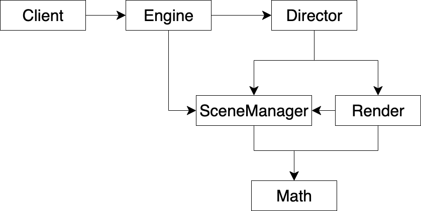
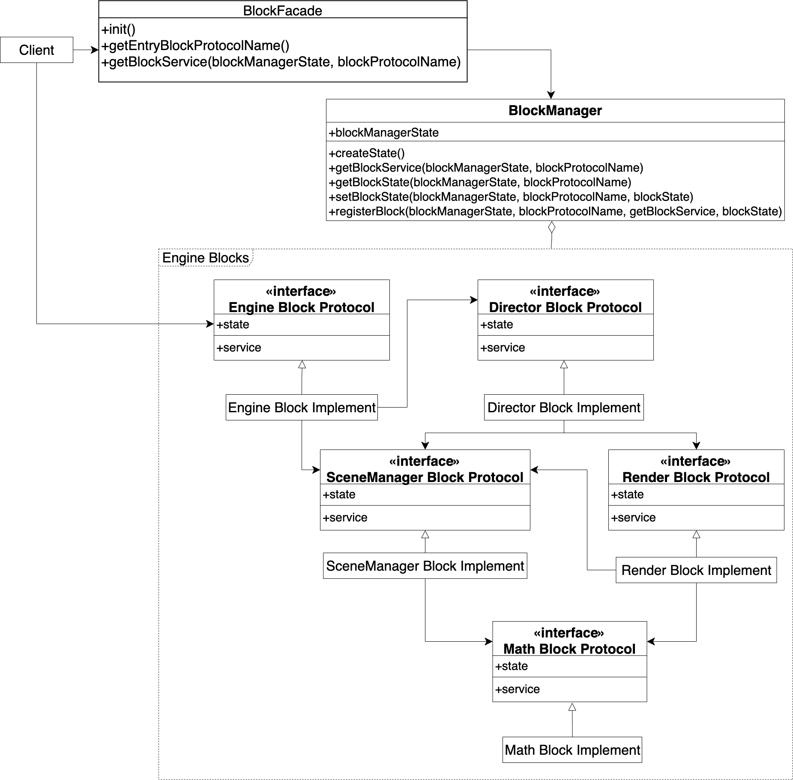
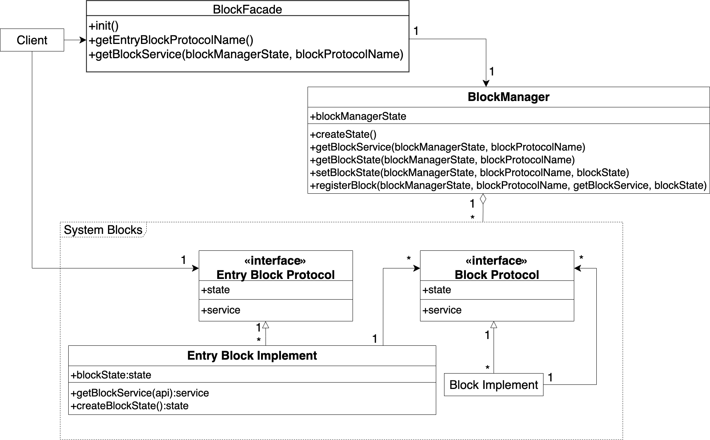

# 一个开发者开发引擎

## 需求

开发者甲要从零开始，开发一个引擎


## 实现思路

首先，甲实现了一个引擎的Demo，使用图形API绘制出了一个最简单的场景；然后，甲从Demo中提炼出了引擎的最基本的框架，实现了初始化、主循环这两个步骤


## 给出UML

**领域模型**


总体来看，领域模型分为用户、引擎这两个部分

我们看下用户这个部分：

Client是用户


我们看下引擎这个部分：

Engine是引擎的入口模块，提供API给Client

Director负责初始化和主循环


## 给出代码

首先，我们依次看下每个模块的代码，它们包括：

- Client的代码；
- Engine和Director的代码；

最后，我们运行Client的代码


### Client的代码

Client
```ts
Engine.DirectorAPI.init()
Engine.DirectorAPI.loop()
```

我们通过Engine的API来调用了Director的init和loop函数，实现引擎的初始化和主循环


### Engine和Director的代码

Engine
```ts
export let DirectorAPI = {
    init: Director.init,
    loop: Director.loop
}
```

Director
```ts
export let init = () => {
    console.log("初始化")
}

export let loop = () => {
    console.log("主循环")
}
```

### 运行Client的代码

下面，我们运行Client的代码，打印的结果如下：
```js
初始化
主循环
```


<!-- ## 提出问题 -->


# 加入更多的开发者一起开发引擎


## 概述解决方案

为了加快开发进度，甲找了另外三个开发者乙、丙、丁一起来开发引擎。他们的分工如下：

- 甲继续开发Engine和Director；
- 乙负责实现实现一个数学库，实现矩阵计算之类的数学计算逻辑；
- 丙负责实现场景的管理；
- 丁负责实现渲染


## 给出UML
**领域模型**




总体来看，领域模型分为用户、引擎这两个部分

我们看下用户这个部分：

Client是用户


我们看下引擎这个部分：

Engine和Director的职责跟之前一样，并且由甲继续开发

我们介绍新加入的引擎模块，他们由分别由一个新的开发者负责开发：

- SceneManager负责场景的管理，由丙负责开发
- Render负责渲染，由丁负责开发
- Math负责数学计算，由乙负责开发


<!-- **依赖关系** -->
我们来看下依赖关系：

Engine依赖Director、SceneManager，封装它们来提供初始化、主循环和管理场景的API

Director依赖SceneManager、Render，在初始化时分别通过它们来初始化场景和初始化渲染，在主循环时分别通过它们来更新场景和渲染

Render依赖SceneManager，在渲染时通过它获得场景数据

SceneManager、Render依赖Math，通过它来进行数学计算


<!-- ## 结合UML图，描述如何具体地解决问题 -->


## 给出代码

首先，我们看下Client的代码

然后，我们看下Engine的代码

然后，我们依次看下Client代码中每个步骤的代码，它们包括：

- 创建EngineState的代码
- 创建场景的代码
- 初始化的代码
- 主循环的代码

最后，我们运行Client的代码


### Client的代码


Client
```ts
let state = Engine.DirectorAPI.createState()

state = Engine.SceneAPI.createScene(state)

state = Engine.DirectorAPI.init(state)

Engine.DirectorAPI.loop(state)
```

Client首先创建了EngineState，用来保存引擎的所有数据；然后创建了场景；然后初始化；最后主循环


### Engine的代码

Engine
```ts
export let DirectorAPI = {
    createState: Director.createState,
    init: Director.init,
    loop: Director.loop
}

export let SceneAPI = {
    createScene: SceneManager.createScene
}
```

Engine负责提供API给Client


### 创建EngineState的代码

Director
```ts
export let createState = (): state => {
    return {
        scene: SceneManager.createState()
    }
}
```
createState函数创建的EngineState保存了创建的SceneManagerState，其中SceneManagerState负责保存场景数据。我们看下创建SceneManagerState的代码：  
SceneManager
```ts
export let createState = (): sceneManagerState => {
    return { allGameObjects: [] }
}
```

createState函数创建了SceneManagerState，它包括保存场景中所有的gameObject的容器
<!-- 目前它的值是空数组，表示场景中目前没有gameObject -->


### 创建场景的代码

SceneManager
```ts
export let createScene = (state: state) => {
    console.log("创建场景")

    //创建一个假的gameObject
    let sceneGameObject = 1

    return {
        ...state,
        scene: {
            ...state.scene,
            //通过concat而不是push来加入，保持immutable
            allGameObjects: state.scene.allGameObjects.concat([sceneGameObject])
        }
    }
}
```

createScene函数创建了场景，场景中只有一个gameObject。这里具体是创建了一个假的gameObject，并将其加入到SceneManagerState的allGameObjects中


### 初始化的代码

Director
```ts
export let init = (state) => {
    state = SceneManager.init(state)
    state = Render.init(state)

    return state
}
```

init函数实现了初始化，调用了SceneManager的init函数来初始化场景，以及调用了Render的init函数来初始化渲染。我们看下相关代码：  
SceneManager
```ts
export let init = (state: state) => {
    console.log("初始化场景")

    return state
}
```
Render
```ts
export let init = (state: state) => {
    console.log("初始化渲染")

    return state
}
```


### 主循环的代码

Director
```ts
//假实现
let requestAnimationFrame = (func) => {
}

export let loop = (state: state) => {
    state = SceneManager.update(state)
    state = Render.render(state)

    requestAnimationFrame(
        (time) => {
            loop(state)
        }
    )
}
```

loop函数实现了主循环，调用了SceneManager的update函数来更新场景，以及调用了Render的render函数来渲染。我们看下更新场景的相关代码：  
SceneManager
```ts
export let update = (state: state) => {
    console.log("更新场景")

    let _ = Math.multiplyMatrix(1, 2)

    return state
}
```
Math
```ts
export let multiplyMatrix = (mat1, mat2) => {
    console.log("计算")

    return 1
}
```

SceneManager的update函数实现了更新场景，调用了Math的multiplyMatrix函数来计算


我们看下渲染的相关代码：  
Render
```ts
export let render = (state: state) => {
    let allGameObjects = SceneManager.getAllGameObjects(state)

    console.log("处理场景数据")

    let _ = Math.multiplyMatrix(1, 2)

    console.log("渲染")

    return state
}
```
SceneManager
```ts
export let getAllGameObjects = (state: state) => {
    return state.scene.allGameObjects
}
```

Render的render函数实现了渲染，调用了SceneManger的getAllGameObjects函数来获得场景中所有的gameObjects，以及调用了Math的multiplyMatrix函数来计算


### 运行Client的代码

下面，我们运行Client的代码，打印的结果如下：
```js
创建场景
//初始化
初始化场景
初始化渲染
//主循环
更新场景
计算
处理场景数据
计算
渲染
```


## 提出问题

- 模块之间互相依赖，导致团队开发效率的降低和沟通成本的增加  
因为这四个开发者实现的模块互相依赖，所以可能会出现下面的情况：  

    - 一个开发者修改了自己的代码，如果该代码是被其它开发者实现的模块依赖，则会影响到它们  
    - 一个开发者可能需要修改其它开发者的代码，如实现Render的丁可能需要修改丙实现的SceneManager的代码，使其能提供某些特定的场景数据  

    这些情况都会造成在开发者合并自己的代码时出现大量的冲突

<!-- ，结果在合并代码时发现SceneManager提供的是其它的数据 -->


<!-- # [给出可能的改进方案，分析存在的问题]?


## 概述解决方案
## 给出UML
## 结合UML图，描述如何具体地解决问题
## 给出代码


## 提出问题 -->


# 使用积木模式来改进

## 概述解决方案


<!-- 通过下面的改进来降低模块之间的依赖： -->

<!-- - 降低模块之间的依赖 -->

<!-- 通过下面的改进来降低模块之间的依赖： -->
- 将每个模块改为一个独立的积木，互相之间只依赖于抽象的协议  
积木包括积木实现和积木协议两个部分，其中积木协议是接口，定义了积木的服务的类型和积木的数据的类型；积木实现是对积木协议的实现。  
积木的服务就是多个实现该积木的逻辑的函数；积木的数据是一个state，它保存了该积木所有的数据。  
每个积木之间依赖的是抽象的积木协议而不是具体的积木实现

- 大家首先一起定义好各个积木的协议，然后每个开发者只独立开发自己的积木实现，互相之间通过积木协议交互


## 给出UML


**领域模型**




总体来看，领域模型分为用户、BlockFacade、BlockManager、Engine Blocks这四个部分


我们看下用户这个部分：

Client是用户


我们看下BlockFacade、BlockManager这两个部分：

BlockFacade是门户，提供了管理积木的API，其中init函数负责注册所有使用的积木

BlockManager负责实现管理积木，提供了注册积木、获得积木的服务和state等函数。BlockManager有一个BlockManagerState，用来保存所有的积木


我们看下Engine Blocks这个部分：

整个引擎由积木组成，它们都在这个部分中。之前的各个引擎模块都对应地改为积木了，其中Engine改为Engine Block，Director改为Director Block，SceneManager改为SceneManager Block，Render改为Render Block，Math改为Math Block

积木包括积木实现和积木协议这两个部分，其中积木实现的模块名以“Implement”结尾，积木协议的模块名以“Protocol”结尾，如Engine Block Implement是积木实现，Engine Block Protocol是积木协议。积木实现是对积木协议的实现，如Engine Block Implement实现了Engine Block Protocol。各个积木实现的逻辑不变，仍然是之前的引擎模块的逻辑。积木协议的state定义了积木的数据的类型，积木协议的service定义了积木的服务的类型

在所有的积木中，需要定义一个积木作为入口。入口积木向Client提供了调用其它积木的API。Engine Block就是入口积木，其中Engine Block Implement是入口积木的积木实现，Engine Block Protocol是入口积木的积木协议。Client调用入口积木的步骤如下：  
1.Client调用BlockFacade的getEntryBlockProtocolName函数来获得入口积木的积木协议名  
2.将其传给BlockFacade的getBlockService函数来获得入口积木的服务，从而使用它提供的API


<!-- **依赖关系** -->
我们来看下依赖关系：

各个积木实现之间没有直接依赖，而是依赖抽象的积木协议，如Engine Block Implement没有依赖Director Block Implement，而是依赖它实现的积木协议：Directo Block Protocol


## 结合UML图，描述如何具体地解决问题

- 因为不同积木之间只依赖于积木协议，所以只要积木协议不修改，积木之间就不会互相影响。因此每个开发者只需要关注自己开发的积木实现，互相不影响，从而提升了团队的开发效率，降低了团队的沟通成本


## 给出代码


首先，我们看下Client的代码  
然后，我们看下Client的代码中第一个步骤的代码：

- 初始化积木的代码  
然后，我们看下初始化积木中每个步骤的相关代码，它们包括：

    - 创建BlockManagerState的代码
    - BlockManager的registerBlock函数的相关代码
    - 积木实现的三个函数的代码

然后，我们继续看下Client的代码中剩余的每个步骤的代码，它们包括：

- 获得入口积木的服务的代码
- 创建场景的代码
- 初始化的代码
- 主循环的代码

最后，我们运行Client的代码


### Client的代码

Client
```ts
let blockManagerState = BlockFacade.init()

//获得了入口积木（Engine Block）的服务
let { director, scene } = BlockFacade.getBlockService<service>(blockManagerState, BlockFacade.getEntryBlockProtocolName())

blockManagerState = scene.createScene(blockManagerState)

blockManagerState = director.init(blockManagerState)

director.loop(blockManagerState)
```

Client首先调用BlockFacade的init函数初始化积木；然后调用BlockFacade的getEntryBlockProtocolName函数来获得入口积木的积木协议（Engine Block Protocol）的协议名，将其传给BlockFacade的getBlockService函数来获得入口积木（Engine Block）的服务；然后调用服务的scene的createScene函数，创建了场景；然后调用服务的director的init函数，实现初始化；最后调用服务的director的loop函数，实现主循环

### 初始化积木的代码

BlockFacade
```ts
export let init = (): blockManagerState => {
    let blockManagerState = BlockManager.createState()

    blockManagerState = BlockManager.registerBlock(
        blockManagerState,
        "engine_block_protocol",
        EngineBlockImplement.getBlockService,
        EngineBlockImplement.getDependentBlockProtocolNameMap(),
        EngineBlockImplement.createBlockState()
    )
    blockManagerState = BlockManager.registerBlock(
        blockManagerState,
        "director_block_protocol",
        DirectorBlockImplement.getBlockService,
        DirectorBlockImplement.getDependentBlockProtocolNameMap(),
        DirectorBlockImplement.createBlockState()
    )
    blockManagerState = BlockManager.registerBlock(
        blockManagerState,
        "sceneManager_block_protocol",
        SceneManagerBlockImplement.getBlockService,
        SceneManagerBlockImplement.getDependentBlockProtocolNameMap(),
        SceneManagerBlockImplement.createBlockState()
    )
    blockManagerState = BlockManager.registerBlock(
        blockManagerState,
        "render_block_protocol",
        RenderBlockImplement.getBlockService,
        RenderBlockImplement.getDependentBlockProtocolNameMap(),
        RenderBlockImplement.createBlockState()
    )
    blockManagerState = BlockManager.registerBlock(
        blockManagerState,
        "math_block_protocol",
        MathBlockImplement.getBlockService,
        MathBlockImplement.getDependentBlockProtocolNameMap(),
        MathBlockImplement.createBlockState()
    )

    return blockManagerState
}
```

init函数实现了初始化积木，它首先调用BlockManager的createState函数创建BlockManagerState；然后多次调用BlockManager的registerBlock函数，注册了Engine Blocks中所有的积木。其中，在调用BlockManager的registerBlock函数时传入了BlockManagerState、积木协议名、获得积木的服务的函数、积木依赖的所有积木协议名、积木的state


### 创建BlockManagerState的代码


BlockManager
```ts
export let createState = (): blockManagerState => {
    return {
        blockServiceMap: Map(),
        blockStateMap: Map()
    }
}
```

createState函数创建了BlockManagerState，它包括一个保存所有积木的服务的Hash Map和一个保存所有积木的state的Hash Map，它们的Key是积木协议名，Value分别是积木的服务和积木的state


### BlockManager的registerBlock函数的相关代码

BlockManager
```ts
export let getBlockServiceExn = <blockService>(blockManagerState: blockManagerState, blockProtocolName: blockProtocolName): blockService => {
    return getExnFromStrictUndefined(blockManagerState.blockServiceMap.get(blockProtocolName))
}

export let getBlockStateExn = <blockState>(blockManagerState: blockManagerState, blockProtocolName: blockProtocolName): blockState => {
    return getExnFromStrictUndefined(blockManagerState.blockStateMap.get(blockProtocolName))
}

export let setBlockState = <blockState>(blockManagerState: blockManagerState, blockProtocolName: blockProtocolName, blockState: blockState): blockManagerState => {
    return {
        ...blockManagerState,
        blockStateMap: blockManagerState.blockStateMap.set(blockProtocolName, blockState)
    }
}

let _buildAPI = (): api => {
    return {
        getBlockService: getBlockServiceExn,
        getBlockState: getBlockStateExn,
        setBlockState: setBlockState,
    }
}

export let registerBlock = <blockService, dependentBlockProtocolNameMap, blockState>(blockManagerState: blockManagerState, blockProtocolName: blockProtocolName, getBlockService: getBlockService<dependentBlockProtocolNameMap, blockService>,
    dependentBlockProtocolNameMap: dependentBlockProtocolNameMap,
    blockState: blockState
): blockManagerState => {
    blockManagerState = {
        ...blockManagerState,
        blockServiceMap: blockManagerState.blockServiceMap.set(blockProtocolName, getBlockService(
            _buildAPI(),
            dependentBlockProtocolNameMap
        ))
    }

    blockManagerState = setBlockState(blockManagerState, blockProtocolName, blockState)

    return blockManagerState
}
```

registerBlock函数实现了注册积木，它首先通过传入的getBlockService函数获得积木的服务，将其保存在BlockManagerState的blockServiceMap中；最后将传入的积木的state保存在BlockManagerState的blockStateMap中

<!-- 值得注意的是： -->
registerBlock函数在调用传入的getBlockService函数时，注入了_buildAPI函数构造的BlockManager的api和积木依赖的所有积木协议名，从而使得该积木能在它的服务中通过它们来调用依赖的其它积木的服务和state，如Engine Block能通过它们调用SceneManagerBlock的服务和state


### 积木实现的三个函数的代码

BlockFacade的init函数在调用BlockManager的registerBlock函数注册积木时，调用了该积木的积木实现的三个函数：getBlockService、getDependentBlockProtocolNameMap、createBlockState。我们以Engine Block Implement为例，来看下它的三个函数的相关代码：  
Engine Block Implement
```ts
//获得积木的服务
export let getBlockService: ... = (api, { directorBlockProtocolName, sceneManagerBlockProtocolName }) => {
    //返回服务
	return {
		director: {
			init: (blockManagerState) => {
                ...
			},
			loop: (blockManagerState) => {
                ...
			}
		},
		scene: {
			createScene: (blockManagerState) => {
                ...
			}
		}
	}
}

//创建积木的state
export let createBlockState: ... = () => {
    //state为null
	return null
}

//获得依赖的所有积木协议名
//（因为Engine Block依赖DirectorBlockProtocol、SceneManagerProtocol，所以这里要给出它们的积木协议名)
export let getDependentBlockProtocolNameMap: ... = () => {
	return {
		"directorBlockProtocolName": "director_block_protocol",
		"sceneManagerBlockProtocolName": "sceneManager_block_protocol"
	}
}
```

getBlockService函数实现了Engine Block Protocol定义的服务。createBlockState函数创建了Engine Block Protocol定义的state，getDependentBlockProtocolNameMap函数获得了依赖的所有积木协议名。其中，getBlockService函数的形参是注入的BlockManager的api和积木依赖的所有积木协议名（也就是getDependentBlockProtocolNameMap函数的返回值）。我们看下Engine Block Protocol对应的代码：  
Engine Block Protocol->ServiceType
```ts
type directorAPI = {
	init: (blockManagerState: blockManagerState) => blockManagerState,
	loop: (blockManagerState: blockManagerState) => void,
}

type sceneAPI = {
	createScene: (blockManagerState: blockManagerState) => blockManagerState,
}

export type service = {
	director: directorAPI
	scene: sceneAPI
}
```
Engine Block Protocol->StateType
```ts
export type state = null
```
Engine Block Protocol在ServiceType.ts文件中定义了服务的类型，在StateType.ts文件中定义了state的类型


### 获得入口积木的服务的代码

Client调用了BlockFacade的函数，获得了入口积木的服务。我们看下BlockFacade的相关代码：  
BlockFacade
```ts
//获得Engine Block Protocol的协议名
export let getEntryBlockProtocolName = () => "engine_block_protocol"

...

export let getBlockService = <blockService>(blockManagerState: blockManagerState, blockProtocolName: blockProtocolName) => {
    return BlockManager.getBlockServiceExn<blockService>(blockManagerState, blockProtocolName)
}
```

BlockFacade的getBlockService函数通过BlockManager的getBlockServiceExn函数获得了注册的积木的服务。Client通过指定BlockFacade的getBlockService函数的形参blockProtocolName为Engine Block Protocol的协议名，从而获得了Engine Block的服务


### 创建场景的代码


Client调用了Engine Block的服务，创建了场景。我们看下Engine Block的相关代码：  
Engine Block Implement
```ts
export let getBlockService: ... = (api, { ..., sceneManagerBlockProtocolName }) => {
	return {
        ...
		scene: {
			createScene: (blockManagerState) => {
				//依赖于SceneManager Block Protocol来调用SceneManager Block的服务的createScene函数
				let { createScene } = api.getBlockService<sceneManagerService>(blockManagerState, sceneManagerBlockProtocolName)

				//因为createScene函数返回了新的SceneManager Block的state，所以调用BlockManager的api的setBlockState将其保存到BlockManagerState中，并返回新的BlockManagerState
				return api.setBlockState<sceneManagerState>(
					blockManagerState,
					sceneManagerBlockProtocolName,
					createScene(api.getBlockState<sceneManagerState>(blockManagerState, sceneManagerBlockProtocolName))
				)
			}
		}
	}
}
```

Engine Block的服务的scene的createScene函数调用了Scene Manager Block的服务和state来创建场景

值得注意的是：  
Engine Block Implement依赖Scene Manager Block的积木协议（SceneManager Block Protocol）而不是积木实现（Scene Manager Block Implement）。只要积木协议（SceneManager Block Protocol）不变，那么不管这个积木实现（SceneManager Block Implement）如何改变，都不会影响到Engine Block Implement

我们看下SceneManager Block的相关代码：  
SceneManager Block Implement
```ts
export let getBlockService: ... = (...) => {
	return {
		createScene: (sceneManagerState) => {
			console.log("创建场景")

			let sceneGameObject = 1

			return {
				...sceneManagerState,
				allGameObjects: sceneManagerState.allGameObjects.concat([sceneGameObject])
			}
		},
        ...
	}
}

export let createBlockState: ... = () => {
	return {
		allGameObjects: []
	}
}
```
SceneManager Block Protocol->ServiceType
```ts
export type service = {
	createScene: (sceneManagerState) => sceneManagerState,
    ...
}
```
SceneManager Block Protocol->StateType
```ts
type gameObject = any

export type allGameObjects = Array<gameObject>

export type state = {
    allGameObjects: allGameObjects
}
```

SceneManager Block的state和服务的逻辑分别跟之前的SceneManager模块的SceneManagerState和逻辑一样，没有变化


### 初始化的代码


<!-- 我们回到Client，继续看Client中初始化的代码： -->
<!-- Client
```ts
blockManagerState = director.init(blockManagerState)
``` -->

Client调用了Engine Block的服务，实现初始化。我们看下Engine Block的相关代码：  
Engine Block Implement
```ts
export let getBlockService: ... = (api, { directorBlockProtocolName, ... }) => {
	return {
		director: {
			init: (blockManagerState) => {
				//依赖于Director Block Protocol来调用Director Block的服务的init函数
				let { init } = api.getBlockService<directorService>(blockManagerState, directorBlockProtocolName)

				return init(blockManagerState)
			},
            ...
	}
}
```


Engine Block的服务的director的init函数调用了Director Block的服务来实现初始化。我们看下Director Block的相关代码：  
Director Block Implement
```ts
export let getBlockService: ... = (api, { sceneManagerBlockProtocolName, renderBlockProtocolName }) => {
	return {
		init: (blockManagerState) => {
			//依赖于SceneManager Block Protocol来调用SceneManager Block的服务的init函数
			let sceneManagerService = api.getBlockService<sceneManagerService>(blockManagerState, sceneManagerBlockProtocolName)

			blockManagerState = sceneManagerService.init(blockManagerState)

			//依赖于Render Block Protocol来调用Render Block的服务的init函数
			let renderService = api.getBlockService<renderService>(blockManagerState, renderBlockProtocolName)

			blockManagerState = renderService.init(blockManagerState)

			return blockManagerState
		},
        ...
    }
}

export let createBlockState: ... = () => {
	return null
}

export let getDependentBlockProtocolNameMap: ... = () => {
	return {
		"sceneManagerBlockProtocolName": "sceneManager_block_protocol",
		"renderBlockProtocolName": "render_block_protocol"
	}
}
```
Director Block Protocol->ServiceType
```ts
export type service = {
	init: (blockManagerState: blockManagerState) => blockManagerState,
	...
}
```
Director Block Protocol->StateType
```ts
export type state = null
```

Director Block的服务的init函数调用了SceneManager Block和Render Block的服务，相关代码如下：  
SceneManager Block Implement
```ts
export let getBlockService: ... = (...) => {
	return {
        ...
		init: (blockManagerState) => {
			console.log("初始化场景")

			return blockManagerState
		},
        ...
	}
}
```
SceneManager Block Protocol->ServiceType
```ts
export type service = {
    ...
	init: (blockManagerState: blockManagerState) => blockManagerState,
    ...
}
```
Render Block Implement
```ts
export let getBlockService: ... = (...) => {
	return {
		init: (blockManagerState) => {
			console.log("初始化渲染")

			return blockManagerState
		},
        ...
    }
}
```
Render Block Protocol->ServiceType
```ts
export type service = {
	init: (blockManagerState: blockManagerState) => blockManagerState,
    ...
}
```


同样的，Director Block的服务、SceneManager Block的服务、Render Block服务的逻辑跟之前的SceneManager、Render模块的逻辑一样，没有变化。不过Director Block的state变为null了


### 主循环的代码


<!-- 我们回到Client，继续看Client中主循环的代码：
Client
```ts
director.loop(blockManagerState)
``` -->

Client调用了Engine Block的服务，实现主循环。我们看下Engine Block的相关代码：  
Engine Block Implement
```ts
export let getBlockService: ... = (api, { directorBlockProtocolName, ... }) => {
	return {
		director: {
            ...
			loop: (blockManagerState) => {
				//依赖于Director Block Protocol来调用Director Block的服务的loop函数
				let { loop } = api.getBlockService<directorService>(blockManagerState, directorBlockProtocolName)

				return loop(blockManagerState)
			}
        }
	}
}
```


Engine Block的服务的director的loop函数调用了Director Block的服务来实现主循环。我们看下Director Block的相关代码：  
Director Block Implement
```ts
//假实现
let requestAnimationFrame = (func) => {
}

let _loop = (api: api, blockManagerState: blockManagerState, sceneManagerBlockProtocolName: blockProtocolName, renderBlockProtocolName: blockProtocolName) => {
	//依赖于SceneManager Block Protocol来调用SceneManager Block的服务的update函数
	let sceneManagerService = api.getBlockService<sceneManagerService>(blockManagerState, sceneManagerBlockProtocolName)

	blockManagerState = sceneManagerService.update(blockManagerState)

	//依赖于Render Block Protocol来调用Render Block的服务的render函数
	let renderService = api.getBlockService<renderService>(blockManagerState, renderBlockProtocolName)

	blockManagerState = renderService.render(blockManagerState)

	requestAnimationFrame(
		(time) => {
			_loop(api, blockManagerState, sceneManagerBlockProtocolName, renderBlockProtocolName)
		}
	)
}

export let getBlockService: ... = (api, { sceneManagerBlockProtocolName, renderBlockProtocolName }) => {
	return {
        ...
		loop: (blockManagerState) => {
			_loop(api, blockManagerState, sceneManagerBlockProtocolName, renderBlockProtocolName)
		},
	}
}
```
Director Block Protocol->ServiceType
```ts
export type service = {
	...
	loop: (blockManagerState: blockManagerState) => void,
}
```

Director Block的服务的loop函数调用了SceneManager Block和Render Block的服务，相关代码如下：  
SceneManager Block Implement
```ts
export let getBlockService: ... = (api, { mathBlockProtocolName }) => {
	return {
        ...
		getAllGameObjects: (sceneManagerState) => {
			return sceneManagerState.allGameObjects
		},
        ...
		update: (blockManagerState) => {
			console.log("更新场景")

			//依赖于Math Block Protocol来调用Math Block的服务的multiplyMatrix函数
			let { multiplyMatrix } = api.getBlockService<mathService>(blockManagerState, mathBlockProtocolName)

			let _ = multiplyMatrix(1, 2)

			return blockManagerState
		}
	}
}

export let getDependentBlockProtocolNameMap: ... = () => {
	return {
		"mathBlockProtocolName": "math_block_protocol"
	}
}
```
SceneManager Block Protocol->ServiceType
```ts
export type service = {
    ...
	getAllGameObjects: (sceneManagerState) => allGameObjects,
	...
	update: (blockManagerState: blockManagerState) => blockManagerState,
    ...
}
```
Render Block
```ts
export let getBlockService: ... = (api, { sceneManagerBlockProtocolName, mathBlockProtocolName }) => {
	return {
        ...
		render: (blockManagerState) => {
			//依赖于SceneManager Block Protocol来调用SceneManager Block的服务的getAllGameObjects函数
			let { getAllGameObjects } = api.getBlockService<sceneManagerService>(blockManagerState, sceneManagerBlockProtocolName)

			let allGameObjects = getAllGameObjects(api.getBlockState<sceneManagerState>(blockManagerState, sceneManagerBlockProtocolName))

			console.log("处理场景数据")

			//依赖于Math Block Protocol来调用Math Block的服务的multiplyMatrix函数
			let { multiplyMatrix } = api.getBlockService<mathService>(blockManagerState, mathBlockProtocolName)

			let _ = multiplyMatrix(1, 2)

			console.log("渲染")

			return blockManagerState
		}
	}
}
```
SceneManager Block的服务的update函数和Render Block的服务的render函数调用了Math Block的服务，相关代码如下：  
Math Block Implement
```ts
export let getBlockService: ... = (...) => {
	return {
		multiplyMatrix: (mat1, mat2) => {
			console.log("计算")

			return 1
		}
	}
}

export let createBlockState: ... = () => {
	return null
}

export let getDependentBlockProtocolNameMap: ... = () => {
    //没有依赖
	return {
	}
}
```
Math Block Protocol->ServiceType
```ts
type matrix = any

export type service = {
	multiplyMatrix: (mat1: matrix, mat2: matrix) => matrix,
}
```
Math Block Protocol->StateType
```ts
export type state = null
```


同样的，这几个Block的服务的逻辑跟之前对应的模块的逻辑一样，没有变化


### 运行Client的代码


我们运行Client的代码，打印的结果跟之前一样


<!-- # 设计意图

阐明模式的设计目标 -->

# 定义

## 一句话定义

<!-- 通过搭建不同的积木来组装系统 -->
系统由积木搭建而成


## 补充说明

将系统的每个模块离散化为一个积木

积木之间依赖于抽象的协议而不是具体的实现


## 通用UML
**领域模型**




<!-- ## 分析角色 -->


<!-- 我们来看看模式的相关角色： -->


总体来看，领域模型分为用户、BlockFacade、BlockManager、System Blocks四个部分


我们看下用户这个部分：

- Client  
该角色是用户


我们看下BlockFacade、BlockManager这两个部分：

- BlockFacade  
该角色是门户，提供了管理积木的API，其中init函数负责注册所有使用的积木

- BlockManager  
该角色负责实现管理积木，提供了注册积木、获得积木的服务和state等函数。该角色有一个BlockManagerState，用来保存所有的积木


我们看下System Blocks这个部分：

整个系统由积木组成，它们都在这个部分中

- Entry Block Protocol  
该角色为入口积木的积木协议，它的state定义了积木的数据的类型，它的service定义了积木的服务的类型

- Entry Block Implement   
该角色为入口积木的积木实现，它有一个BlockState数据和3个函数，其中getBlockService函数返回了实现的服务，createBlockState函数创建了blockState，getDependentBlockProtocolNameMap函数返回了依赖的所有积木协议名

- Block Protocol  
该角色为其它积木的积木协议，它的成员跟Entry Block Protocol一样

- Block Implement  
该角色为其它积木的积木实现，它的成员跟Entry Block一样，图中省略了它们


**角色之间的关系**

- 一个积木包括积木实现和积木协议这两个部分

- System Blocks中有且只有一个入口积木

- 因为多个积木实现可以实现同一个积木协议，所以Entry Block Implement和Entry Block Protocol、Block Implement和Block Protocol都是多对一的关系


<!-- **依赖关系** -->

- 各个积木实现之间没有直接依赖，而是依赖抽象的积木协议

- 因为入口积木依赖多个其它积木，所以Entry Block Implement和Block Protocol是一对多的依赖关系

- 其它积木不能依赖入口积木

- 因为其它积木可以通过多个其它积木协议来依赖多个其它积木，所以Block Implement和Block Protocol是一对多的依赖关系

- 因为BlockManager通过registerBlock函数注册了多个积木，所以BlockManager与System Blocks中的积木是一对多的组合关系


## 角色的抽象代码

下面我们来看看各个角色的抽象代码：


我们依次看下领域模型中各个部分的抽象代码：

首先，我们看下Client的抽象代码  
然后，我们看下BlockFacade的抽象代码  
然后，我们看下BlockManager的抽象代码  
最后，我们看下System Blocks这个部分的抽象代码，它们包括：

- Entry Block Protocol的抽象代码
- Entry Block的抽象代码
- Block Protocol的抽象代码
- Block的抽象代码


### Client的抽象代码
Client
```ts
let blockManagerState = BlockFacade.init()

let entryBlockService = BlockFacade.getBlockService<service>(blockManagerState, BlockFacade.getEntryBlockProtocolName())

调用entryBlockService...
```

### BlockFacade的抽象代码
BlockFacade
```ts
export let init = (): blockManagerState => {
    let blockManagerState = BlockManager.createState()

    blockManagerState = BlockManager.registerBlock(
        blockManagerState,
        "entry_block_protocol",
        EntryBlock.getBlockService,
        EntryBlock.getDependentBlockProtocolNameMap(),
        EntryBlock.createBlockState()
    )

    blockManagerState = BlockManager.registerBlock(
        blockManagerState,
        "block1_protocol",
        Block1.getBlockService,
        Block1.getDependentBlockProtocolNameMap(),
        Block1.createBlockState()
    )
    注册更多的Block...

    return blockManagerState
}

export let getEntryBlockProtocolName = () => "entry_block_protocol"

export let getBlockService = <blockService>(blockManagerState: blockManagerState, blockProtocolName: blockProtocolName) => {
    return BlockManager.getBlockServiceExn<blockService>(blockManagerState, blockProtocolName)
}
```

### BlockManager的抽象代码
BlockManagerType
```ts
import type { Map } from "immutable";

export type blockName = string

export type blockProtocolName = string

export type blockService = any

export type blockState = any

export type dependentBlockProtocolNameMap = any

export type state = {
  blockServiceMap: Map<blockProtocolName, blockService>,
  blockStateMap: Map<blockProtocolName, blockState>
}

export type api = {
  getBlockService<blockService>(state: state, blockProtocolName: blockProtocolName): blockService,
  getBlockState<blockState>(state: state, blockProtocolName: blockProtocolName): blockState,
  setBlockState<blockState>(state: state, blockProtocolName: blockProtocolName, blockState: blockState): state
};

export type getBlockService<dependentBlockProtocolNameMap, blockService> = (api: api, dependentBlockProtocolNameMap: dependentBlockProtocolNameMap) => blockService;

export type createBlockState<blockState> = () => blockState;

export type getDependentBlockProtocolNameMap = () => any
```
BlockManager
```ts
import { state, blockProtocolName, getBlockService } from "./BlockManagerType"

export declare function createState(): state

export declare function getBlockServiceExn<blockService>(state: state, blockProtocolName: blockProtocolName): blockService

export declare function getBlockStateExn<blockState>(state: state, blockProtocolName: blockProtocolName): blockState

export declare function setBlockState<blockState>(state: state, blockProtocolName: blockProtocolName, blockState: blockState): state

export declare function registerBlock<blockService, dependentBlockProtocolNameMap, blockState>(state: state, blockProtocolName: blockProtocolName, getBlockService: getBlockService<dependentBlockProtocolNameMap, blockService>,
    dependentBlockProtocolNameMap: dependentBlockProtocolNameMap,
    blockState: blockState
): state
```

BlockManager的函数实现已经在之前的案例代码中给出了，这里只给出函数签名

### Entry Block Protocol的抽象代码
ServiceType
```ts
export type service = {
	...
}
```
StateType
```ts
export type state = ...
```
### Entry Block Implement的抽象代码
DependentMapType
```ts
export type dependentBlockProtocolNameMap = {
    block1ProtocolName: string,
    block2ProtocolName: string,
    ...
}
```
Entry Block Implement
```ts
export let getBlockService: BlockManagerType.getBlockService<
	DependentMapType.dependentBlockProtocolNameMap,
	EntryBlockProtocolServiceType.service
> = (api, { block1ProtocolName, block2ProtocolName, ... }) => {
	return {
		实现service...
	}
}

export let createBlockState: BlockManagerType.createBlockState<
	EntryBlockProtocolStateType.state
> = () => {
	return 创建blockState...
}

export let getDependentBlockProtocolNameMap: BlockManagerType.getDependentBlockProtocolNameMap = () => {
	return {
		"block1ProtocolName": "block1 protocol's package.json's name",
		"block2ProtocolName": "block2 protocol's package.json's name",
		...
	}
}
```

getBlockService函数的第二个形参的类型定义在DependentMapType的dependentBlockProtocolNameMap中


### Block Protocol的抽象代码
跟Entry Block Protocl的抽象代码一样，故省略

### Block Implement的抽象代码
跟Entry Block Implement的抽象代码一样，故省略


## 遵循的设计原则在UML中的体现

- 单一职责原则  
每个积木只做一件事情
- 合成复用原则  
系统组合了积木
- 依赖倒置原则  
各个积木实现之间没有直接依赖，而是依赖抽象的积木协议
- 接口隔离原则  
积木协议的state和service只定义了该积木的数据和服务的类型，没有定义其它积木的相关类型
- 最少知识原则  
各个积木协议相互独立，如Block Protocol和其它的Block Protocol之间没有依赖关系；各个积木实现相互独立，如Block Implement和其它的Block Implement之间没有依赖关系
- 开闭原则  
要增加系统的一个模块，只需要增加一个积木，并在BlockFacade的init函数中注册该积木即可，无需修改其它的积木


# 应用

## 优点

- 实现了可插拔架构，支持大型的开发团队  
因为每个开发者只独立地负责自己的积木，互相之间通过抽象的积木协议交互，所以只要积木协议设计得足够抽象，则可以任意插拔积木，显著降低了各个开发者之间的影响

- 可以按需打包使用的积木到build后的系统文件中，从而减小文件大小  
具体是在BlockFacade的init函数中通过import只引入需要使用的积木并注册，其它的积木则不需要引入进来。这样的话通过打包工具（如webpack）的tree shaking机制，即可只打包import进来的积木

- 测试方便  

    - 对于单个积木的单元测试：  
因为各个积木实现之间没有耦合，所以可以单独地对每个积木实现进行单元测试；  
对于积木实现之间通过依赖积木协议交互的代码，可以很容易地使用stub或者mock来构造依赖的积木协议的积木实现  
    - 对于涉及到多个积木的集成测试或者运行测试：  
开发单个积木的开发者可以在本地构造假的Client，并构造假的BlockFacade的init函数来引入和注册需要测试的多个积木；然后运行Client来测试


## 缺点

无


## 使用场景

### 场景描述

多人开发的大型系统

### 具体案例

- 多人开发的引擎  
引擎的动画、场景管理、模型加载、粒子、物理等各个模块都可以作为一个积木或者拆解为多个更小的积木。整个引擎可以完全由积木搭建而成，每个开发者负责一个积木的开发，这样相互的影响会降到最低


- 多人开发的编辑器  
编辑器的引擎、UI、撤销重做、导入导出、发布等各个模块都可以作为一个积木或者拆解为多个更小的积木。整个编辑器可以完全由积木搭建而成，每个开发者负责一个积木的开发，这样相互的影响会降到最低


## 注意事项

- 积木模式是影响全局架构的模式，最好在刚开始时就使用积木模式来设计整体架构

- 确保积木协议足够抽象，避免频繁改动


# 扩展

## 对于积木协议中定义的服务、state的类型，可以使用Dependent Type来加强类型约束，从而在编译期间尽量除错

因为Typescript部分地支持Dependent Type，所以使用它开发的积木协议可以加入Dependent Type


## 对积木本身进行扩展

有些积木本身需要进行扩展，如一个积木A有自己的数据，A提供了默认的方式来操作数据；而A的用户希望能够用自定义的方式来操作它的数据。实现的思路是将“默认的方式”和“自定义的方式”这两个方式作为对A的两个扩展，用户通过在注册A时指定使用哪个扩展，来实现使用哪种方式操作它的数据

积木应该有两种类型：默认类型、扩展类型。积木A属于“默认类型”的积木，它的两个扩展属于“扩展类型”的积木。属于“默认类型”的积木应该有数据，属于“扩展类型”的积木应该没有数据。具体来说：  
假设在开发编辑器时，编辑器使用了一个引擎积木。该积木维护所有的场景数据，实现了用默认的组件来操作场景数据。如果编辑器希望能够使用自定义的组件来操作它的场景数据，该如何实现？  
我们可以将积木分为两种类型的积木：Extension和Contribute。其中，Extension即是前面提到的“默认类型”的积木，Contribute即是前面提到的“扩展类型”的积木。Contribute是Extension的扩展。Extension有数据，Contribute没有数据。  
那么就可以实现一个Extension：Engine Extension，它是编辑器使用的引擎积木，负责维护所有的场景数据；实现两个Contribute：EngineSceneContribute1、EngineSceneContribute2，它们是对Engine Extension的扩展，其中前者使用默认的组件来操作Engine Extension的场景数据，后者使用自定义的组件来操作Engine Extension的场景数据。因为两者都是操作Engine Extension的场景数据，它们的接口应该相同，所以它们实现同一个积木协议。  
编辑器在注册Engine Extension积木时，可以通过指定注册其中一个Contribute，从而实现使用默认的组件或者自定义的组件来操作场景数据。  

首先，我们看下Extension和Contribute的参考代码：  
Engine Extension Implement
```ts
export let getExtensionService: BlockManagerType.getExtensionService<
    //将Engine Extension的DependentMapType拆分为DependentExtensionMapType、DependentContributeMapType
	EngineExtensionDependentExtensionMapType.dependentBlockProtocolNameMap,
	EngineExtensionDependentContributeMapType.dependentBlockProtocolNameMap,

    EngineExtensionProtocolServiceType.service
> = 
//第二个形参改为一个2元Tuple了，包括依赖的所有Extension协议名、依赖的所有Contribute协议名
(api, [{ extension1ProtocolName, ...}, { engineSceneContributeProtocolName }]) => {
    return {
        operateScene: (blockManagerState) => {
			//依赖于Contribute的积木协议来调用Contribute的积木实现（可能是EngineSceneContribute1或者EngineSceneContribute2）的服务
            let { operate } = api.getContribute<EngineSceneContributeProtocolServiceType.service>(blockManagerState, engineSceneContributeProtocolName)

            //操作场景数据
            operate(xxx)

            ...
        }
	}
}

export let createExtensionState: BlockManagerType.createExtensionState<
    EngineExtensionProtocolStateType.state
> = () => {
	return {
        创建初始的场景数据...
    }
}

//获得依赖的所有Extension协议名
export let getDependentExtensionProtocolNameMap: BlockManagerType.getDependentExtensionProtocolNameMap = () => {
	return {
		"extension1ProtocolName": "xxx",
        ...
	}
}

//获得依赖的所有Contribute协议名
export let getDependentContributeProtocolNameMap: BlockManagerType.getDependentContributeProtocolNameMap = () => {
    //因为两个Contribute都实现了名为engine_scene_contribute_protocol的同一个积木协议，所以这里只有一个Contribute协议名
	return {
		"engineSceneContributeProtocolName": "engine_scene_contribute_protocol",
	}
}
```
Engine Extension Implement->DependentExtensionMapType
```ts
export type dependentBlockProtocolNameMap = {
    extension1ProtocolName: string,
    ...
}
```
Engine Extension Implement->DependentContributeMapType
```ts
export type dependentBlockProtocolNameMap = {
    engineSceneContributeProtocolName: string
}
```
EngineSceneContribute1 Implement
```ts
export let getContributeService: BlockManagerType.getContributeService<
	EngineSceneContribute1DependentExtensionMapType.dependentBlockProtocolNameMap,
	EngineSceneContribute1DependentContributeMapType.dependentBlockProtocolNameMap,
    EngineSceneContributeProtocolServiceType.service
> = (api, [{...}, {...}]) => {
    return {
        operate: (...) => {
            使用默认的组件操作场景数据...
        }
	}
}

export let getDependentExtensionProtocolNameMap: BlockManagerType.getDependentExtensionProtocolNameMap = () => {
	return {
        ...
	}
}

export let getDependentContributeProtocolNameMap: BlockManagerType.getDependentContributeProtocolNameMap = () => {
	return {
        ...
	}
}

//因为没有数据，所以没有create block state函数
```
EngineSceneContribute2 Implement
```ts
export let getContributeService: BlockManagerType.getContributeService<
	EngineSceneContribute2DependentExtensionMapType.dependentBlockProtocolNameMap,
	EngineSceneContribute2DependentContributeMapType.dependentBlockProtocolNameMap,
    EngineSceneContributeProtocolServiceType.service
> = (api, [{...}, {...}]) => {
    return {
        operate: (...) => {
            使用自定义的组件操作场景数据...
        }
	}
}

export let getDependentExtensionProtocolNameMap: BlockManagerType.getDependentExtensionProtocolNameMap = () => {
	return {
        ...
	}
}

export let getDependentContributeProtocolNameMap: BlockManagerType.getDependentContributeProtocolNameMap = () => {
	return {
        ...
	}
}

//因为没有数据，所以没有create block state函数
```

这里省略了积木协议以及EngineSceneContribute1、EngineSceneContribute2的DependentExtensionMapType、DependentContributeMapType的代码


然后，我们看下在BlockFacade的init函数中注册Engine Extension和需要的Contribute的参考代码：  
BlockFacade
```ts
export let init = (): blockManagerState => {
    ...

    //注册Engine Extension积木
    blockManagerState = BlockManager.registerExtensionBlock(
        blockManagerState,
        "engine_extension_protocol",
        EngineExtension.getExtensionService,
        EngineExtension.getDependentExtensionProtocolNameMap(),
        EngineExtension.getDependentContributeProtocolNameMap(),
        EngineExtension.createExtensionState()
    )

    //注册EngineSceneContribute1或者EngineSceneContribute2积木
    blockManagerState = BlockManager.registerContributeBlock(
        blockManagerState,
        //因为两者实现同一个积木协议，所以积木协议名是同一个
        "engine_scene_contribute_protocol",
        //选择EngineSceneContribute1或者EngineSceneContribute2

        (EngineSceneContribute1 或者 EngineSceneContribute2).getContributeService,
        (EngineSceneContribute1 或者 EngineSceneContribute2).getDependentExtensionProtocolNameMap(),
        (EngineSceneContribute1 或者 EngineSceneContribute2).getDependentContributeProtocolNameMap()
    )
    ...
}
```


## 积木加入钩子函数

积木可以加入钩子函数，从而在不同的时机执行对应的钩子函数，实现对积木生命周期的控制。如积木可以加入onRegister钩子函数，它在注册该积木时被执行。积木的参考代码如下：  
Block Implement
```ts
//加入getBlockLife函数
export let getBlockLife: BlockManagerType.getBlockLife<BlockProtocolServiceType.service> = (api, blockProtocolName) => {
    //返回积木的生命周期数据，包括了钩子函数
	return {
		onRegister: (blockManagerState, service) => {
			console.log("register!")

			return blockManagerState
		}
	}
}
```

BlockManagerType增加下面的类型定义：  
BlockManagerType
```ts
type blockLife<blockService> = {
	onRegister?: (state: state, blockService: blockService) => state,
}

export type getBlockLife<blockService> = (api: api, blockProtocolName: blockProtocolName) => blockLife<blockService>
```

BlockManager的registerBlock函数在注册了积木后，需要执行该积木的生命周期数据中的onRegister函数


<!-- # 结合其它模式

## 结合哪些模式？
## 使用场景是什么？
## UML如何变化？
## 代码如何变化？ -->


# 最佳实践

<!-- ## 结合具体项目实践经验，如何应用模式来改进项目？ -->
## 哪些场景不需要使用模式

如果系统的规模较小，或者系统的开发者人数较少，那么就不需要积木模式

<!-- ## 哪些场景需要使用模式？ -->
## 给出具体的实践案例


### monorepo

每个积木实现以及积木协议都可以作为一个单独的项目。如果使用monorepo来管理一个系统的开发，那么整个系统就是一个大的项目，该项目中有很多个独立的package，其中每个积木实现以及积木协议都是一个package。可以使用lerna来管理monorepo


<!-- - 开发流程


TODO 开发流程：
划分积木
    服务
    数据
协议
开发
测试

由架构师带着所有开发者一起确定了各个积木协议后，就可以由每个开发者具体开发一个积木实现

 -->


# 更多资料推荐

我开发的Meta3D使用了积木模式来设计整体架构。Meta3D是开源的Web3D低代码开发平台，用来开发Web3D引擎和编辑器。可以在网上搜索“Meta3D Github”来找到Github Repo


可以在网上搜索“dependent type typescript”来找到在Typescript使用Dependent Type的资料


可以在网上搜索“lerna”来找到lerna的资料