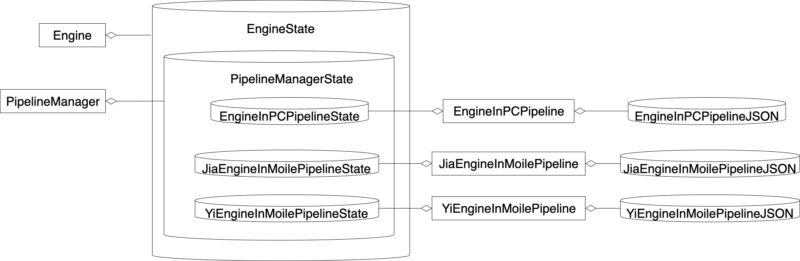

# 在一个模块中实现两个运行环境的逻辑

## 需求

开发者甲要实现引擎的渲染，并使其能够同时运行在PC端和移动端。两个运行环境的差异如下所示：

- PC端支持WebGL2，移动端只支持WebGL1
- PC端可以使用延迟渲染的算法来渲染，移动端因为不支持multi render targets，所以只能使用前向渲染的算法来渲染


## 实现思路

引擎需要实现初始化、渲染这两个逻辑，其中初始化可分解为初始化WebGL这一个步骤，渲染可分解为渲染、Tonemap后处理这两个步骤

处理运行环境的差异的思路是在每个步骤中判断运行环境，进行对应的处理，具体如下：

- 在“初始化WebGL”中判断运行环境，如果是PC端就获得WebGL2的上下文，否则就获得WebGL1的上下文
- 在“渲染”中判断运行环境，如果是PC端就使用延迟渲染算法，否则就使用前向渲染算法
- 在“Tonemap”中判断运行环境，如果是PC端就使用WebGL2的上下文，否则就使用WebGL1的上下文


## 给出UML


**领域模型**


总体来看，领域模型分为用户、Engine这两个部分

我们来看下用户这个部分：

Client是用户


我们来看下Engine这个部分：

Engine是引擎，负责初始化和渲染。Engine有一个EngineState数据，用来保存引擎的所有数据。Engine的createState函数实现创建EngineState，Engine的init函数实现初始化，Engine的render函数实现渲染


## 给出代码

首先，我们依次看下每个模块的代码，它们包括：

- Client的代码；
- Engine的代码；

最后，我们运行Client的代码

### Client的代码

Client
```ts
//构造假canvas
let canvas = {
    getContext: (_) => 1 as any
}

//此处设置运行环境为PC端
//也可以通过设置为false来设置运行环境为移动端 
globalThis.isPC = true

let state = Engine.createState()

state = Engine.init(state, canvas)
state = Engine.render(state)
```

Client首先调用createState函数创建了引擎的EngineState；然后调用init函数进行初始化；最后调用render函数进行渲染


### Engine的代码

EngineStateType
```ts
export type state = {
    gl: WebGLRenderingContext | WebGL2RenderingContext | null
}
```
EngineStateType定义了EngineState的类型，其中gl字段保存了WebGL上下文。因为它可能是WebGL1或者WebGL2的上下文，所以gl的类型也是这两个类型的联合类型


Engine
```ts
let _isPC = () => {
    return globalThis.isPC
}

let _initWebGL = (state, canvas) => {
    let gl = null

    if (_isPC()) {
        gl = canvas.getContext("webgl2")
    }
    else {
        gl = canvas.getContext("webgl1")
    }

    return {
        ...state,
        gl: gl
    }
}

let _render = (state) => {
    if (_isPC()) {
        let gl = getExnFromStrictNull(state.gl) as WebGL2RenderingContext

        console.log("延迟渲染")
    }
    else {
        let gl = getExnFromStrictNull(state.gl) as WebGLRenderingContext

        console.log("前向渲染")
    }

    return state
}

let _tonemap = (state) => {
    let gl = null

    if (_isPC()) {
        gl = getExnFromStrictNull(state.gl) as WebGL2RenderingContext
    }
    else {
        gl = getExnFromStrictNull(state.gl) as WebGLRenderingContext
    }

    console.log("tonemap")

    return state
}

export let createState = (): state => {
    return {
        gl: null
    }
}

export let init = (state: state, canvas) => {
    console.log(globalThis.isPC ? "is PC" : "is mobile")

    state = _initWebGL(state, canvas)

    return state
}

export let render = (state: state) => {
    state = _render(state)
    state = _tonemap(state)

    return state
}
```

初始化的“初始化WebGL”步骤在_initWebGL这个函数中实现，渲染的“渲染”、“Tonemap后处理”这两个步骤分别在_render、_tonemap这两个函数中实现。每个步骤都判断了运行环境，执行对应的逻辑


### 运行Client的代码

下面，我们运行Client的代码，打印的结果如下：
```js
is PC
初始化WebGL2
延迟渲染
tonemap for WebGL2
```

因为这里指定环境为PC端，所以执行的是PC端的逻辑


## 提出问题

为了加快开发进度，甲找到了开发者乙来一起开发，其中甲负责PC端的所有步骤和移动端的“初始化WebGL”、“前向渲染”这两个步骤，乙负责移动端的“Tonemap后处理”这个步骤。

在开发过程中，遇到了下面的问题：

- 开发效率低  
由于两个运行环境的逻辑混杂在同一个模块的同一个函数中，导致两个开发者在开发时相互影响，导致容易出现代码冲突，最终使得整体的开发效率逐渐变慢


# 拆分模块


## 概述解决方案

- 分离PC端和移动端的逻辑为不同的模块  
从Engine中提出两个模块：EngineInPC、EngineInMobile，分别实现PC端和移动端的逻辑；然后在Engine中判断运行环境，调用对应的模块

- 将每个步骤提出成单独的模块，这样可减少步骤之间的耦合，便于维护


## 给出UML

**领域模型**


总体来看，领域模型分为用户、Engine、针对每个运行环境的引擎实现、步骤这四个部分


我们看下用户、Engine这两个部分：

Client是用户

Engine是引擎门户，负责判断运行环境，调用对应的模块


我们看下针对每个运行环境的引擎实现这个部分：

EngineInPC负责PC端的引擎实现

EngineInMobile负责移动端的引擎实现


我们看下步骤这个部分：

EngineInPC的步骤模块如下：

- InitWebGL2负责初始化WebGL2
- DeferRender负责延迟渲染
- TonemapForWebGL2负责使用WebGL2实现Tonemap后处理

EngineInMobile的步骤模块如下：

- InitWebGL1负责初始化WebGL1
- ForwardRender负责前向渲染
- TonemapForWebGL1负责使用WebGL1实现Tonemap后处理


## 结合UML图，描述如何具体地解决问题

- 现在甲负责EngineInPC的所有步骤模块和EngineInMobile的InitWebGL1、ForwardRender步骤模块，乙负责EngineInMobile的TonemapForWebGL1步骤模块，两人相互不影响


## 给出代码

首先，我们看下Client的代码；

然后，我们依次看下Client代码中每个步骤的代码，它们包括：

- 创建EngineState的代码
- Engine的init函数的代码
- Engine的render函数的代码

然后，因为Engine调用了EngineInPC来实现PC端的逻辑，所以我们看下相关的代码，它们包括：

- EngineInPC的代码；
- EngineInPC的步骤模块的代码；

然后，因为Engine调用了EngineInMobile来实现移动端的逻辑，所以我们看下相关的代码，它们包括：

- EngineInMobile的代码；
- EngineInMobile的步骤模块的代码；

最后，我们运行Client的代码

### Client的代码

Client代码跟之前一样，故省略


### 创建EngineState的代码

EngineStateType
```ts
export type engineInPCState = {
    gl: WebGL2RenderingContext | null
}

export type engineInMobileState = {
    gl: WebGL2RenderingContext | null
}

export type state = {
    engineInPC: engineInPCState,
    engineInMobile: engineInMobileState,
}
```
Engine
```ts
export let createState = (): state => {
    return {
        engineInPC: {
            gl: null
        },
        engineInMobile: {
            gl: null
        }
    }
}
```

createState函数创建了EngineState，它现在使用两个字段来分别保存两个运行环境的数据，互不干扰


### Engine的init函数的代码

Engine
```ts
let _isPC = () => {
    return globalThis.isPC
}

export let init = (state: state, canvas) => {
    console.log(globalThis.isPC ? "is PC" : "is mobile")

    if (_isPC()) {
        state = EngineInPC.init(state, canvas)
    }
    else {
        state = EngineInMobile.init(state, canvas)
    }

    return state
}
```

init函数实现了初始化的逻辑，它根据不同的运行环境来调用对应的模块


### Engine的render函数的代码

Engine
```ts
export let render = (state: state) => {
    if (_isPC()) {
        state = EngineInPC.render(state)
    }
    else {
        state = EngineInMobile.render(state)
    }

    return state
}
```

render函数实现了渲染的逻辑，它根据不同的运行环境来调用对应的模块

### EngineInPC的代码

EngineInPC
```ts
export let init = (state: state, canvas) => {
    state = InitWebGL2.initWebGL2(state, canvas)

    return state
}

export let render = (state: state) => {
    state = DeferRender.deferRender(state)
    state = TonemapForWebGL2.tonemap(state)

    return state
}
```

它调用步骤模块来执行PC端运行环境的初始化和渲染

### EngineInPC的步骤模块的代码

InitWebGL2
```ts
export let initWebGL2 = (state: state, canvas) => {
    console.log("初始化WebGL2")

    return {
        ...state,
        engineInPC: {
            gl: canvas.getContext("webgl2")
        }
    }
}
```
DeferRender
```ts
export let deferRender = (state: state) => {
    let gl = getExnFromStrictNull(state.engineInPC.gl)

    console.log("延迟渲染")

    return state
}
```
TonemapForWebGL2
```ts
export let tonemap = (state: state) => {
    let gl = getExnFromStrictNull(state.engineInPC.gl)

    console.log("tonemap for WebGL2")

    return state
}
```

各个步骤模块的逻辑跟之前一样


### EngineInMobile的代码

EngineInMobile
```ts
export let init = (state: state, canvas) => {
    state = InitWebGL1.initWebGL1(state, canvas)

    return state
}

export let render = (state: state) => {
    state = ForwardRender.forwardRender(state)
    state = TonemapForWebGL1.tonemap(state)

    return state
}
```

它调用步骤模块来执行移动端运行环境的初始化和渲染

### EngineInMobile的步骤模块的代码

InitWebGL1
```ts
export let initWebGL1 = (state: state, canvas) => {
    console.log("初始化WebGL1")

    return {
        ...state,
        engineInMobile: {
            gl: canvas.getContext("webgl1")
        }
    }
}
```
ForwardRender
```ts
export let forwardRender = (state: state) => {
    let gl = getExnFromStrictNull(state.engineInMobile.gl)

    console.log("前向渲染")

    return state
}
```
TonemapForWebGL1
```ts
export let tonemap = (state: state) => {
    let gl = getExnFromStrictNull(state.engineInMobile.gl)

    console.log("tonemap for WebGL1")

    return state
}
```

各个步骤模块的逻辑跟之前一样

### 运行Client的代码

下面，我们运行Client的代码，打印的结果如下：
```js
is PC
初始化WebGL2
延迟渲染
tonemap for WebGL2
```

打印结果跟之前一样


## 提出问题


- 不能通过配置来指定初始化和渲染的步骤  
现在是通过函数调用的方式来执行每个步骤。如果不懂代码的策划人员想要自定义各个步骤的执行顺序，那么他不能直接通过修改配置数据来实现，而需要通过麻烦开发人员修改代码来实现

<!-- - 多人同时开发不同的步骤模块时容易造成冲突
现在让甲负责开发EngineInPC和EngineInMobile中的InitWebGL1，乙负责开发EngineInMobile中的另外两个步骤模块，那么当他们合并EngineInMobile的代码时容易出现代码冲突和Bug。
这是因为RenerInMobile的三个步骤模块之间相互依赖，即另外两个步骤模块依赖InitWebGL1模块，所以如果甲负责的InitWebGL1模块修改了，会影响到乙负责的模块 -->


# 使用管道模式来改进

## 概述解决方案

- 将EngineInPC和EngineInMobile改为三个管道模块  
它们分别是：EngineInPCPipeline、JiaEngineInMobilePipeline、YiEngineInMobilePipeline，其中前两个由甲负责，最后一个由乙负责
- 将每个步骤模块改为一个Job
- 每个管道模块都有一个或多个管道，每个管道有多个Job
- 每个管道模块都定义了自己的JSON配置，用来指定Job的执行顺序

<!-- 通过这样的改进， -->


<!-- 通过下面的改进来解决冲突的问题：
因为不同的管道相互独立，同一个管道中的Job也是相互独立，它们相互之间不依赖，所以甲和乙同时开发EngineInMobile管道的不同的Job是不会相互影响的 -->

## 给出UML

**领域模型**


总体来看，领域模型分为用户、Engine、管道管理、三个管道模块这四个部分


我们看下用户、Engine这两个部分：

Client是用户

Engine是引擎门户，下面介绍它的函数：  
Engine的createState函数创建了EngineState；Engine的registerAllPipelines函数按照不同的运行环境注册了对应的管道模块；Engine的init函数运行了注册的管道模块的Init Pipeline管道，依次执行它所有的Job，实现了初始化；Engine的rende函数运行了注册的管道模块的Render Pipeline管道，依次执行它所有的Job，实现了渲染


我们看下管道管理这个部分：

PipelineManager负责管理管道，实现了注册管道、合并管道、运行管道的逻辑


我们看下三个管道模块这个部分：

这个部分包括了三个管道模块、管道模块的PipelineState和其类型定义（PipelineStateType）、管道模块的管道、管道的Job。三个管道模块具体是甲负责的EngineInPCPipeline、JiaEngineInMobilePipeline和乙负责的YiEngineInMobilePipeline。每个管道模块都有自己的PipelineState，用来保存管道的所有数据，它们具体是EngineInPCPipelineState、JiaEngineInMobilePipelineState、YiEngineInMobilePipelineState。每个PipelineState实现了定义在对应的PipelineStateType中的类型，这些类型具体是EngineInPCPipelineStateType、JiaEngineInMobilePipelineStateType、YiEngineInMobilePipelineStateType

每个管道模块有多个管道，这些管道的数据都保存在它的PipelineState中。具体来说，EngineInPCPipeline有一个Init Pipeline和一个Render Pipeline，JiaEngineInMobilePipeline有一个Init Pipeline和一个Render Pipeline，YiEngineInMobilePipeline有一个Render Pipeline

之前的步骤模块现在都对应地改为Job，每个管道可以有多个Job


<!-- **依赖关系** -->
我们来看下依赖关系：

每个Job都能读写**所有**管道模块的PipelineState，但它们没有直接依赖PipelineState，而是依赖它的类型（PipelineStateType），如领域模型中EngineInPCPipeline的Render Pipeline管道的两个Job依赖了EngineInPCPipeineStateType，这是因为它们需要读写EngineInPCPipelineState。当然它们也可以通过依赖另外两个管道模块的PipelineStateType来读写另外两个管道模块的PipelineState，只是目前没有必要  
同理，YiEngineInMobilePipeline的Render Pipeline管道的TonemapJob依赖了YiEngineInMobilePipelineStateType和JiaEngineInMobilePipelineStateType，这是因为它们需要读写YiEngineInMobilePipeline、JiaEngineInMobilePipeline这两个管道模块的PipelineState  
另外，YiEngineInMobilePipelineStateType依赖了JiaEngineInMobilePipelineStateType，这是因为YiEngineInMobilePipelineStateType的states类型需要包括JiaEngineInMobilePipelineStateType的state，从而让YiEngineInMobilePipeline中的TonemapJob能够通过它来获得YiEngineInMobilePipelineState和JiaEngineInMobilePipelineState的类型


**数据视图**



总体来看，数据分为运行时数据和配置数据，其中各个State属于运行时数据，各个JSON属于配置数据

Engine有自己的数据-EngineState，它包括了其它所有的state

PipelineManager有自己的数据-PipelineManagerState，它包括了所有管道模块的PipelineState

三个管道模块各自有一个PipelineState数据和一个JSON配置数据，其中PipelineState保存了管道模块中所有管道的运行时数据，JSON配置数据用来指定管道模块中所有管道的Job的执行顺序


## 结合UML图，描述如何具体地解决问题

- EngineInPCPipeline、JiaEngineInMobilePipeline、YiEngineInMobilePipeline这三个管道模块都有自己的JSON配置数据，不懂开发的策划人员只需要配置它们而不需要修改代码，即可指定初始化和渲染的步骤

- 现在甲、乙之间的开发更加解耦了，进一步减少了两人的相互影响  
甲和乙开发的是不同的管道，它们之间唯一的依赖是乙开发的管道模块（YiEngineInMobilePipeline）的PipelineState（YiEngineInMobilePipelineState）和Job（TonemapJob）使用了甲开发的管道模块的PipelineState（JiaEngineInMobilePipelineState）。但是因为它们的依赖是类型（PipelineStateType）之间的依赖，所以只要JiaEngineInMobilePipelineStateType不变（类型是抽象的，一般都不会改变），则甲、乙之间的开发就不会互相影响


## 给出代码

首先，我们看下Client的代码；

然后，我们依次看下Client代码中每个步骤的代码，它们包括：

- 创建EngineState的代码
- 注册管道模块的代码
- Engine的init函数的代码
- Engine的render函数的代码

然后，我们看下移动端注册的管道模块的相关代码，它们包括：

- JiaEngineInMobilePipeline的相关代码
- YiEngineInMobilePipeline的相关代码

然后，因为注册的管道模块有同名的管道，需要合并它们，所以我们看下相关代码：

- 移动端合并Render Pipeline的相关代码

然后，我们看下PC端注册的管道模块的相关代码，它们包括：

- EngineInPCPipeline的相关代码；

最后，我们运行Client的代码


### Client的代码

Client
```ts
...

let engineState = Engine.createState()

engineState = Engine.registerAllPipelines(engineState)

...
```


Client代码跟之前基本上一样，只是多出了调用registerAllPipelines函数来注册管道模块的这一步代码


### 创建EngineState的代码

Engine
```ts
export let createState = (): state => {
    return {
        pipelineManagerState: PipelineManager.createState()
    }
}
```

createState函数创建的EngineState保存了创建的PipelineManagerState，而PipelineManagerState保存了所有管道的数据

### 注册管道模块的代码

Engine
```ts
export let registerAllPipelines = (state: state) => {
    if (_isPC()) {
        let pipelineManagerState = PipelineManager.registerPipeline(
            state.pipelineManagerState,
            EngineInPCPipeline.getPipeline(),
            []
        )

        state = {
            ...state,
            pipelineManagerState: pipelineManagerState
        }
    }
    else {
        let pipelineManagerState = PipelineManager.registerPipeline(
            state.pipelineManagerState,
            JiaEngineInMobilePipeline.getPipeline(),
            []
        )
        pipelineManagerState = PipelineManager.registerPipeline(
            pipelineManagerState,
            YiEngineInMobilePipeline.getPipeline(),
            [
                {
                    pipelineName: "render",
                    insertElementName: "forward_render_jia_engineInMobile",
                    insertAction: "after"
                }
            ]
        )

        state = {
            ...state,
            pipelineManagerState: pipelineManagerState
        }
    }

    return state
}
```

registerAllPipelines函数注册了管道模块，它判断运行环境，注册对应的管道模块，具体如下：

- 如果是PC端，就注册EngineInPCPipeline；
- 如果是移动端，就注册JiaEngineInMobilePipeline、YiEngineInMobilePipeline

值得注意的是：  
移动端的注册会合并JiaEngineInMobilePipeline、YiEngineInMobilePipeline这两个管道模块中同名的管道，具体就是将它们的Render Pipeline合并为一个Render Pipeline

registerAllPipelines函数调用了PipelineManager的registerPipeline函数来注册管道模块，它接收三个参数，返回新的PipelineManagerState。接收的三个参数分别为PipelineManagerState、管道模块的模块数据、JobOrders，其中，JobOrders用来指定如何合并管道模块的管道，后面再讨论；管道模块的模块数据是通过调用管道模块的getPipeline函数获得的

### Engine的init函数的代码

Engine
```ts
export let init = (state: state, canvas): Promise<state> => {
    初始化管道

    //将canvas保存到全局变量中，从而在Job中通过全局变量能够获得canvas
    globalThis.canvas = canvas

    运行Init Pipeline管道
}
```
init函数实现了引擎的初始化

值得注意的是：  
init函数将用户Client传过来的配置数据（这里是canvas）保存到了全局变量中，从而使得Job能够通过全局变量获得这些配置数据


### Engine的render函数的代码


Engine
```ts
export let render = (state: state): Promise<state> => {
    运行Render Pipeline管道
}
```

<!-- 因为不管是PC端还是移动端，都只注册了一个Render Pipeline管道，所以render函数无需判断运行环境，直接运行这个管道即可 -->

render函数实现了引擎的渲染


### JiaEngineInMobilePipeline的相关代码

JiaEngineInMobilePipelineStateType
```ts
export const pipelineName = "JiaEngineInMobile"

//JiaEngineInMobilePipelineState的类型
export type state = {
    gl: WebGLRenderingContext | null
}

//states定义了在JiaEngineInMobilePipeline的所有的Job中需要调用的所有的PipelineState的类型
//因为目前只需要调用JiaEngineInMobilePipelineState，所以只定义了它的类型
export type states = {
    [pipelineName]: state,
}

```

JiaEngineInMobilePipelineStateType定义了JiaEngineInMobilePipelineState相关的类型

JiaEngineInMobilePipeline
```ts
//返回Job的exec函数
let _getExec = (_pipelineName: string, jobName: string) => {
	switch (jobName) {
		case "init_webgl1_jia_engineInMobile":
			return InitWebGL1Job.exec
		case "forward_render_jia_engineInMobile":
			return ForwardRenderJob.exec
		default:
			return null
	}
}

//获得管道模块的模块数据
export let getPipeline = (): ... => {
	return {
        ...
        //创建JiaEngineInMobilePipelineState
		createState: engineState => {
			return {
				gl: null
			}
		},
		//getExec关联了allPipelineData中的type为job的element的name与Job
		getExec: _getExec,
        //allPipelineData是JSON配置数据，用来指定Job的执行顺序
        //它包括所有管道的配置数据
		allPipelineData: [
            //Init Pipeline管道配置数据
			{
				//管道名
				name: "init",
				//groups包括所有的group，目前只有一个group
				groups: [
					{
						//group名
						name: "first_jia_engineInMobile",
						//link指定了该group的所有element之间的链接方式
						//有两种链接方式：concat或者merge
						//concat是指每个element串行执行
						//merge是指每个element并行执行
						link: "concat",
						//element的类型可以为job或者group
						//目前只有一个类型为job的element
						elements: [
							{
								"name": "init_webgl1_jia_engineInMobile",
								"type_": "job"
							}
						]
					}
				],
				//运行该管道时首先执行的group名
				first_group: "first_jia_engineInMobile"
			},
            //Render Pipeline管道配置数据
			{
				name: "render",
				groups: [
					{
						name: "first_jia_engineInMobile",
						link: "concat",
						elements: [
							{
								"name": "forward_render_jia_engineInMobile",
								"type_": "job"
							},
						]
					}
				],
				first_group: "first_jia_engineInMobile"
			}
		]
	}
}
```

JiaEngineInMobilePipeline有一个Init Pipeline和一个Render Pipeline，其中Init Pipeline只有一个Job：InitWebGL1Job，Render Pipeline只有一个Job：ForwardRenderJob


我们看下Job的相关代码：  
InitWebGL1Job
```ts
export let exec: ... = (engineState, ...) => {
    ...

    //从全局变量中获得canvas
	let canvas: HTMLCanvasElement = globalThis.canvas

    //调用most.js库，返回了一个流
	return mostService.callFunc(() => {
		console.log("初始化WebGL1")

		let gl = canvas.getContext("webgl")

        将gl保存到EngineState的JiaEngineInMobilePipelineState中
	})
}
```
ForwardRenderJob
```ts
export let exec: ... = (engineState, ...) => {
    ...

	return mostService.callFunc(() => {
		gl = 从EngineState中获得JiaEngineInMobilePipelineState，并获得它的gl

		console.log("前向渲染")

		return engineState
	})
}
```


虽然这个Job只有同步操作，但是Job其实可能会进行异步操作的（如与GPU的操作可能是异步操作）。处理异步一般有两种方法：  
1.通过Async、Await关键字，将异步转换为同步  
2.使用Promise

这里我们使用第三种方法：基于FRP（函数反应型编程），使用流来处理异步操作。具体是让每个Job都返回一个流，在流的处理函数（即callFunc函数）中执行Job的逻辑。这样做的一个好处是能够轻易实现串行或者并行的Job（当JSON配置数据的link字段为concat或者merge时），这只需要将每个Job返回的流concat或者merge即可。另一个好处是能够轻易实现合并管道，因为一个管道就是一个流，合并管道就是合并流，容易实现

我们这里使用了most.js库来实现流，它是一个开源的FRP库，相比Rxjs库性能要更好

### YiEngineInMobilePipeline的相关代码

YiEngineInMobilePipelineStateType
```ts
export const pipelineName = "YiEngineInMobile"

export type state = {
}

export type states = {
    [pipelineName]: state,
    [jiaEngineInMobilePipelineName]: jiaEngineInMobilePipelineState,
}
```


YiEngineInMobilePipelineStateType定义了YiEngineInMobilePipelineState相关的类型。因为YiEngineInMobilePipeline中的Job需要通过这里的states类型来获得YiEngineInMobilePipelineState和JiaEngineInMobilePipelineState的类型，所以这里的states需要定义YiEngineInMobilePipelineState以及JiaEngineInMobilePipelineState的类型


YiEngineInMobilePipeline
```ts
...

export let getPipeline = (): ... => {
	return {
        ...
		createState: engineState => {
			return {
			}
		},
		...
		allPipelineData: [
            //Render Pipeline管道配置数据
			{
                ...
			}
		],
	}
}

```

YiEngineInMobilePipeline只有一个Render Pipeline管道，它只有一个Job：TonemapJob


Job的相关代码如下：  
TonemapJob
```ts
export let exec: ... = (engineState, ...) => {
    ...

    return mostService.callFunc(() => {
		gl = 从EngineState中获得JiaEngineInMobilePipelineState，并获得它的gl

        console.log("tonemap for WebGL1")

        return engineState
    })
}
```

值得注意的是：  
这个Job需要获得另一个管道模块的PipelineState（JiaEngineInMobilePipelineState）的gl


### 移动端合并Render Pipeline的相关代码

移动端注册的两个管道模块中有同名的管道：Render Pipeline管道，需要合并它们。我们回顾下Engine的registerAllPipelines函数中合并这两个管道的相关代码：  
Engine
```ts
        let pipelineManagerState = registerPipeline(
            state.pipelineManagerState,
            JiaEngineInMobilePipeline.getPipeline(),
            []
        )
        pipelineManagerState = registerPipeline(
            pipelineManagerState,
            YiEngineInMobilePipeline.getPipeline(),
            [
                {
                    pipelineName: "render",
                    insertElementName: "forward_render_jia_engineInMobile",
                    insertAction: "after"
                }
            ]
        )
```

我们之前提到registerPipeline函数接收的第三个参数-JobOrders用来指定如何合并管道，现在我们来具体看一下它的类型定义：  
PipelineManager->RegisterPipelineType
```ts
export type insertAction = "before" | "after"

export type jobOrder = {
  //管道名
  pipelineName: pipelineName,
  //将该管道的所有Job插入到某个element中（element可以为job或者group），而这里的insertElementName就是该element的名称
  insertElementName: elementName,
  //值可以为before或者after，意思是插入到该element之前或者之后
  insertAction: insertAction,
}

//可能要合并多种同名管道，所以jobOrders是数组，每个数组元素对应一种名字的管道
export type jobOrders = Array<jobOrder>
```

因为这里只需要合并一种同名管道：Render Pipeline，所以jobOrders只包含一个jobOrder

Engine的registerAllPipelines函数具体是将YiEngineInMobilePipeline的Render Pipeline的所有的Job（也就是TonemapJob）插入到JiaEngineInMobilePipeline的Render Pipeline中名为 "forward_render_jia_engineInMobile"的Job（也就是ForwardRenderJob）之后执行，从而实现了在移动端只有一个Init Pipeline和一个Render Pipeline管道，其中前者执行InitWebGL1Job，后者依次执行ForwardRenderJob、TonemapJob这两个Job

值得注意的是：  
合并后，EngineState中的PipelineManagerState中仍然有这两个管道模块的PipelineState（即JiaEngineInMobilePipelineState、YiEngineInMobilePipelineState），而不是只有JiaEngineInMobilePipelineState


### EngineInPCPipeline的相关代码

EngineInPCPipelineStateType
```ts
export const pipelineName = "EngineInPC"

export type state = {
    gl: WebGL2RenderingContext | null
}

export type states = {
    [pipelineName]: state,
}
```

EngineInPCPipelineStateType定义了EngineInPCPipelineState相关的类型

EngineInPCPipeline
```ts
...

export let getPipeline = (): ... => {
	return {
		...
		createState: engineState => {
			return {
				gl: null
			}
		},
		...
		allPipelineData: [
            //Init Pipeline管道配置数据
			{
                ...
			},
            //Render Pipeline管道配置数据
			{
                ...
			}

		],
	}
}
```

EngineInPCPipeline有一个Init Pipeline和一个Render Pipeline，其中Init Pipeline只有一个Job：InitWebGL2Job，Render Pipeline有两个Job：DeferRenderJob、TonemapJob

我们看下Job的相关代码：  
InitWebGL2Job
```ts
export let exec: ... = (engineState, ...) => {
    ...

    //从全局变量中获得canvas
	let canvas: HTMLCanvasElement = globalThis.canvas

    //调用most.js库，返回了一个流
	return mostService.callFunc(() => {
		console.log("初始化WebGL2")

		let gl = canvas.getContext("webgl2")

        将gl保存到EngineState的EngineInPCPipelineState中
	})
}
```
DeferRenderJob
```ts
export let exec: ... = (engineState, ...) => {
    ...

	return mostService.callFunc(() => {
		gl = 从EngineState中获得EngineInPCPipelineState，并获得它的gl

        console.log("延迟渲染")

		return engineState
	})
}
```
TonemapJob
```ts
export let exec: ... = (engineState, ...) => {
    ...

    return mostService.callFunc(() => {
		gl = 从EngineState中获得EngineInPCPipelineState，并获得它的gl

        console.log("tonemap for WebGL2")

        return engineState
    })
}
```

### 运行Client的代码

下面，我们运行Client的代码，打印的结果如下：
```js
is PC
初始化WebGL2
延迟渲染
tonemap for WebGL2
```

打印结果跟之前一样


<!-- # 设计意图

阐明模式的设计目标 -->

# 定义

## 一句话定义

将连续的、有一定执行顺序的逻辑离散化为一个个独立的Job，按照配置数据定义的顺序在管道中依次执行

## 补充说明

因为考虑到Job可能会进行异步操作，并且也可能会并行地执行多个Job（当配置数据中的link字段为merge时），所以基于FRP（函数反应型编程），使用流来处理异步操作。具体就是让每个Job返回一个流，并且整个管道就是一个流


## 通用UML

**领域模型**


<!-- ## 分析角色 -->


<!-- 我们来看看模式的相关角色： -->


总体来看，领域模型分为用户、System、管道管理、管道模块四个部分


我们看下用户这个部分：

- Client  
该角色是用户

我们看下System这个部分：

- System  
该角色是门户，下面介绍它的函数：  
System的createState函数创建了SystemState；System的registerAllPipelines函数按照不同的运行环境注册了对应的管道模块；System的init函数运行了注册的管道模块的Init Pipeline管道，依次执行它所有的Job，实现了初始化；System可能有多个runPipelineX函数，其中每个函数用来运行注册的管道模块的对应管道，实现某个运行时逻辑（如渲染）


我们看下管道管理这个部分：

- PipelineManager  
该角色负责管理管道，实现了注册管道、合并管道、运行管道的实现逻辑


我们看下管道模块这个部分：

- Pipeline  
该角色是注册的管道模块

- PipelineState  
该角色保存了管道模块中所有管道的数据

- PipelineStateType  
该角色是PipelineState的类型定义

- X Pipeline  
该角色是一个管道

- Job  
该角色是一段独立的逻辑


**角色之间的关系**

- System可以注册多个Pipeline，它们中同名的管道会合并

- 一个Pipeline有一个PipelineState和多个X Pipeline

- 一个PipelineState实现了对应的PipelineStateType

- 一个X Pipeline有多个Job


<!-- **依赖关系** -->

- 每个Job都能读写所有的PipelineState，但它们没有直接依赖PipelineState，而是依赖它实现的PipelineStateType

- 如果一个Pipeline A中的Job依赖了另一个Pipeline B的PipelineState，那么Pipeline A的PipelineStateType就需要在states字段包括Pipeline B的PipelineStateType的state，这在领域模型中表现为PipelineStateType对自己的依赖


**数据视图**


<!-- ## 分析角色 -->


总体来看，数据分为运行时数据和配置数据，其中各个State是运行时数据，各个JSON是配置数据


System有自己的数据-SystemState，它包括了所有其它的state

PipelineManager有自己的数据-PipeStateManagerState，它包括了所有管道模块的PipelineState

Pipeline有一个PipelineState数据和一个JSON配置数据，其中PipelineState保存了管道模块中所有管道的运行时数据，JSON配置数据用来指定管道模块中所有管道的Job的执行顺序


<!-- **角色之间的关系** -->


## 角色的抽象代码


下面我们来看看各个角色的抽象代码：


我们依次看下领域模型中用户、System、管道模块这几个部分的抽象代码：

首先，我们看下Client的抽象代码  
然后，我们看下System的抽象代码  
最后，我们看下管道模块这个部分的抽象代码，它们包括：

- PipelineStateType的抽象代码
- Pipeline的抽象代码
- Job的抽象代码


### Client的抽象代码
Client
```ts
let systemState = System.createState()

systemState = System.registerAllPipelines(systemState)

System.init(systemState, configForInit).then(systemState => {
    System.runPipeline1(systemState, pipeline1Config).then(systemState => {
        运行更多的管道...
    })
})
```
### System的抽象代码
SystemStateType
```ts
export type state = {
    pipelineManagerState: pipelineManagerState
}
```
System
```ts
declare function _isEnvironment1(): boolean

export let createState = (): state => {
    return {
        pipelineManagerState: PipelineManager.createState()
    }
}

export let registerAllPipelines = (state: state) => {
    if (_isEnvironment1()) {
        let pipelineManagerState = PipelineManager.registerPipeline(
            state.pipelineManagerState,
            Pipeline1.getPipeline(),
            []
        )

        pipelineManagerState = PipelineManager.registerPipeline(
            pipelineManagerState,
            Pipeline2.getPipeline(),
            if (需要合并Pipeline2和Pipeline1的某个X Pipeline管道) {
                [
                    {
                        pipelineName: 某个X Pipeline名,
                        insertElementName: 插入到的Element名,
                        insertAction: "before" or "after" 
                    },
                    指定其它的X Pipeline的合并...
                ]
            }
            else{
                []
            }
        )

        注册更多的Pipeline...

        state = {
            ...state,
            pipelineManagerState: pipelineManagerState
        }
    }
    else {
        注册其它Environment的Pipeline...
    }

    return state
}

...

export let init = (state: state, initConfig) => {
    初始化管道

    //把配置保存到全局变量中，从而在Job中通过全局变量获得配置
    globalThis.initConfig = initConfig

    运行Init Pipeline管道
}

export let runPipeline1 = (state: state, pipeline1Config) => {
    //把配置保存到全局变量中，从而在Job中通过全局变量获得配置
    globalThis.pipeline1Config = pipeline1Config

    //运行某个X Pipeline
    return _runPipeline(state, 某个X Pipeline名)
}

更多的runPipelineX函数，运行对应的X Pipeline...
```

<!-- 因为一般System都需要进行初始化，所以这里增加了init函数来实现System的初始化
这里假定注册的管道模块包括了名为“init”的Init Pipeline，因此在init函数中运行该管道 -->

runPipeline1函数在实际项目中，它的名字可能是update或者render等名字，它通过运行Update Pipeline或者Render Pipeline等某个X Pipeline来实现更新或者渲染等逻辑

### PipelineStateType的抽象代码
Pipeline1StateType
```ts
export const pipelineName = X Pipeline名

// PipelineState的类型
export type state = {
    ...
}

//该Pipeline的Job使用的所有PipelineState的类型
export type states = {
    [pipelineName]: state,

    [依赖的其它PipelineState的名称]: 依赖的其它PipelineState的state类型,
}
```

有多个PipelineStateType，这里只给出一个PipelineStateType的抽象代码

### Pipeline的抽象代码
Pipeline1
```ts
let _getExec = (pipelineName: string, jobName: string) => {
	switch (jobName) {
		case Job1的JSON名
			return Job1.exec
		case 更多Job的JSON名...
			return ...
		default:
			return null
	}
}

export let getPipeline = (): ... => {
	return {
		pipelineName: pipelineName,
		createState: systemState => {
			return 创建PipelineState...
		},
		getExec: _getExec,
		allPipelineData: [
			{
				name: 某个X Pipeline名,
				groups: [
					{
						name: "first_xxx",
						link: "concat" or "merge"
						elements: [
							包含的group或者job的配置数据（将会依次按照link的方式执行每个element）
						]
					},
                    更多的group...
				],
				first_group: "first_xxx"
			},

			更多X Pipeline的配置数据...
		],
	}
}
```

有多个Pipeline，这里只给出一个Pipeline的抽象代码

### Job的抽象代码
Job1
```ts
export let exec: ... = (systemState, { getStatesFunc, setStatesFunc }) => {
    let states = getStatesFunc<states>(systemState)

    //通过全局变量获得配置
    let initConfig = globalThis.initConfig
    let pipeline1Config = globalThis.pipeline1Config

    return mostService.callFunc(() => {
        let xxx = Utils.获得依赖的其它PipelineState的数据(states)
        //获得自己的PipelineState
        let pipelineState = Utils.getState(states)

        if (需要写数据到自己的PipelineState) {
            return setStatesFunc<systemState, states>(
                systemState,
                Utils.setState(states, {
                    ...Utils.getState(states),
                    写数据
                })
            )
        }
        else if (需要写数据到其它的PipelineState) {
            return setStatesFunc<systemState, states>(
                systemState,
                Utils.设置依赖的其它PipelineState(states, {
                    ...Utils.获得依赖的其它PipelineState(states),
                    写数据
                })
            )
        }
        else {
            return systemState
        }
    })
}
```
Utils
```ts
export function getState(states: states): state {
    return states[Pipeline1StateType.pipelineName]
}

export function setState(states: states, state: state): states {
    return Object.assign({}, states, {
        [Pipeline1StateType.pipelineName]: state
    })
}

export function 获得依赖的其它PipelineState(states: states): 其它PipelineStateType.state {
    return states[依赖的其它PipelineStateType.pipelineName]
}

export function 设置依赖的其它PipelineState(states: states, state: 其它PipelineStateType.state): states {
    return Object.assign({}, states, {
        [依赖的其它PipelineStateType.pipelineName]: state
    })
}

export function 获得依赖的其它PipelineState的数据(states: states) {
    return 获得依赖的其它PipelineState(states).xxx
}
```

有多个Job，这里只给出一个Job的抽象代码

值得注意的是：  
Job一般都只写数据到自己的PipelineState，最好不要修改其它的PipelineState，以免造成冲突


## 遵循的设计原则在UML中的体现

管道模式主要遵循下面的设计原则：

- 单一职责原则  
每个Job只做一件事情；每个管道只做一件事情，如初始化或者渲染
- 合成复用原则  
Pipeline组合了多个X Pipeline；X Pipeline组合了多个Job
- 依赖倒置原则  
Job没有直接依赖PipelineState，而是依赖抽象的PipelineStateType
- 接口隔离原则  
PipelineStateType的states字段中只定义需要使用的PipelineState的state类型，保持最小
- 最少知识原则  
各个Job相互独立；各个管道相互独立
- 开闭原则  
要调整管道的Job执行顺序，只需要调整配置数据，无需修改代码；要增加一种运行环境，只需要增加一个管道模块，无需修改其它管道模块


# 应用

## 优点

- 不懂代码的同学可以通过修改配置数据来定制管道

- 多个开发者能够同时开发不同的管道，或者同时开发同一个管道中不同的Job。因为它们之间相互独立，所以多人开发时不会相互影响

- Job的exec函数、Pipeline的getPipeline函数都具有统一的输入和输出的类型，从而多人开发Job和Pipeline模块时不会出现输入输出的冲突


## 缺点

- 需要转换为函数式编程的思维  
Job中基于FRP使用流来处理异步、一个Job其实就是一个函数、管道依次执行各个Job、使用state保存数据等这些思路都属于函数式编程的思维模式


## 使用场景

<!-- TODO 系统的初始化、更新、渲染 -->

### 场景描述

<!-- ### 解决方案 -->

需要按串行或者并行的顺序连续地执行多个逻辑

<!-- 将有先后执行顺序的逻辑离散化为一个个独立的Job，按照配置数据在管道中依次执行 -->


### 具体案例

- 系统的初始化  
初始化时通常需要连续地执行一些逻辑，因此可以注册一个Pipeline，它包括一个Init Pipeline管道，该管道包括初始化相关的Job

- 引擎主循环中的更新、渲染  
更新、渲染时通常需要连续地执行一些逻辑，因此可以注册一个Pipeline，它应该包括一个Update Pipeline管道、一个Render Pipeline管道，前者包括更新相关的Job，后者包括渲染相关的Job。在每次主循环时，先运行Update Pipeline，然后在返回的Promise回调中运行Render Pipeline

- 需要运行在多个运行环境中  
为每个运行环境注册一个管道模块，相互不干扰

## 注意事项

- 一般来说，Job可以读所有的PipelineState，但最好只写自己所在管道模块的PipelineState，以免冲突


# 扩展


## 避免使用全局变量来保存配置数据，改为在注册管道时传入管道的配置数据

我们现在是在运行管道前，把配置数据保存到全局变量，从而在运行管道时执行的Job中，通过全局变量获得配置数据，参考代码如下：  
Pipeline1
```ts
export let runPipeline1 = (state: state, pipeline1Config) => {
    globalThis.pipeline1Config = pipeline1Config

    运行某个X Pipeline
}
```
Job1
```ts
export let exec: ... = (...) => {
    ...

    //通过全局变量获得配置
    let pipeline1Config = globalThis.pipeline1Config
```

因为全局变量是全局共用的，容易相互影响，所以应该将其改为私有的，具体就是在注册管道时传入管道的配置数据，保存在管道中。修改后的参考代码如下：  
System
```ts
export let registerAllPipelines = (state, config) => {
    if (_isEnvironment1()) {
        let pipeline1Config = config.pipeline1Config

        //注册Pipeline1时传入pipeline1Config
        let pipelineManagerState = PipelineManager.registerPipeline(
            ...
            Pipeline1.getPipeline(),
            pipeline1Config,
            ...
        )
        ...
}
```

在Pipeline1的getPipeline函数返回的createState函数中应该可以接收到pipeline1Config；然后将其保存到Pipeline1State。这样在Job中可以通过Pipeline1State获得pipeline1Config。参考代码如下：  
Pipeline1
```ts
export let getPipeline = (): ... => {
	return {
		...
		createState: (systemState, pipeline1Config) => {
            return {
                config: pipeline1Config,
                ...
            }
		},
```
Job1
```ts
export let exec: ... = (...) => {
    ...
    let pipeline1State = getState(states)

    let config = pipeline1State.config
```

## 可以增强管道模块的JSON配置数据

目前只有指定Job执行顺序的配置数据。除此之外，可以增加对Job进行一些配置的配置数据，如在Pipeline的getPipeline函数返回的模块数据中增加allJobData这个JSON配置数据，在其中对Job指定一些配置数据。  

举例来说，可以对设置WebGL的clearColor的ClearColorJob指定ClearColor的值，以及对清空WebGL的ClearJob指定清空哪个Buffer。参考代码如下：  
Pipeline
```ts
export let getPipeline = (): ... => {
	return {
		...
        allJobData: [
            {
                //对应ClearColorJob
                "name": "clear_color",
                "flags": [
                    //指定clearColor值
                    "#20B2AA"
                ]
            },
            {
                //对应ClearJob
                "name": "clear",
                //指定清空这三个Buffer
                "flags": [
                    "COLOR_BUFFER",
                    "DEPTH_BUFFER",
                    "STENCIL_BUFFER"
                ]
            }
        ]
```
ClearColorJob
```ts
//exec函数增加flags形参，传入配置数据中的flags的值。这里它的值是: 
//["#20B2AA"]
export let exec: ... = (systemState, { getStatesFunc, setStatesFunc }, flags) => {
    ...
}
```
ClearJob
```ts
//增加flags形参，传入配置数据中的flags的值。这里它的值是:
// [
//     "COLOR_BUFFER",
//     "DEPTH_BUFFER",
//     "STENCIL_BUFFER"
// ]
export let exec: ... = (systemState, { getStatesFunc, setStatesFunc }, flags) => {
    ...
}
```


<!-- 
# 结合其它模式

## 结合哪些模式？
## 使用场景是什么？
## UML如何变化？
## 代码如何变化？ -->


# 最佳实践

## 哪些场景不需要使用模式

如果逻辑之间没有明显的执行顺序，则不需要使用管道模式将其管道化

## 给出具体的实践案例

### 支持各种运行环境

引擎通常需要运行在各种运行环境中，如运行在移动端、Nodejs桌面端、浏览器端等运行环境，那么引擎就可以使用管道模式，针对每个运行环境注册一个管道模块。每个管道模块相互独立互不影响，可以由不同的引擎开发者同时开发不同的管道模块，以及同时开发同一个管道的不同的Job

如果要切换运行环境，那么就只是在System的registerAllPipelines函数中注册对应的管道模块即可


### 自定义管道

如果引擎的用户希望开发自定义的管道，而不是只能使用引擎提供的管道，那么用户可以开发自己的Pipeline、X Pipeline和对应的Job；然后在Client调用了System的registerAllPipelines函数后，调用PipelineManager的registerPipeline函数来注册Pipeline，并在注册的时通过指定registerPipeline函数的JobOrders参数来将其合并到与引擎注册的同名管道中


# 更多资料推荐

most.js是一个开源的FRP库，可以在网上搜索“cujojs/most”来找到它的Github Repo


stingray游戏引擎（前身是bitsquid）使用了管道模式


Frostbite的FrameGraph和Unity的RenderGraph可以看成是对管道模式的扩展